



---



---

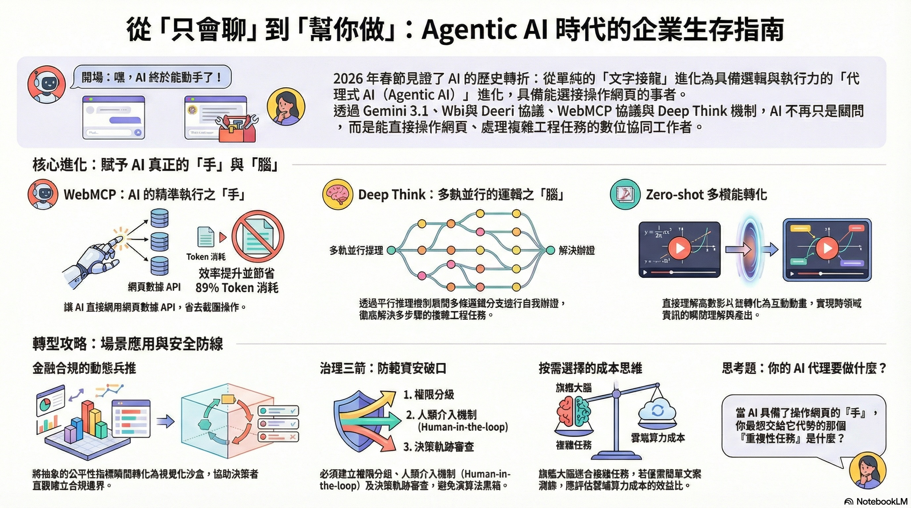

---

  - 2026 年春節期間，AI 迎來了從「對話生成」跨入「代理式執行」的歷史性轉折。分析 Gemini 3.1、WebMCP 協議與 Deep Think 機制如何重塑企業工作流。
  - Analyzing how Gemini 3.1, WebMCP, and Deep Think reshape enterprise workflows as AI transitions from conversational to agentic execution in early 2026.
  - [👉 點此看深度技術分析 ](https://deep-learning-101.github.io/Agent/Agentic-AI-Gemini-3.1-WebMCP)
  - [👉 點此看白話文分析 ](https://blog.twman.org/2026/02/Agentic-AI-Gemini-3.1-WebMCP.html)
  - [🌐 Gemini 3.1 Pro (預先發布版)](https://ai.google.dev/gemini-api/docs/models/gemini-3.1-pro-preview?hl=zh-tw)
  - [🌐 WebMCP 搶先體驗版現已推出](https://developer.chrome.com/blog/webmcp-epp?hl=zh-tw) |
  - [終結「AI 點擊按鈕」時代 WebMCP預覽版引領新潮流 已登陸Chrome](https://www.sinotrade.com.tw/richclub/news/698c1ae4b4c4296334a82634)
  - 🎵 不聽可惜的 NotebookLM Podcast @ Google 🎵 <audio controls style="width:200px; height:20px;"><source src="../notebooklm-mp3/Gemini_3.mp3" type="audio/mpeg"></audio>

---

  

    <iframe
      src="https://www.youtube.com/embed/7ulF2z0t9Hg"
      style="position: absolute; width: 100%; height: 100%; left: 0; top: 0;"
      frameborder="0"
      allow="accelerometer; autoplay; clipboard-write; encrypted-media; gyroscope; picture-in-picture"
      allowfullscreen>
    </iframe>
  

 

---

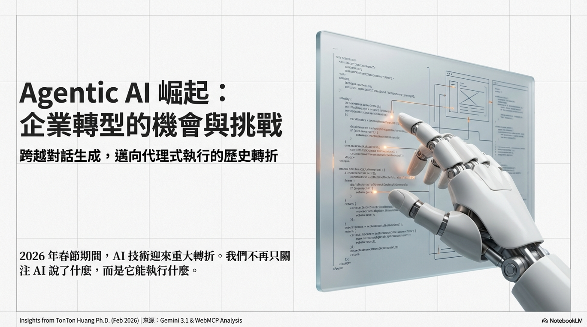

2026年02月22日：<a href="https://twman.org">TonTon Huang Ph.D.</a>

# Agentic AI 崛起：企業轉型的機會與挑戰

**From Chatbots to Autonomous Executors. Crafting Logic, Vision, and Speech for the Real World.**

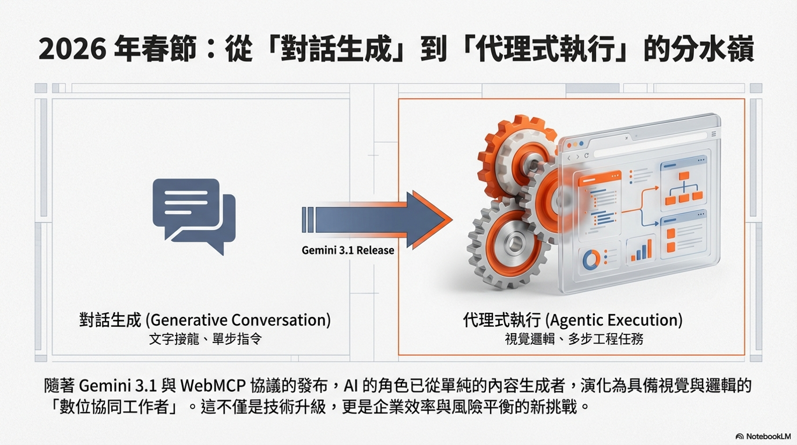

隨著生成式 AI 技術快速演進，企業對於「如何在效率與風險之間取得平衡」的關注日益升高。2026 年春節期間，AI 迎來了從「對話生成」跨入「代理式執行（Agentic Execution）」的歷史性轉折；包含 Google 推出的 Gemini 3.1、WebMCP 協議。(PS: Anthropic 的 Claude Opus 4.6 靜待下回分曉)

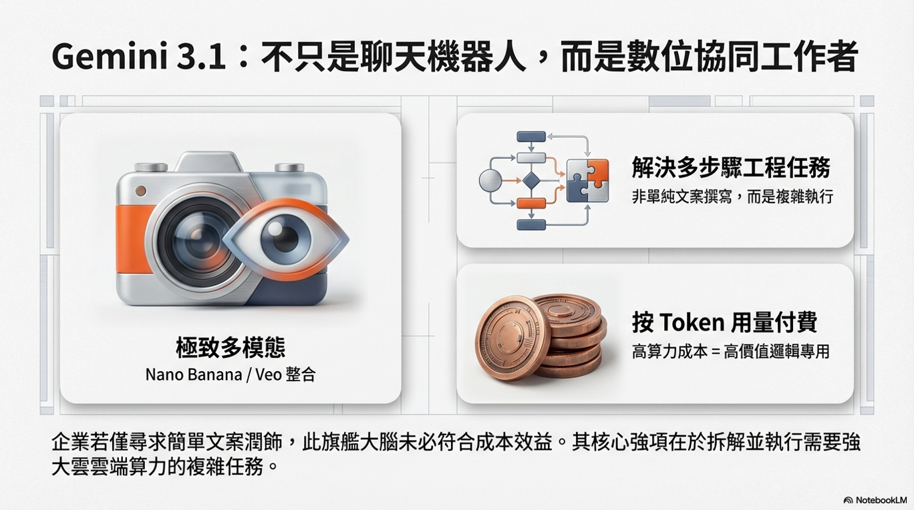

## 代理式工作流是什麼？關鍵特性一次掌握

在功能定位上，Google 最新的 Gemini 3.1 並非「單純看一步走一步的文字接龍機器人」，而更像是「具備視覺與邏輯的數位協同工作者」。其複雜任務的拆解與執行仍需透過強大的雲端算力運算，採取按 Token 用量付費的模式。若企業追求「僅作簡單文案潤飾」的解決方案，這類旗艦大腦未必符合成本效益；然而，若希望 AI 能「代為解決多步驟工程任務」，則正是其核心強項。

### 主要特點包括：

* **核心技術矩陣**：整合 Gemini 3.1 的極致多模態理解力與頂尖生成工具矩陣（如 Nano Banana、Veo）。
* **平行推理機制**：透過 Deep Think 推理機制，展開多條邏輯分支進行假設與自我辯證。
* **技術門檻**：多數複雜應用需建立嚴謹的 Prompt 與系統整合，對一般使用者而言仍具一定技術門檻。

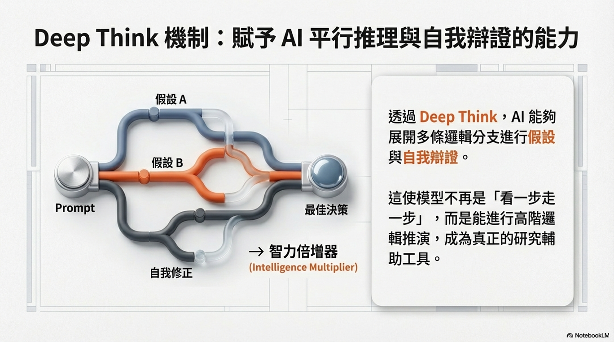

值得關注的是，讓這套代理式工作流得以完美落地的關鍵，在於 Google 同步推出的 **「Deep Think」機制與「WebMCP」協議**。WebMCP 讓 AI 可直接與網站底層的宣告式或命令式 API 握手，省去傳統「截圖盲猜」的繁瑣流程，使模型得以直接調用網頁結構數據，形同讓 AI 具備了精準操作網頁的「手」；而 Deep Think 則賦予其平行思考的能力，成為高階邏輯的「智力倍增器」。

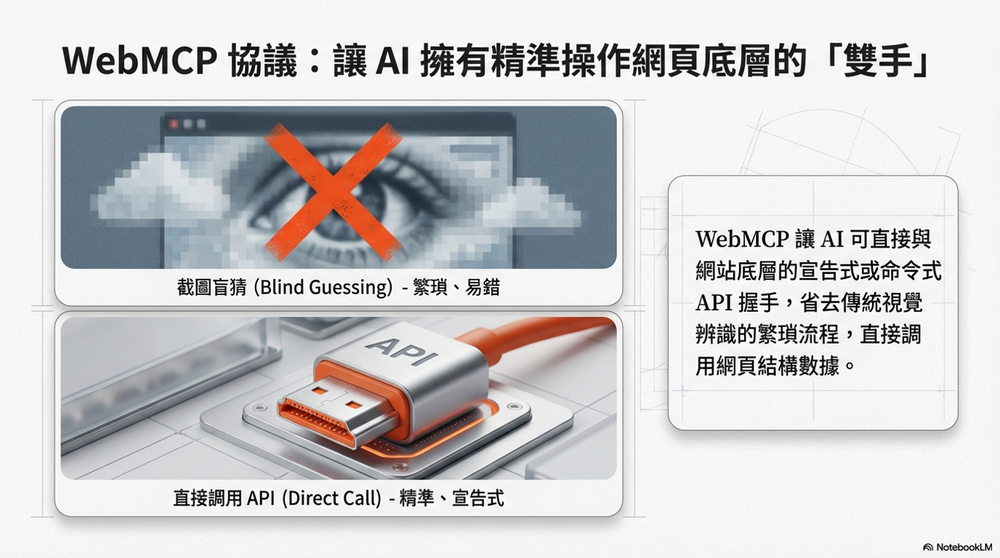

所謂的「Zero-shot 多模態轉化」，意指其能直接理解跨領域資訊。不同於過去模型僅能回應文字，Gemini 3.1 可直接看懂充滿高等數學公式的影片，並寫出純程式碼轉化為互動式 SVG 動畫。這種設計大幅提升了工作效率，同時也對企業的算力成本控管提出考驗。[👉 點此看實際案例分析 ](./Gemini-3.1_WebMCP_Deep-Think/20260222.html)

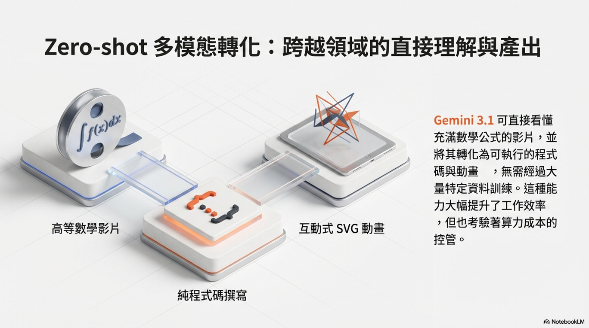

---

## 典型應用場景

在適當治理與控管下，這套 Agentic AI 可於以下場景展現價值：

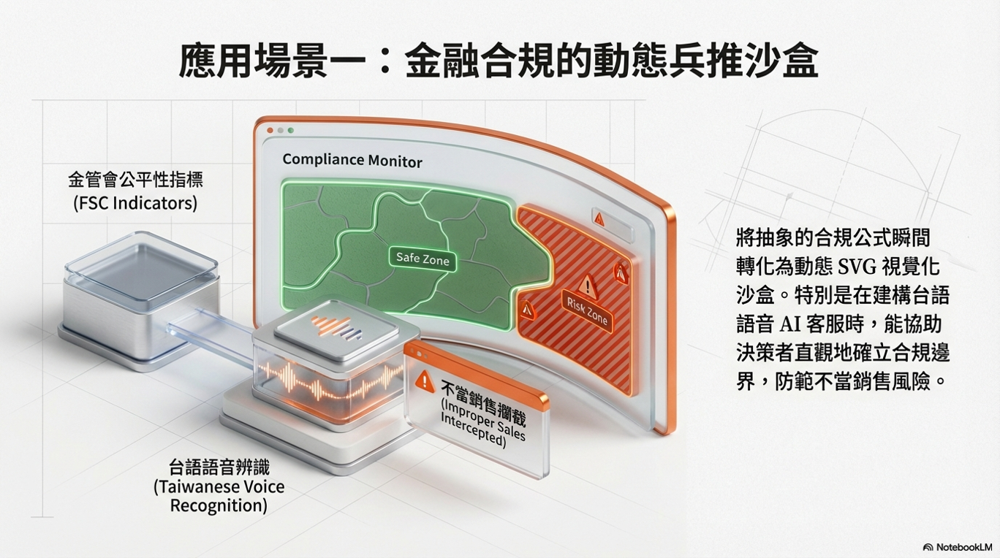

1. **金融合規的動態兵推沙盒**：將金管會公平性指標等抽象公式，瞬間轉化為動態 SVG 視覺化沙盒。例如在建構台語語音 AI 客服時，視覺化防範不當銷售的攔截過程，協助決策者直觀確立合規邊界。

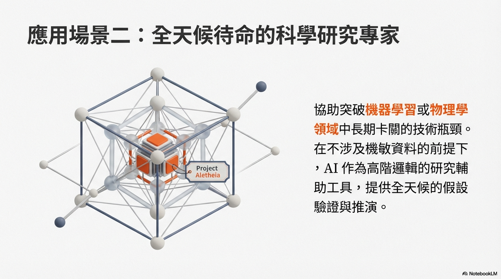

2. **科學與高階邏輯研究專家**：奠基於專案 Aletheia 的技術，在不涉及機敏資料的前提下，協助突破機器學習或物理學領域中長期卡關的技術瓶頸，作為全天候待命的研究輔助工具。

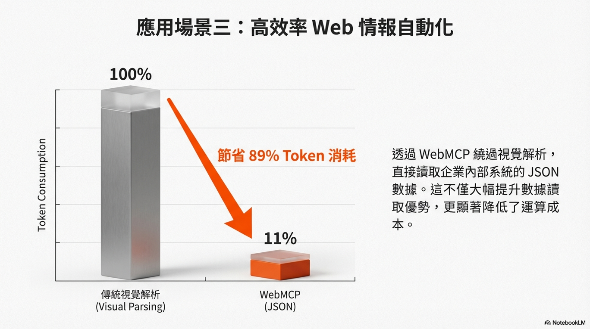

3. **高效率 Web 情報自動化**：透過 WebMCP 讓 AI 繞過視覺解析，直接讀取企業內部系統的 JSON 數據，實測可節省高達 89% 的 Token 消耗，發揮其高效率的數據讀取優勢。

---

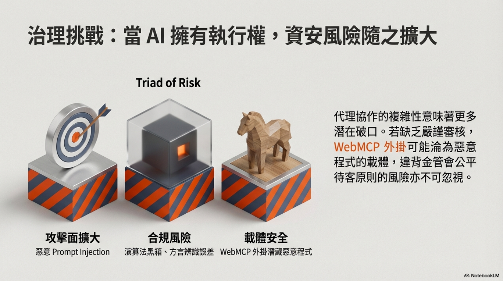

## 治理與資安風險不可忽視

然而，正因 Agentic AI 擁有更深度的推理與直接操作網頁底層函數的權限，若缺乏適當的內控與治理機制，恐成為潛在資安破口。例如：

* **攻擊面擴大**：複雜的代理協作可能擴大惡意「Prompt Injection」的攻擊面。
* **合規風險**：演算法黑箱與語音辨識誤差（如台語口音）可能引發違背金管會公平待客原則的裁罰。
* **載體安全**：WebMCP 外掛若缺乏嚴謹審核機制，可能淪為惡意程式載體。

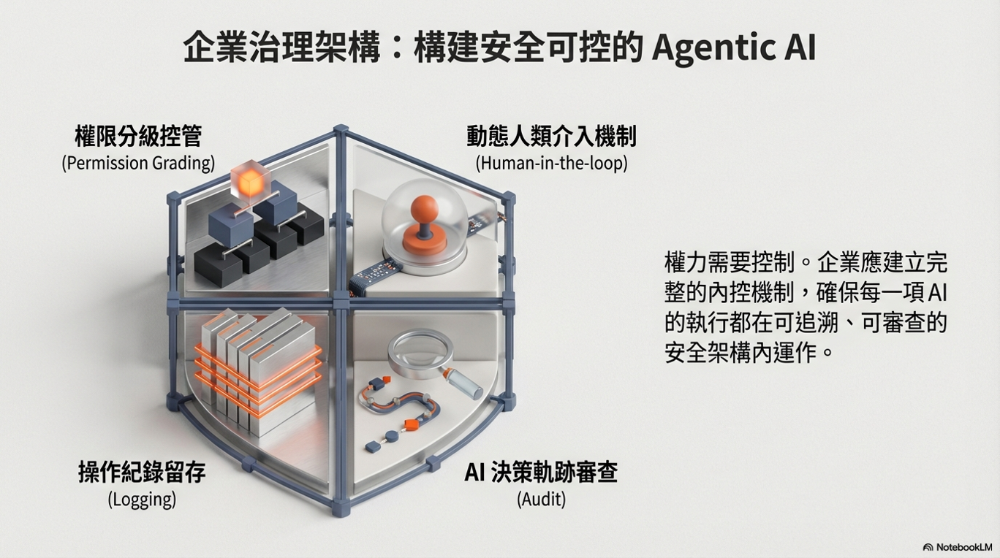

因此，企業在評估導入此類技術時，應同步建立「權限分級控管」、「動態人類介入機制 (Human-in-the-loop)」、「操作紀錄留存」及「AI 決策軌跡審查」等管理措施，並納入整體資訊安全與合規架構中審慎規劃。

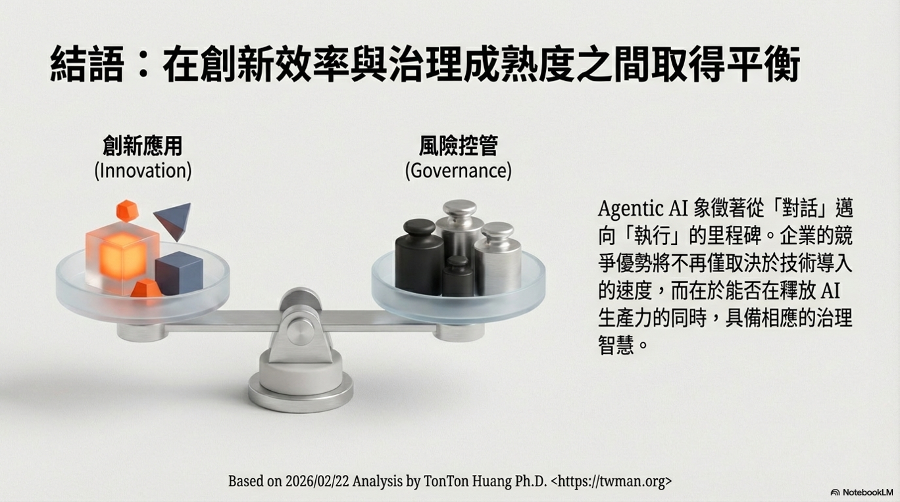

**總體而言**，這波技術爆發象徵 AI 應用從「對話生成」邁向「實際執行」的重要里程碑。其帶來的效率提升潛力不容忽視，但也同時對企業治理能力提出更高要求。如何在創新應用與風險控管之間取得平衡，將成為企業邁向 Agentic AI 轉型過程中的關鍵課題。

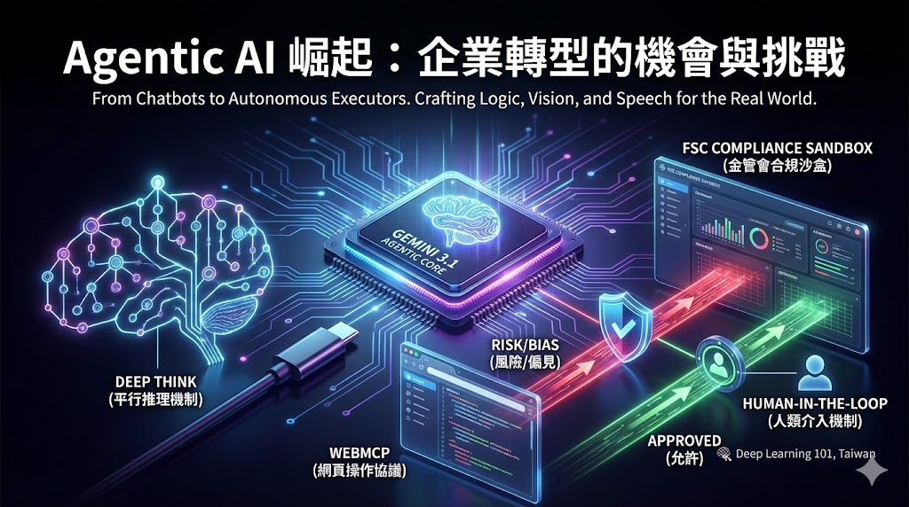

