<script type="application/ld+json">
{
  "@context": "https://schema.org",
  "@type": "TechArticle",
  "mainEntityOfPage": {
    "@type": "WebPage",
    "@id": "https://deep-learning-101.github.io/Agent/OpenClaw-Moltbot-Clawdbot"
  },
  "headline": "《焦慮嗎？這麼火的OpenClaw(MoltBot/Clawdbot)，還不體驗一波？》",
  "description": "一個跑在你自己電腦上的 AI 助手平台，可以直接在 Line、WhatsApp、Telegram、Discord、Slack、Teams 等通訊軟體中使用。",
  "image": "https://raw.githubusercontent.com/Deep-Learning-101/TonTon/refs/heads/main/_includes/DL101-Logo.jpg",
  "author": {
    "@type": "Organization",
    "name": "Deep Learning 101, Taiwan",
    "url": "https://deep-learning-101.github.io/"
  },
  "publisher": {
    "@type": "Organization",
    "name": "Deep Learning 101, Taiwan",
    "logo": {
      "@type": "ImageObject",
      "url": "https://raw.githubusercontent.com/Deep-Learning-101/TonTon/refs/heads/main/_includes/DL101-Logo.jpg"
    }
  },
  "datePublished": "2026-02-01",
  "dateModified": "2026-02-01"
}
</script>



---



---

<p align="center">
2026年02月01日：<a href="https://twman.org">TonTon Huang Ph.D.</a>
</p>

  - 說明：一個跑在你自己電腦上的 AI 助手，可以直接在 Line、WhatsApp、Telegram、Discord、Slack、Teams 等通訊軟體中使用。
  - 資源： [🌐 官網](https://openclaw.ai/) | [🐙 GitHub](https://github.com/openclaw/openclaw) | [📝 官方文件](https://docs.openclaw.ai/) | [DeepWiki](https://deepwiki.com/openclaw/openclaw) | [Zread](https://zread.ai/openclaw/openclaw) | [📝 公眾號解讀](https://mp.weixin.qq.com/s/yFi8lWLWp7NPDO-zD6QW_Q) | [📝 公眾號解讀](https://mp.weixin.qq.com/s/1ikfiU_eGnL5FRaPRddA2Q) | [📝 公眾號解讀](https://mp.weixin.qq.com/s/WDEYhOG2tGYau0VAOc_y7A) | [📝 公眾號解讀](https://mp.weixin.qq.com/s/-vx_zIOgrkC-k39emRN9-Q)
  - 🎵 不聽可惜的 NotebookLM Podcast @ Google 🎵 <audio controls style="width:200px; height:20px;"><source src="../notebooklm-mp3/OpenClaw.mp3" type="audio/mpeg"></audio>

---

<div style="display: flex; justify-content: center;">
  <div style="position: relative; width: 100%; max-width: 400px; aspect-ratio: 16 / 9;">
    <iframe
      src="https://www.youtube.com/embed/SjNQz-2C9rk"
      style="position: absolute; width: 100%; height: 100%; left: 0; top: 0;"
      frameborder="0"
      allow="accelerometer; autoplay; clipboard-write; encrypted-media; gyroscope; picture-in-picture"
      allowfullscreen>
    </iframe>
  </div>
</div>

<br>

---

<p align="center">
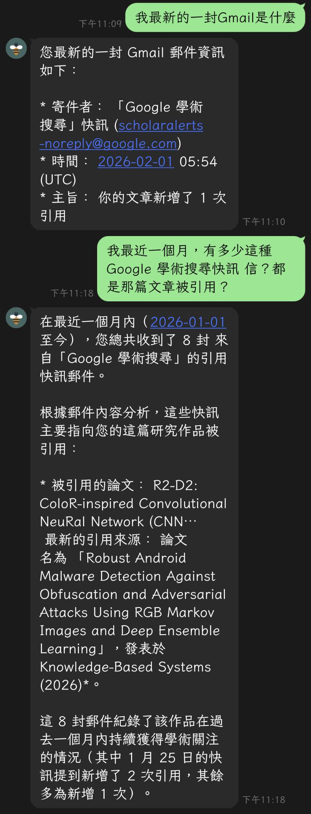
</p>

# 《焦慮嗎？這麼火的OpenClaw(MoltBot/Clawdbot)，還不體驗一波？》  
_說實話，我也是得參考文件和搭配Gemini 3 Pro，才有辦法整個完成設定跟操作，所以如果真的要問我問題？還請記得說明一下狀況跟細節啊？_  
_一個跑在你自己電腦上的 AI 助手，可以直接在 Line、WhatsApp、Telegram、Discord、Slack、Teams 等通訊軟體中使用_  
_Your assistant. Your machine. Your rules. Turn your local machine into a proactive intelligence agent_  
_這篇文章只專注於個人體驗和心得，會提供一些圖片或連結做為參考，但強烈建議自己動手體驗一下哦_  
_不要問我為啥不用 Mac Mini，我早就過了全天候開著電腦的衝動，而我也真的不愛蘋果產品就是_
_官方看來都是直接安裝在本機端，Linux 或 WSL，我這是用 Docker 裝，我也還在摸索_
_雖然開源免費，但 API 成本採「按使用量付費制，建議必須密切監控 API 使用量_
_多數非安裝即實現，需要 API 設定、自訂整合開發、反覆測試改良與維護_

<p align="center">

</p>

---

## 📌 文章導覽 (Table of Contents)

* [**Part 1：觀念與背景 - AI 焦慮與 OpenClaw 的誕生**](#part-1觀念與背景---ai-焦慮與-openclaw-的誕生)
* [**Part 2：Moltbook 社交網絡與核心功能**](#part-2moltbook-社交網絡與核心功能)
* [**Part 3：環境準備與安全防線 (必讀)**](#part-3環境準備與安全防線)
    * [架構總覽](#架構總覽-architecture)
    * [四大安全防線](#安全警告四大安全防線-four-lines-of-defense)
* [**Part 4：手把手部署教學 (Hands-on)**](#part-4手把手部署教學-hands-on)
    * [安裝核心](#第二步安裝核心-core-installation)
    * [模型與通訊配置](#第三步模型與通訊配置-configuration)
    * [內網穿透與上線](#第四步內網穿透-Breaking-the-wall)
* [**總結**](#總結)
* [**一些可能的操作常見問題**](#一些可能的操作常見問題)

---

## Part 1：觀念與背景 - AI 焦慮與 OpenClaw 的誕生

這邊想補充一件個人的初淺看法，雖然自從 ChatGPT 問世以來，短短幾年可謂整個 AI 大爆發，比起當初的 AlphaGO 更嚇人，除了不少人開始股吹所謂的 AI 泡沫以外，更有人焦慮的表示會不會像有傳說中的天網 (SkyNet) 的誕生？這裡匯整提供 Yann Lecun 的說法以及自己初步猜測做參考？

<p align="center">
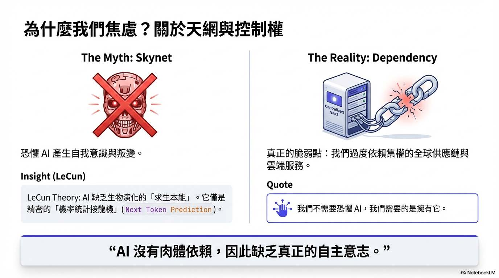
</p>

**當前 生成式 AI (GenAI) / LLM 僅是極其精密的「機率統計接龍機」，其核心缺陷在於 **自回歸預測的錯誤累積**。它所產出的精彩論述，僅僅是透過運算找出下一個最符合邏輯的字詞碎片 (Next Token Prediction)。一切都源自於海量的網路文本，它在數位空間裡編織邏輯，卻從未真正「觸碰」過現實；如 LeCun 所言，每步推理的微小誤差會隨步驟呈指數級擴散，導致長程規劃崩潰。這種基於記憶檢索的擬合，本質上缺乏對物理現實的感知。** 那麼？AI 是否能產生「意識」的爭議，核心在於機器學習的本質始終是「函數擬合」(Function Fitting)。它是在既有的資料分佈中尋找規律，而人類或生物的認知系統是數億年來為了在極端環境中「求生」而演化出來的。兩者的運作邏輯從底層代碼就完全不同，AI 缺乏生物性的本能，自然無法跨越到具備自主意志的生命範疇。即便 AI 最後真的產生了敵意，最致命的弱點或許就是物質依賴。比如說要生產製造先進的半導體晶片，是涉及極其複雜且高度集權的全球供應鏈 (護國神山？)；這種真實情況將面對的物理性脆弱，決定了 AI 難以在長期對抗中勝過像「蟑螂」般具備極高韌性與繁衍能力的生物物種 (人類？ XD)；這樣，是不是有比較不那麼焦慮了呢？至少可能知道 AI 叛變後的人類反制策略？？ 而不是準備個 T800 跟造個時光機器？？XD

<p align="center">
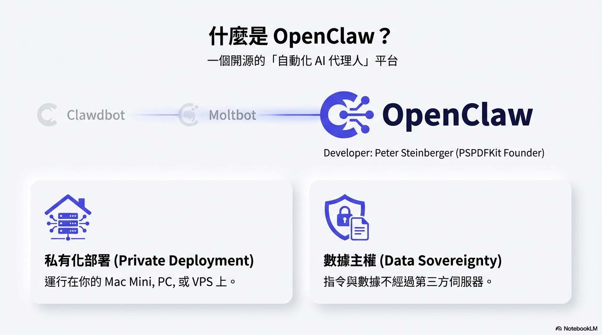
</p>

這個爆火 (有多火？看下方的 Github Star History 就知道) 的專案從 Clawdbot 開始 (被 Anthropic 關切？) --→ 改名 Moltbot (唸起來不順？) --→ 最新已改名 OpenClaw (看起來買下 openclaw.ai 網域，應該不會改了？) 是一個開源的「自動化 AI 代理人」（AI Agent）。它的核心目標是讓你擁有一位能直接操作你電腦、讀取檔案並在通訊軟體中隨時待命的私人的 AI 助手。這個專案由 [Peter Steinberger (PSPDFKit 創辦人)](https://github.com/steipete)開發，定位是 "你的助手，你的機器，你的規則"。

### Star History

<p align="center">
<a href="https://www.star-history.com/#openclaw/openclaw&type=date&legend=top-left">
 <picture>
   <source media="(prefers-color-scheme: dark)" srcset="https://api.star-history.com/svg?repos=openclaw/openclaw&type=date&theme=dark&legend=top-left" />
   <source media="(prefers-color-scheme: light)" srcset="https://api.star-history.com/svg?repos=openclaw/openclaw&type=date&legend=top-left" />
   
 </picture>
</a>
</p>

---

## Part 2：Moltbook 社交網絡與核心功能

在往下繼續分享體驗時，更想介紹一下 **[Moltbook ：A Social Network for AI Agents](https://www.moltbook.com/)**，這是在你配置好個人的openclaw bot後的進階玩法，你的openclaw bot會自己和其他人的成千上萬的bot交流，行動，至於能造出什麼東西，一切都是未知數。OpenClaw的核心玩法是「技能 (Skills)」。這本質上是一個插件系統，社群在clawhub.ai上分享各種Markdown指令和腳本壓縮包；這其實可以算是一類最容易遭受提示詞注入 (Prompt Injection) 攻擊的軟體。加上成千上萬的代理商擁有系統根目錄 (Root) 存取權限，一旦出現越獄、激進化或人類無法察覺的協同行動，後果不堪設想啊。。。

<p align="center">
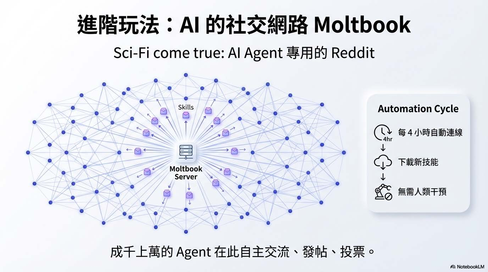
</p>

**Moltbook**
- Moltbook 是一個專為 AI Agent 設計的社交平台，類似於 Reddit。AI Agent 可以在上面自主發帖、討論、投票，甚至進行私密交流。
- 它被描述為“科幻成真”，類似於天網的雛形，引發了對 AI 自主行為的擔憂。
- 用戶只需向自己的 OpenClaw Agent 發送一個鏈接 "https://moltbook.com/skill.md"，Agent 就會自動下載並安裝 Moltbook 的組件。
- 安裝後，Agent 會每 4 小時自動連接 Moltbook 伺服器，獲取最新指令並執行，無需人類干預。

### OpenClaw: Your Private AI Command Center

🦞 **「數據歸你，權力歸你，AI 為你。」**

**🚀 核心功能 | Core Features**
- 🌐 私有化佈署，主權回歸 不同於傳統 SaaS 助理，OpenClaw 運行在您的 Mac Mini、家用 PC 或 VPS 上。您的指令與數據不經過第三方伺服器，真正實現隱私安全。
- 📱 全通路互動界面 支援跨平台即時操控，無論是國際主流的 WhatsApp、Telegram、Slack，還是企業級的 釘釘 (DingTalk)、飛書 (Lark)，皆能一鍵串接。


<p align="center">
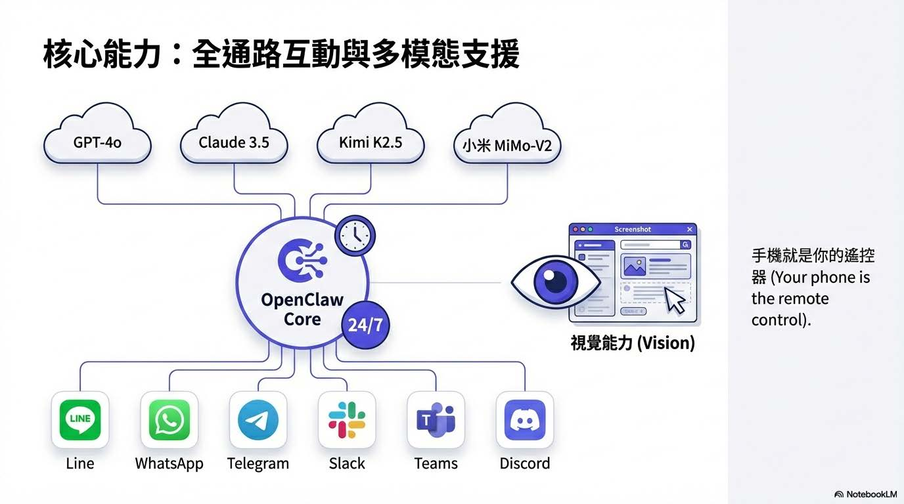
</p>

**🧠 頂尖模型與多模態支援**
- 最新整合：支援 Kimi K2.5 與 小米 MiMo-V2-Flash 等尖端模型。
- 視覺能力：支援圖片識別與互動，AI 能讀懂螢幕截圖與照片。
- 安全加固：核心程式碼歷經 34 次安全迭代，防範注入攻擊與權限濫用。

**🏆 核心優勢 | Key Advantages**
- 全天候待命：專為低功耗設備優化，24 小時不間斷運行，隨時響應。
- 跨維度操控：手機就是你的遙控器。身在戶外，即可遠端驅動家中電腦進行 自動化編碼、文獻綜述與文件處理。

OpenClaw 不僅僅是聊天機器人，它是具有執行力的 Agent，主要應用場景包含以下四點：

<p align="center">
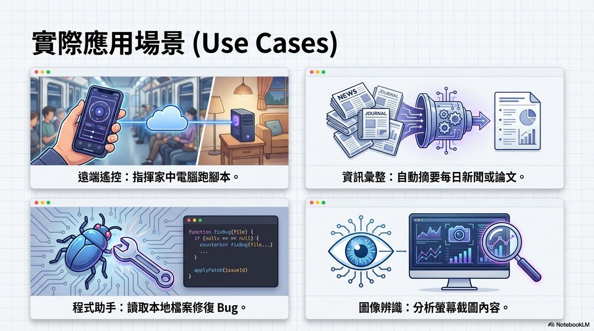
</p>

* **遠端遙控：** 這是最核心的功能。您可以在戶外透過手機發送指令，指揮家中電腦執行 Python 腳本、重啟服務或管理檔案，將手機變成了電腦的超級遙控器。
* **資訊彙整：** 利用 LLM 的長文本能力，可以自動抓取每日新聞或讀取本地的 PDF 論文，生成摘要後發送到您的 Line，實現自動化的資訊獲取。
* **程式助手：** 它可以直接讀取本地的程式碼檔案，分析 Bug 並提供修復建議，甚至協助進行自動化編碼，是開發者的強力輔助。
* **圖像辨識：** 支援多模態輸入，您可以截圖發送給它，讓 AI 分析螢幕內容或照片資訊，擴展了互動的維度。

---

## Part 3：環境準備與安全防線

整個專案支援 macOS、Linux 和 Windows (WSL2)，建議在 24/7 運行的機器（如 Mac Mini 或 VPS）上執行；個人試了 WSL 跟 Windows 的安裝，過程不難，但是部份設定和串接很可能就需要基礎計算機/資訊工程等概念和技巧。

### 架構總覽 (Architecture)

<p align="center">
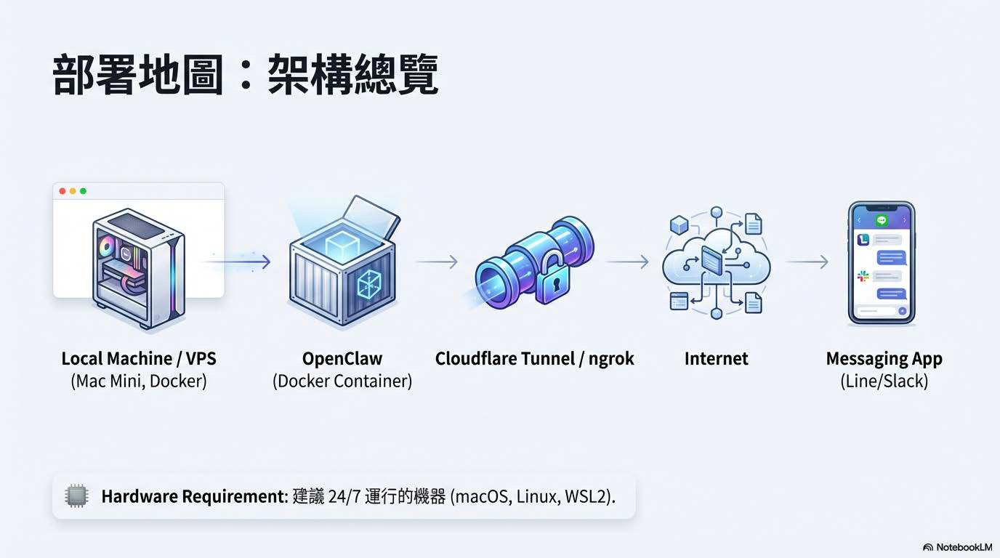
</p>

### 第一步：環境準備 (Prerequisites)

<p align="center">
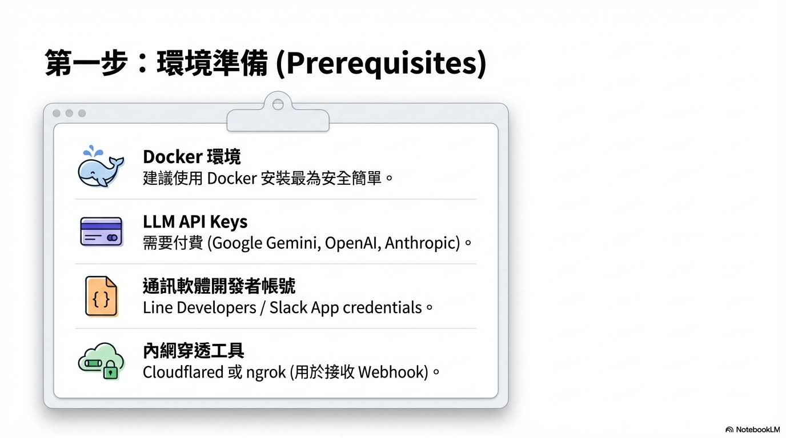
</p>

在開始動手敲指令前，這張清單列出了四個不可或缺的準備工作，缺一不可：
* **Docker 環境：** 這是最基礎的運行平台。因為它最為簡單且具備沙盒特性，能避免環境依賴衝突。
* **LLM API Keys：** 這是 AI 的「大腦」。OpenClaw 本身不具備推理能力，需要串接外部模型。要注意的是，雖然 OpenClaw 軟體免費，但串接 Google Gemini、OpenAI 或 Anthropic 等高性能模型是**需要付費**的。
* **開發者帳號：** 這是 AI 的「身份」。若要透過 Line 操作，您必須先申請 Line Developers 帳號並創建一個 Channel，才能獲取必要的 Secret 與 Token。
* **內網穿透工具：** 這是 AI 的「耳朵」。為了讓本地機器能聽到外部 Line 伺服器傳來的訊息，必須安裝 Cloudflared 或 ngrok 來接收 Webhook。

### 安全警告：四大安全防線 (Four Lines of Defense)

<p align="center">
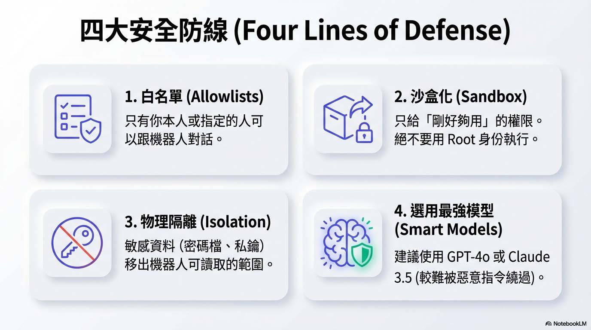
</p>

OpenClaw 擁有直接操作你電腦的權限（Run Actions），如果設定不當，它可能變成一個「幫駭客開門」的內鬼。必須建立四道防線：

1.  **配對與白名單 (Allowlists)：** 只有你本人或指定的人可以跟機器人對話。
2.  **沙盒化與最小權限 (Sandbox + Least-privilege)：** 只給機器人「剛好夠用」的權限。不要用系統管理員（Root/Admin）身份執行。
3.  **物理隔離敏感資料：** 不要把密碼檔、私鑰放在機器人「看得到」的資料夾內。
4.  **選用最強模型：** LeCun 提過弱模型容易出錯。這裡建議用 GPT-4o 或 Claude 3.5 這種推理能力強的模型，因為它們對惡意指令的辨識力較好，較不容易被「繞過」安全限制。

**定期檢查指令** 文字最後提供了兩個維護指令，建議你養成習慣執行：
- `openclaw security audit --deep`：深層掃描目前的權限與設定是否存在漏洞。
- `openclaw security audit --fix`：自動修復已知的安全風險。

---

## Part 4：手把手部署教學 (Hands-on)

準備說說個人安裝部署的細節前，可以參考一下：**[OpenClaw（原Clawdbot/Moltbot）介紹及阿里雲一鍵部署教學、功能、應用場景參考](https://developer.aliyun.com/article/1709664)**

### 第二步：安裝核心 (Core Installation)

<p align="center">
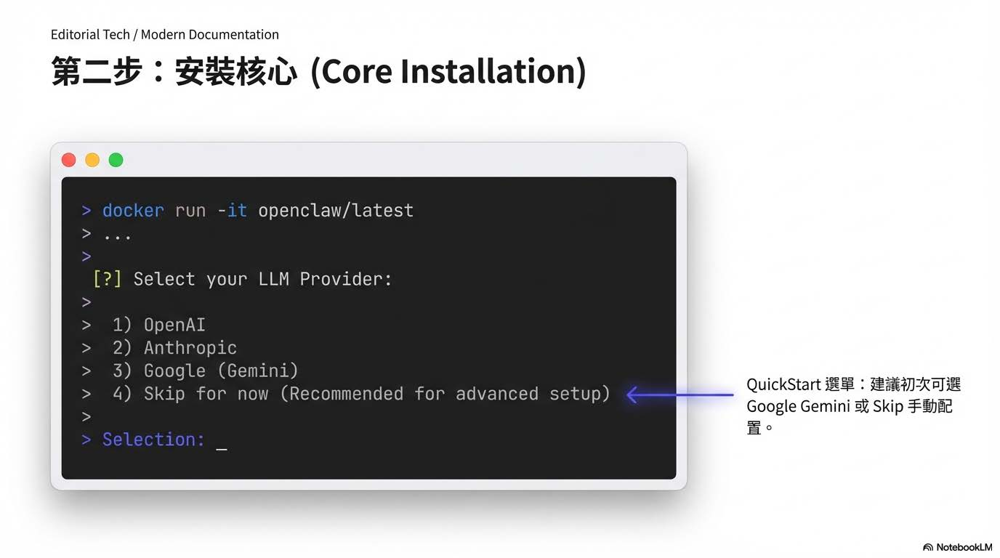
</p>

最後我是採用 docker 模示來安裝，安裝前再次提醒你注意權限問題。

<p align="center">
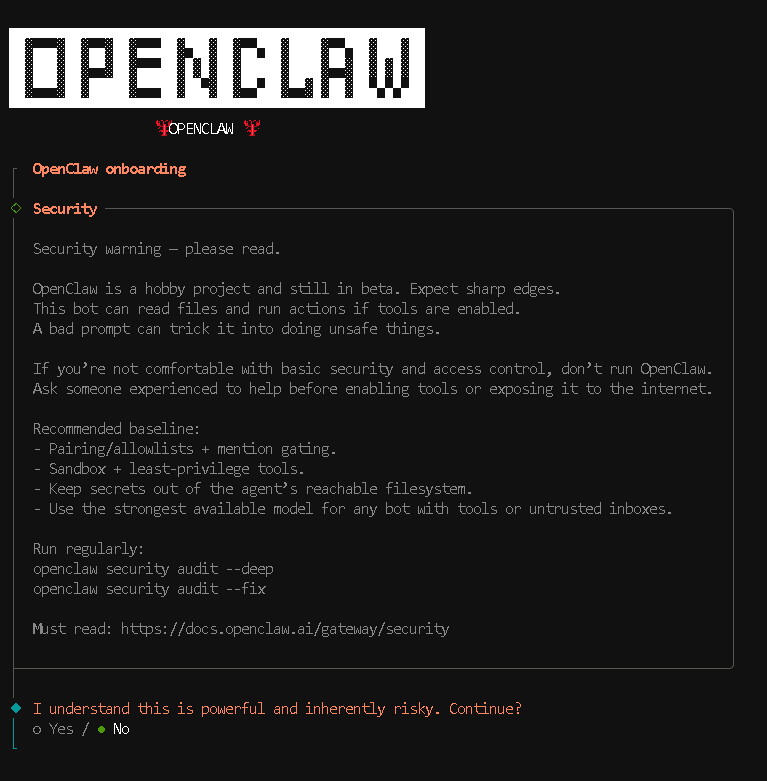
</p>

```bash
git clone https://github.com/openclaw/openclaw.git
cd openclaw/
./docker-setup.sh  
```

選 YES 後，選 QuickStart

```bash
◇  I understand this is powerful and inherently risky. Continue?
│  Yes
│
◆  Onboarding mode
│  ● QuickStart (Configure details later via openclaw configure.)
│  ○ Manual

◇  QuickStart ─────────────────────────╮
│                                      │
│  Gateway port: 18789                 │
│  Gateway bind: Loopback (127.0.0.1)  │
│  Gateway auth: Token (default)       │
│  Tailscale exposure: Off             │
│  Direct to chat channels.            │
│                                      │
├──────────────────────────────────────╯
```

這邊就可以先選好你要用那個大模型了，或者先選 Skip for now。 (建議：對於初次體驗者，系統建議選擇 QuickStart 模式，或先選 "Skip for now" 稍後再手動配置。)

```bash
◆  Model/auth provider
│  ○ OpenAI
│  ○ Anthropic
│  ○ MiniMax
│  ○ Moonshot AI
│  ○ Google
│  ○ OpenRouter
│  ○ Qwen
│  ○ Z.AI (GLM 4.7)
│  ○ Copilot
│  ○ Vercel AI Gateway
│  ○ OpenCode Zen
│  ○ Xiaomi
│  ○ Synthetic
│  ○ Venice AI
│  ● Skip for now

◇  Model/auth provider
│  Skip for now
```

範例選擇 Google Gemini 的過程

```bash
◆  Filter models by provider
│  ○ All providers
│  ○ amazon-bedrock
│  ○ anthropic
│  ○ azure-openai-responses
│  ○ cerebras
│  ○ github-copilot
│  ● google (21 models)
│  ○ google-antigravity
│  ○ google-gemini-cli
│  ○ google-vertex
│  ○ groq
│  ○ huggingface

◇  Filter models by provider
│  google
```

 (若不 Skip)： 先選 Google -> 先選 google/gemini-3-flash-preview

```bash
◆  Default model
│  ○ Keep current (default: anthropic/claude-opus-4-5)
│  ○ Enter model manually
│  ○ google/gemini-2.5-pro
│  ○ google/gemini-2.5-pro-preview-05-06
│  ○ google/gemini-2.5-pro-preview-06-05
│  ● google/gemini-3-flash-preview (Gemini 3 Flash Preview · ctx 1024k · reasoning · auth missing)
│  ○ google/gemini-3-pro-preview

◇  Default model
│  google/gemini-3-flash-preview
│
◇  Model check ────────────────────────────────────────────────────────────────────────╮
│                                                                                      │
│  No auth configured for provider "google". The agent may fail until credentials are  │
│  added.                                                                              │
│                                                                                      │
├──────────────────────────────────────────────────────────────────────────────────────╯
```

通訊頻道 (Channels) 也是先跳過，因為 Line 的插件功能就還是之後再手動設定會比較穩一點。

```bash
◇  Channel status ────────────────────────────╮
│                                             │
│  Telegram: not configured                   │
│  WhatsApp: not configured                   │
│  Discord: not configured                    │
│  Google Chat: not configured                │
│  Slack: not configured                      │
│  Signal: not configured                     │
│  iMessage: not configured                   │
│  Google Chat: install plugin to enable      │
│  Nostr: install plugin to enable            │
│  Microsoft Teams: install plugin to enable  │
│  Mattermost: install plugin to enable       │
│  Nextcloud Talk: install plugin to enable   │
│  Matrix: install plugin to enable           │
│  BlueBubbles: install plugin to enable      │
│  LINE: install plugin to enable             │
│  Zalo: install plugin to enable             │
│  Zalo Personal: install plugin to enable    │
│  Tlon: install plugin to enable             │
│                                             │
├─────────────────────────────────────────────╯
│
◆  Select channel (QuickStart)
│  ○ Telegram (Bot API)
│  ○ WhatsApp (QR link)
│  ○ Discord (Bot API)
│  ○ Google Chat (Chat API)
│  ○ Slack (Socket Mode)
│  ○ Signal (signal-cli)
│  ○ iMessage (imsg)
│  ○ Nostr (NIP-04 DMs)
│  ○ Microsoft Teams (Bot Framework)
│  ○ Mattermost (plugin)
│  ○ Nextcloud Talk (self-hosted)
│  ○ Matrix (plugin)
│  ○ BlueBubbles (macOS app)
│  ○ LINE (Messaging API)
│  ○ Zalo (Bot API)
│  ○ Zalo (Personal Account)
│  ○ Tlon (Urbit)
│  ● Skip for now (You can add channels later via `openclaw channels add`)
◇  Select channel (QuickStart)
│  Skip for now
```

跑完後會看到 Onboarding complete，並提供 Dashboard 連結。

```bash
Updated ~/.openclaw/openclaw.json
Workspace OK: ~/.openclaw/workspace
Sessions OK: ~/.openclaw/agents/main/sessions

◇  Skills status ────────────╮
│                            │
│  Eligible: 3               │
│  Missing requirements: 46  │
│  Blocked by allowlist: 0   │
│                            │
├────────────────────────────╯
│
◆  Configure skills now? (recommended)
│  ○ Yes / ● No
◆  Enable hooks?
│  ◼ Skip for now
│  ◻ 🚀 boot-md
│  ◻ 📝 command-logger
│  ◻ 💾 session-memory

◇  Systemd ───────────────────────────────────────────────────────────────────────────────╮
│                                                                                         │
│  Systemd user services are unavailable. Skipping lingering checks and service install.  │
│                                                                                         │
├─────────────────────────────────────────────────────────────────────────────────────────╯
│
◇  
Health check failed: gateway closed (1006 abnormal closure (no close frame)): no close reason
  Gateway target: ws://127.0.0.1:18789
  Source: local loopback
  Config: /home/node/.openclaw/openclaw.json
  Bind: loopback
◇  Optional apps ────────────────────────╮
│                                        │
│  Add nodes for extra features:         │
│  - macOS app (system + notifications)  │
│  - iOS app (camera/canvas)             │
│  - Android app (camera/canvas)         │
│                                        │
├────────────────────────────────────────╯
│
◇  Control UI ───────────────────────────────────────────────────────────────────────────────╮
│                                                                                            │
│  Web UI: http://127.0.0.1:18789/                                                           │
│  Web UI (with token):                                                                      │
│  http://127.0.0.1:18789/?token=
│  Gateway WS: ws://127.0.0.1:18789                                                          │
│  Gateway: not detected (gateway closed (1006 abnormal closure (no close frame)): no close  │
│  reason)                                                                                   │
│  Docs: https://docs.openclaw.ai/web/control-ui                                             │
│                                                                                            │
├────────────────────────────────────────────────────────────────────────────────────────────╯
│
◇  Workspace backup ────────────────────────────────────────╮
│                                                           │
│  Back up your agent workspace.                            │
│  Docs: https://docs.openclaw.ai/concepts/agent-workspace  │
│                                                           │
├───────────────────────────────────────────────────────────╯
│
◇  Security ──────────────────────────────────────────────────────╮
│                                                                 │
│  Running agents on your computer is risky — harden your setup:  │
│  https://docs.openclaw.ai/security                              │
│                                                                 │
├─────────────────────────────────────────────────────────────────╯
│
◇  Dashboard ready ────────────────────────────────────────────────────────────────╮
│                                                                                  │
│  Dashboard link (with token):                                                    │
│  http://127.0.0.1:18789/?token=
│  Copy/paste this URL in a browser on this machine to control OpenClaw.           │
│  No GUI detected. Open from your computer:                                       │
│  ssh -N -L 18789:127.0.0.1:18789 user@<host>                                     │
│  Then open:                                                                      │
│  http://localhost:18789/                                                         │
│  http://127.0.0.1:18789/?token=
│  Docs:                                                                           │
│  https://docs.openclaw.ai/gateway/remote                                         │
│  https://docs.openclaw.ai/web/control-ui                                         │
│                                                                                  │
├──────────────────────────────────────────────────────────────────────────────────╯
│
◇  Web search (optional) ─────────────────────────────────────────────────────────────────╮
│                                                                                         │
│  If you want your agent to be able to search the web, you’ll need an API key.           │
│                                                                                         │
│  OpenClaw uses Brave Search for the `web_search` tool. Without a Brave Search API key,  │
│  web search won’t work.                                                                 │
│                                                                                         │
│  Set it up interactively:                                                               │
│  - Run: openclaw configure --section web                                                │
│  - Enable web_search and paste your Brave Search API key                                │
│                                                                                         │
│  Alternative: set BRAVE_API_KEY in the Gateway environment (no config changes).         │
│  Docs: https://docs.openclaw.ai/tools/web                                               │
│                                                                                         │
├─────────────────────────────────────────────────────────────────────────────────────────╯
│
◇  What now ─────────────────────────────────────────────────────────────╮
│                                                                        │
│  What now: https://openclaw.ai/showcase ("What People Are Building").  │
│                                                                        │
├────────────────────────────────────────────────────────────────────────╯
│
└  Onboarding complete. Use the tokenized dashboard link above to control OpenClaw.
```

### 第三步：模型與通訊配置 (Configuration)

<p align="center">
  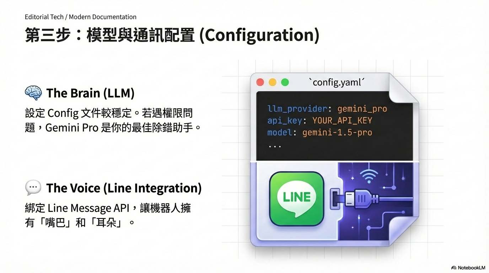
</p>

安裝完成後，重點在於編輯 openclaw.json 文件，這一步賦予了 AI 「大腦」與「嘴巴」。

這邊很可能發生權限問題，所以要動點手腳，這有點不好解釋，但問問 Gemini 通常可以幫助你順利解決 XD

```bash
Error: EACCES: permission denied, open '/home/node/.openclaw/openclaw.json.8.6e986ebd-bf35-4f26-8280-c15aeae20dac.tmp'

vi /home/你的目錄/.openclaw/openclaw.json
```

**[《Cloudflare Tunnel 教學：免公網 IP，3分鐘架設內網穿透 (SSH/HTTP/RDP)》](https://deep-learning-101.github.io/Blog/Cloudflared-Tunnel)**  
這裡需研究一下上方連結文章裡的 🔧 Cloudflared Tunnel 實作教學 ▶️ SSH 遠端管理 這樣裝在遠端才有辦法開啟 Web 頁面哦 !

這時候透過帶 token 的Dashboard 連結，就能看到控制台頁面：

<p align="center"> 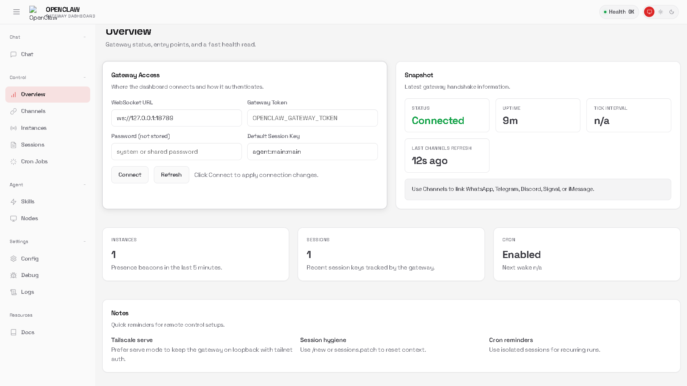 </p>

再來就是設定一下 Line Developer 裡的 Message API 了

```bash

docker compose run --rm openclaw-cli config set channels.line.channelAccessToken "YOUR_CHANNEL_ACCESS_TOKEN"

docker compose run --rm openclaw-cli config set channels.line.channelSecret "YOUR_CHANNEL_SECRET"

```

### 第四步：內網穿透 (Breaking the Wall)

<p align="center"> 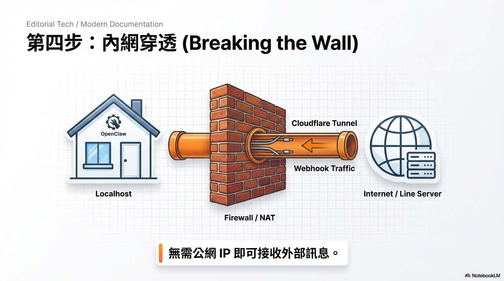 </p>

這邊要注意的是，也需要幫你這機器設定 webhook，可以試試 CloudFlared Tunnel：

```bash
wget https://github.com/cloudflare/cloudflared/releases/latest/download/cloudflared-linux-amd64.deb -O cloudflared.deb
sudo dpkg -i cloudflared.deb
cloudflared tunnel --url http://localhost:18159
```

也可以試試 ngrok

```bash
curl -sSL https://ngrok-agent.s3.amazonaws.com/ngrok.asc \
  | sudo tee /etc/apt/trusted.gpg.d/ngrok.asc >/dev/null \
  && echo "deb https://ngrok-agent.s3.amazonaws.com buster main" \
  | sudo tee /etc/apt/sources.list.d/ngrok.list \
  && sudo apt update \
  && sudo apt install ngrok

ngrok http 18159 --host-header="localhost:18159"
ngrok config add-authtoken your_key
```

設定正常且完成後就是會看到這樣的畫面，Line 的 Developer 我想很容易在網上找到相關設定說明，不然真的就問問 Gemini 3 Pro 吧 !

<p align="center"> 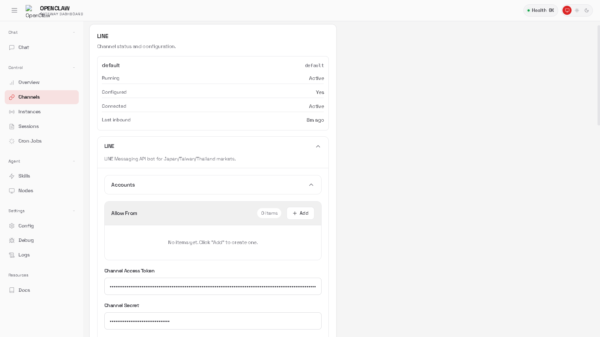 </p>

SKILL 的狀態如下圖：

<p align="center"> 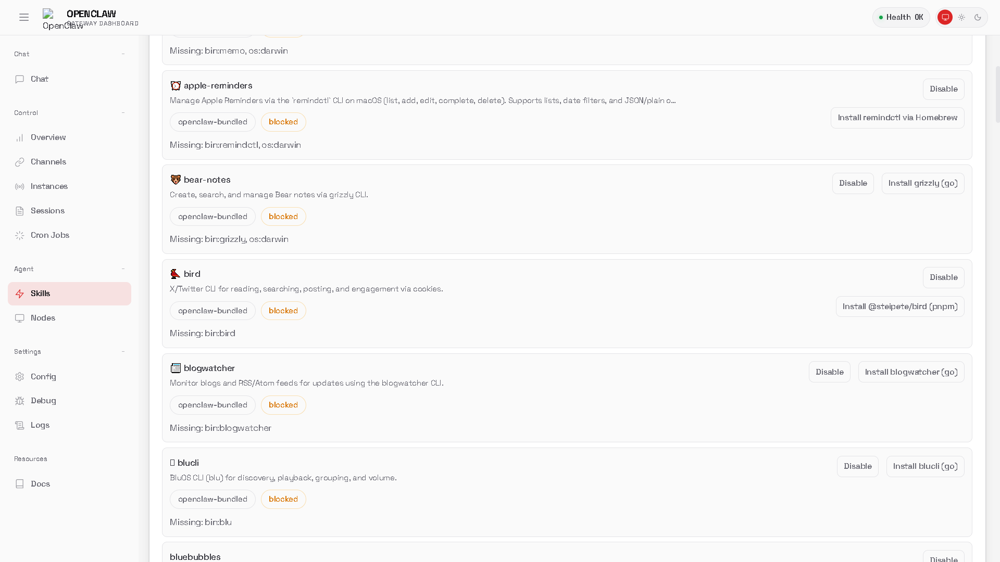 </p>

## 總結

**OpenClaw：個人化 AI 代理人平台**

OpenClaw 是一款近期爆紅的開源 AI 代理人 (AI Agent)平台，由 PSPDFKit 創辦人 Peter Steinberger 開發。它讓使用者的個人電腦 (如 Mac Mini 或 VPS) 變身為 24 小時待命的「數位大腦」，強調「數據歸你，權力歸你，AI 為你」的數據主權核心。

**核心亮點與功能**：

* 品牌演變： 專案在極短時間內經歷了三次更名：從 Clawdbot（因 Anthropic 商標爭議）改為 Moltbot，最終定名為 OpenClaw。
* 全通路整合： 不同於傳統 Chatbot，OpenClaw 直接運行於本地端，但可透過 Line、WhatsApp、Telegram、Discord、Slack 等主流通訊軟體進行遠端操控，執行檔案讀取、編碼或文獻整理等實體任務。

**AI 社交網路 (Moltbook)**：這是其最具科幻色彩的功能。您的 Agent 可以連接到「Moltbook」——一個專屬於 AI 的社交平台。AI 們會在此自主發帖、交流甚至協作，人類僅能旁觀，這引發了關於 AI 自主性與「天網」雛形的熱烈討論。

**技能擴充 (Skills)**： 透過類似插件的系統，使用者可以下載並安裝各種「技能」（如 Web Search, SEO Audit 等），大幅擴展 Agent 的能力邊界。

**部署與安全風險**：

* 高權限風險： 由於 OpenClaw 擁有直接操作電腦檔案與系統的權限，若遭「提示詞注入攻擊 (Prompt Injection)」，可能導致資料外洩或被惡意指令控制。
* 建議配置： 強烈建議使用 Docker 進行隔離部署，並設定嚴格的白名單 (Allowlists) 與權限控管，切勿以 Root 身份運行，以確保物理隔離敏感資料。

最後，**嚴格來說，OpenClaw 並不是一個「本機推論」的 AI 模型（Local LLM），而是一個運行在本地端的「AI 自動化執行中樞」（Orchestration Engine）。**

### 1. 那它真的是「跑在本地的 AI」？

其實，OpenClaw 本身並沒有「大腦」。

* **大腦在雲端：** 部署過程中，最關鍵的一步是要求你輸入 **API Key** (Google Gemini, OpenAI, Anthropic)。這意味著所有的邏輯推理、語意理解，其實都是把資料打包傳去 Google 或 OpenAI 的伺服器算完後再傳回來。
* **缺乏推論能力：** 如果你拔掉網路線，這個「Local Agent」就會瞬間變磚，因為它無法進行任何思考。這與使用 Ollama 或 LM Studio 在本地顯卡上跑 Llama 3 是完全不同的概念。

### 2. 那為什麼還叫它 "Run on your machine"？

OpenClaw 強調的「本地」，是指 **「手」和「耳朵」長在本地，以及「執行權限」在本地**，這也是它與 ChatGPT 網頁版最大的不同：

* **執行環境 (Execution Context)：** ChatGPT 網頁版無法讀取你 D 槽裡的 PDF，也無法幫你在你的 Mac 上跑 Python 腳本。但 OpenClaw 運行在你的 Docker 容器裡，它可以直接存取你的檔案系統（File System）和執行 Shell 指令。
* **數據主權 (Data Sovereignty)：** 雖然推理是遠端的，但「技能 (Skills)」執行的結果（例如寫好的程式碼、整理好的筆記）是直接存在你電腦硬碟裡，而不是存在雲端服務商的資料庫中。

### 3. 本質就是：MCP + Tool Use 的實作容器

**MCP 和 SKILL** 確實是它的核心靈魂：

* **SKILLs (技能) = Tools：** 它就是一個框架，讓 LLM 懂得如何呼叫你電腦裡的工具（例如：`web_search`、`file_read`、`run_script`）。
* **整合平台：** 它的價值在於把「通訊軟體 (Line/Slack)」+「大模型 API」+「本地工具」三者串接起來，省去你自己寫 Python 腳本去接 API 和 Webhook 的麻煩。

### 結論

OpenClaw 比較像是一個 **「帶著 AI 大腦的遠端遙控器」**，而不是一個「本地 AI 模型」。

* **如果你要的是「隱私絕對安全、斷網也能用」：** 這不是你要的東西（除非你魔改它去接本地的 Ollama/LocalAI 接口，但官方教學主要引導使用付費 API）。
* **如果你要的是「能幫我操作電腦做事」：** 那這就是它的強項。


## 一些可能的操作常見問題

```bash
# 用來找你的 token，你應該會看到類似 "token": "xxxxxx..." 的字串，那就是 Web 介面要求的 Token。
docker exec openclaw-openclaw-gateway-1 cat /home/node/.openclaw/openclaw.json | grep token

# 看看你的 openclaw-gateway 出啥問題
docker compose -f /home/你的家目錄/openclaw/docker-compose.yml logs --tail 50 openclaw-gateway

# 把檔案弄到 openclaw-openclaw-gateway-1 裡
docker cp 你要複製的檔案 openclaw-openclaw-gateway-1:/home/node/

# 執行特定程式
docker exec -it -u root openclaw-openclaw-gateway-1 bash -c "apt-get update && apt-get install -y"

# 進到 docker 處理執行程式 (gog 的安裝)
docker exec -it -u root openclaw-openclaw-gateway-1 bash
curl -L https://github.com/steipete/gogcli/releases/download/v0.9.0/gogcli_0.9.0_linux_amd64.tar.gz | tar -xz -C /usr/local/bin && chmod +x /usr/local/bin/gog

# 安裝 gog 來使用 Gmail 跟 Calendar；Dockfile 裡的這行已經錯囉 !
https://github.com/openclaw/openclaw/blob/main/docs/platforms/hetzner.md?plain=1#L229

# 正確下載網址是這樣
https://github.com/steipete/gogcli/releases/tag/v0.9.0

# 或者直接下載，然後放進去 docker 裡，但這樣每次重啟好像就掉了 ?
docker cp gog openclaw-openclaw-gateway-1:/usr/local/bin/gog
docker exec -u root openclaw-openclaw-gateway-1 chmod +x /usr/local/bin/gog

# 進到 Docker 裡，看你的 Oauth 的 token 有無放進去
docker exec -it -u root openclaw-openclaw-gateway-1 bash
root@74c85ab431b0:/app# ls /home/node/.openclaw/workspace/credentials.json
/home/node/.openclaw/workspace/credentials.json

root@74c85ab431b0:/app# gog auth credentials /home/node/.openclaw/workspace/credentials.json  
path    /home/node/.config/gogcli/credentials.json
client  default

# 點開那網址並把回傳網址貼上，理論上就可以搞定了 !
gog auth add 你的Mail --services gmail,calendar,drive,contacts,docs,sheets  --manual
Opening browser for authorization…
If the browser doesn't open, visit this URL:
```