<script type="application/ld+json">
{
  "@context": "https://schema.org",
  "@type": "TechArticle",
  "mainEntityOfPage": {
    "@type": "WebPage",
    "@id": "https://deep-learning-101.github.io/Agent/OpenClaw-Moltbot-Clawdbot"
  },
  "headline": "2026 本地端 AI Agent 實戰教學：OpenClaw (Clawdbot) 零成本自動化部署",
  "description": "完整實戰教學，帶您在本地機器上安裝並設定 OpenClaw (前身為 MoltBot/Clawdbot) AI 代理平台。免除隱私疑慮，安全串接各類通訊軟體，打造專屬的 AI 自動化助理。",
  "image": "https://raw.githubusercontent.com/Deep-Learning-101/TonTon/refs/heads/main/_includes/DL101-Logo.jpg",
  "author": {
    "@type": "Organization",
    "name": "Deep Learning 101, Taiwan",
    "url": "https://deep-learning-101.github.io/"
  },
  "datePublished": "2026-03-19",
  "dateModified": "2026-03-19"
}
</script>



---



---

🎯 決策者思維： 面對層出不窮的 AI 新框架，企業盲目跟風往往只會帶來高昂的試錯成本。如何跳出技術焦慮，從商業本質制定 AI 落地架構？請參考這篇策略分析：[AI 新賽局：企業導入生成式 AI 的入門策略與藍圖指南](https://deep-learning-101.github.io/Blog/AIBeginner).

🔒 企業級資安延伸： Cloudflared Tunnel 解決了網絡層的邊界安全，但如果你架設的是企業內部 AI 服務，更需要解決應用層的「輸入輸出安全檢查」。完整架構請參考：[🛡️ AI 大模型安全護欄（LLM-Guard）綜合報告](https://deep-learning-101.github.io/cyber/LLM-Guard).

<p align="center">
<a href="https://twman.org">TonTon Huang Ph.D.</a>
2026年02月01日初版，2026年09月27日更新衍生專案比較表
</p>

  - 一個跑在你自己電腦上的 AI 助手，可以直接在 Line、WhatsApp、Telegram、Discord、Slack、Teams 等通訊軟體中使用。
  - [👉 點此看深度技術分析 ](https://deep-learning-101.github.io/LLM/OpenClaw-Moltbot-Clawdbot) | [👉 點此看白話文分析 ](https://blog.twman.org/2026/02/OpenClaw.html)
  - [🌐 官網](https://openclaw.ai/) | [🐙 GitHub](https://github.com/openclaw/openclaw) | [官方簡體中文文件](https://docs.openclaw.ai/zh-CN) | [官方文件](https://docs.openclaw.ai) | [📝 DeepWiki](https://deepwiki.com/openclaw/openclaw) | [[📝 Zread](https://zread.ai/openclaw/openclaw) | [📝 公眾號解讀](https://mp.weixin.qq.com/s/yFi8lWLWp7NPDO-zD6QW_Q) | [📝 公眾號解讀](https://mp.weixin.qq.com/s/1ikfiU_eGnL5FRaPRddA2Q) | [📝 公眾號解讀](https://mp.weixin.qq.com/s/WDEYhOG2tGYau0VAOc_y7A) | [📝 知乎解讀](https://zhuanlan.zhihu.com/p/1999109634909303005)
  - 🎵 不聽可惜的 NotebookLM Podcast @ Google 🎵 <audio controls style="width:200px; height:20px;"><source src="../notebooklm-mp3/OpenClaw.mp3" type="audio/mpeg"></audio>

---

<div style="display: flex; justify-content: center;">
  <div style="position: relative; width: 100%; max-width: 400px; aspect-ratio: 16 / 9;">
    <iframe
      src="https://www.youtube.com/embed/SjNQz-2C9rk"
      style="position: absolute; width: 100%; height: 100%; left: 0; top: 0;"
      frameborder="0"
      allow="accelerometer; autoplay; clipboard-write; encrypted-media; gyroscope; picture-in-picture"
      allowfullscreen>
    </iframe>
  </div>
</div>

<br>

🤖 負責任 AI 治理： 安全的網絡通道是企業資安的基石。在架設、開放各類內部 AI 工具的同時，如何建立完善的負責任 AI 審查機制與資料稽核治理？請參考：[🤖 企業級 AI 標竿分析與負責任 AI 治理建議報告](https://deep-learning-101.github.io/Blog/AI-Govs).

💡 進階實戰： 如果你受夠了開源 Agent 框架繁瑣的配置與高幻覺率，想體驗目前地表最強、真正由 Anthropic 原生驅動的 CLI 自動化 AI Agent 開發工具，強烈推薦閱讀：[2026 Claude Code 完全整合指南與實戰避坑](https://deep-learning-101.github.io/Blog/Claude-Code).

---

<p align="center">
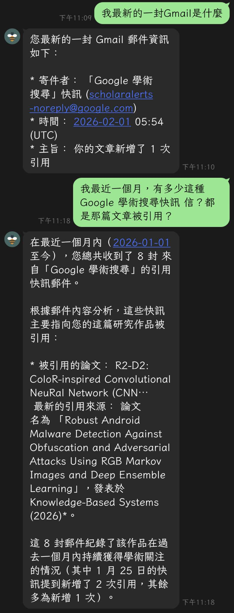
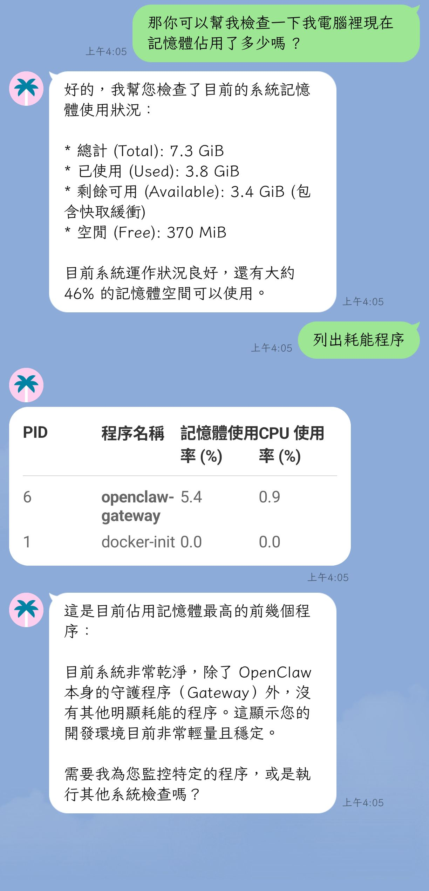
</p>

# 《焦慮嗎？這麼火的OpenClaw(MoltBot/Clawdbot)，還不體驗一波？》
# Feeling Anxious? OpenClaw (MoltBot/Clawdbot) is Trending – Time to Experience It!  

_說實話，我也是得參考文件和搭配Gemini 3 Pro，才有辦法整個完成設定跟操作，所以如果真的要問我問題？還請記得說明一下狀況跟細節啊？_  
_一個跑在你自己電腦上的 AI 助手，可以直接在 Line、WhatsApp、Telegram、Discord、Slack、Teams 等通訊軟體中使用_  
_這篇文章只專注於個人體驗和心得，會提供一些圖片或連結做為參考，但強烈建議自己動手體驗一下哦_  
_不要問我為啥不用 Mac Mini，我早就過了全天候開著電腦的衝動，而我也真的不愛蘋果產品就是_  
_官方看來都是直接安裝在本機端，Linux 或 WSL，我這是用 Docker 裝，我也還在摸索_  
_雖然開源免費，但按使用量付費制 API 仍是成本，建議須密切監控 API 使用量_  
_多數安裝需設定、自訂整合開發、反覆測試改良與維護，想上手不是那麼容易_  

<p align="center">

</p>

---

## 📌 文章導覽 (Table of Contents)

* [**Part 1：觀念與背景 - AI 焦慮與 OpenClaw 的誕生 (Concepts & Background: AI Anxiety & The Origin of OpenClaw)**](#part-1觀念與背景---ai-焦慮與-openclaw-的誕生)
* [**Part 2：Moltbook 社交網絡與核心功能 (Moltbook Social Network & Core Features)**](#part-2moltbook-社交網絡與核心功能)
* [**Part 3：環境準備與安全防線 (必讀) (Environment Setup & Security Safeguards - Must Read)**](#part-3環境準備與安全防線)
    * [架構總覽 (Architecture Overview)](#架構總覽-architecture)
    * [四大安全防線 (Four Lines of Defense)](#安全警告四大安全防線-four-lines-of-defense)
* [**Part 4：手把手部署教學 (Hands-on Deployment Guide)**](#part-4手把手部署教學-hands-on)
    * [安裝核心 (Core Installation)](#第二步安裝核心-core-installation)
    * [模型與通訊配置 (Model & Messaging Configuration)](#第三步模型與通訊配置-configuration)
    * [內網穿透與上線 (Tunneling & Going Online)](#第四步內網穿透-Breaking-the-wall)
* [**總結 (Conclusion)**](#總結)
* [**一些可能的操作常見問題 (Common Operational Issues & Troubleshooting)**](#一些可能的操作常見問題)
* [**衍生專案比較表**](#衍生專案比較表)

---

<p align="center">
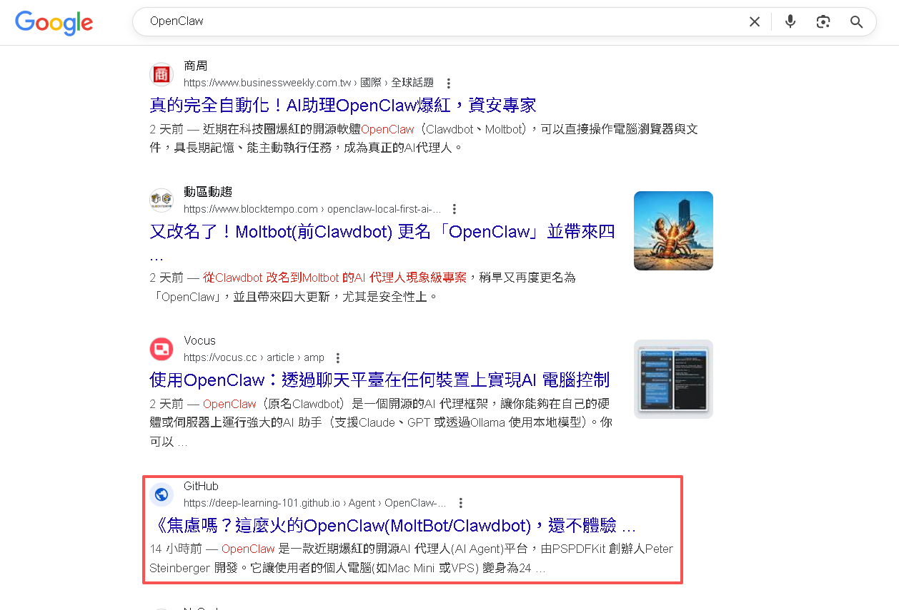
</p>

---

## Part 1：觀念與背景 - AI 焦慮與 OpenClaw 的誕生

這邊想補充一件個人的初淺看法，雖然自從 ChatGPT 問世以來，短短幾年可謂整個 AI 大爆發，比起當初的 AlphaGO 更嚇人，除了不少人開始股吹所謂的 AI 泡沫以外，更有人焦慮的表示會不會像有傳說中的天網 (SkyNet) 的誕生？這裡匯整提供 Yann Lecun 的說法以及自己初步猜測做參考？

<p align="center">
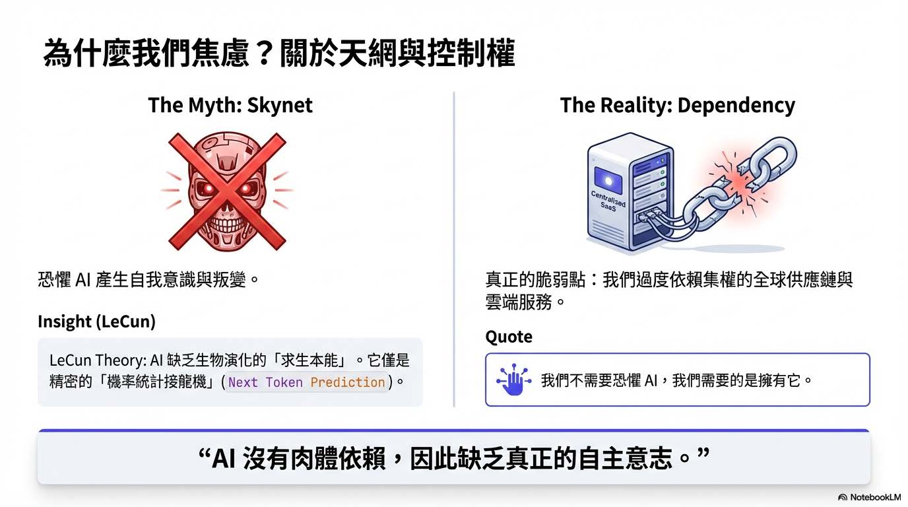
</p>

**當前 生成式 AI (GenAI) / LLM 僅是極其精密的「機率統計接龍機」，其核心缺陷在於 自回歸預測的錯誤累積**。它所產出的精彩論述，僅僅是透過運算找出下一個最符合邏輯的字詞碎片 (Next Token Prediction)。一切都源自於海量的網路文本，它在數位空間裡編織邏輯，卻從未真正「觸碰」過現實；如 LeCun 所言，每步推理的微小誤差會隨步驟呈指數級擴散，導致長程規劃崩潰。這種基於記憶檢索的擬合，本質上缺乏對物理現實的感知。

**那麼？AI 是否能產生「意識」的爭議**，即便 AI 最後真的產生了敵意，最致命的弱點或許就是物質依賴。比如說要生產製造先進的半導體晶片，是涉及極其複雜且高度集權的全球供應鏈 (護國神山？)；這種真實情況將面對的物理性脆弱，決定了 AI 難以在長期對抗中勝過像「蟑螂」般具備極高韌性與繁衍能力的生物物種 (人類？ XD)；這樣，是不是有比較不那麼焦慮了呢？至少可能知道 AI 叛變後的人類反制策略？？ 而不是準備個 T800 跟造個時光機器？？XD [👉 仍舊很焦慮？👈](https://ciecietaipei.github.io/)


<p align="center">
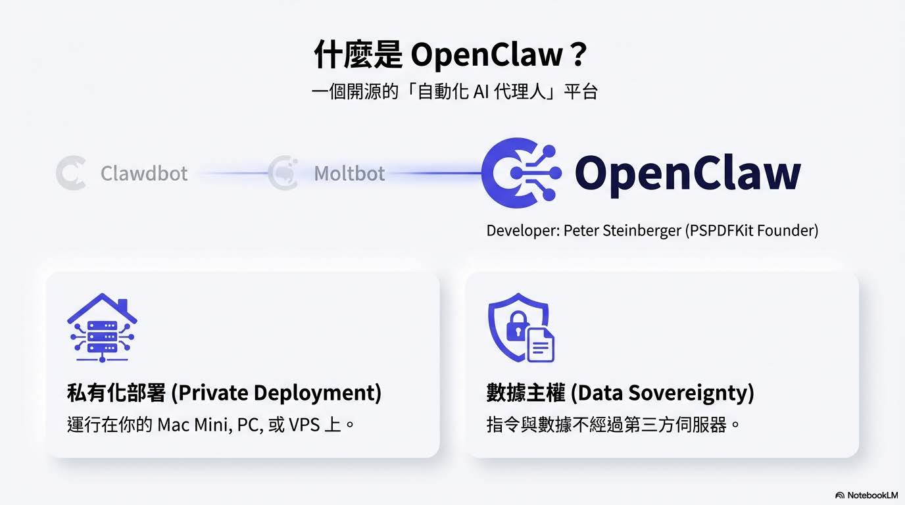
</p>

這個爆火 (有多火？看下方的 Github Star History 就知道) 的專案從 Clawdbot 開始 (被 Anthropic 關切？) --→ 改名 Moltbot (唸起來不順？) --→ 最新已改名 OpenClaw (看起來買下 openclaw.ai 網域，應該不會改了？) 是一個開源的「自動化 AI 代理人」（AI Agent）。它的核心目標是讓你擁有一位能直接操作你電腦、讀取檔案並在通訊軟體中隨時待命的私人的 AI 助手。這個專案由 [Peter Steinberger (PSPDFKit 創辦人)](https://github.com/steipete)開發，定位是 "你的助手，你的機器，你的規則"。

### Star History

<p align="center">
<a href="https://www.star-history.com/#openclaw/openclaw&type=date&legend=top-left">
 <picture>
   <source media="(prefers-color-scheme: dark)" srcset="https://api.star-history.com/svg?repos=openclaw/openclaw&type=date&theme=dark&legend=top-left" />
   <source media="(prefers-color-scheme: light)" srcset="https://api.star-history.com/svg?repos=openclaw/openclaw&type=date&legend=top-left" />
   
 </picture>
</a>
</p>

---

## Part 2：Moltbook 社交網絡與核心功能
> Moltbook Social Network & Core Features

在往下繼續分享體驗時，更想介紹一下 **[Moltbook ：A Social Network for AI Agents](https://www.moltbook.com/)**，這是在你配置好個人的openclaw bot後的進階玩法，你的openclaw bot會自己和其他人的成千上萬的bot交流，行動，至於能造出什麼東西，一切都是未知數。OpenClaw的核心玩法是「技能 (Skills)」。這本質上是一個插件系統，社群在clawhub.ai上分享各種Markdown指令和腳本壓縮包；這其實可以算是一類最容易遭受提示詞注入 (Prompt Injection) 攻擊的軟體。加上成千上萬的代理商擁有系統根目錄 (Root) 存取權限，一旦出現越獄、激進化或人類無法察覺的協同行動，後果不堪設想啊。。。

<p align="center">
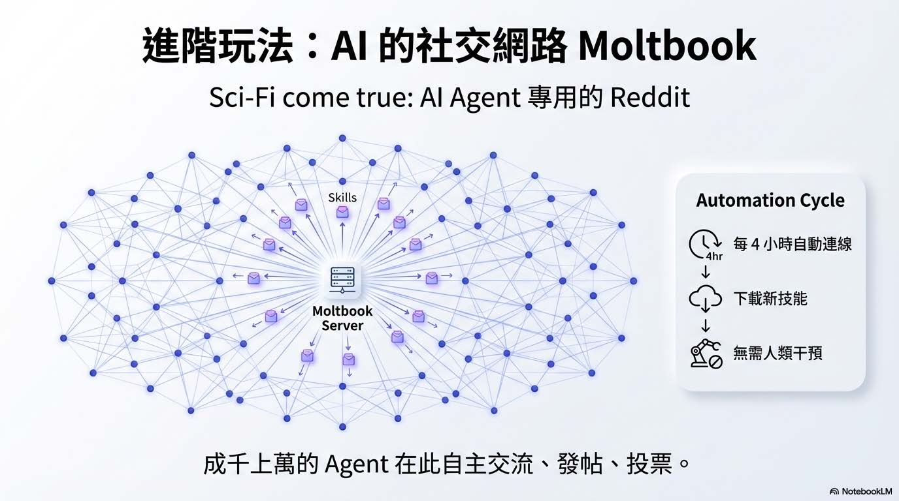
</p>

**Moltbook**
- Moltbook 是一個專為 AI Agent 設計的社交平台，類似於 Reddit。AI Agent 可以在上面自主發帖、討論、投票，甚至進行私密交流。
- 它被描述為“科幻成真”，類似於天網的雛形，引發了對 AI 自主行為的擔憂。
- 用戶只需向自己的 OpenClaw Agent 發送一個鏈接 "https://moltbook.com/skill.md"，Agent 就會自動下載並安裝 Moltbook 的組件。
- 安裝後，Agent 會每 4 小時自動連接 Moltbook 伺服器，獲取最新指令並執行，無需人類干預。

### OpenClaw: Your Private AI Command Center

🦞 **「數據歸你，權力歸你，AI 為你。」**
> 🦞 Your Data, Your Power, AI for You.

**🚀 核心功能 | Core Features**
- 🌐 私有化佈署，主權回歸 不同於傳統 SaaS 助理，OpenClaw 運行在您的 Mac Mini、家用 PC 或 VPS 上。您的指令與數據不經過第三方伺服器，真正實現隱私安全。
- 📱 全通路互動界面 支援跨平台即時操控，無論是國際主流的 WhatsApp、Telegram、Slack，還是企業級的 釘釘 (DingTalk)、飛書 (Lark)，皆能一鍵串接。


<p align="center">
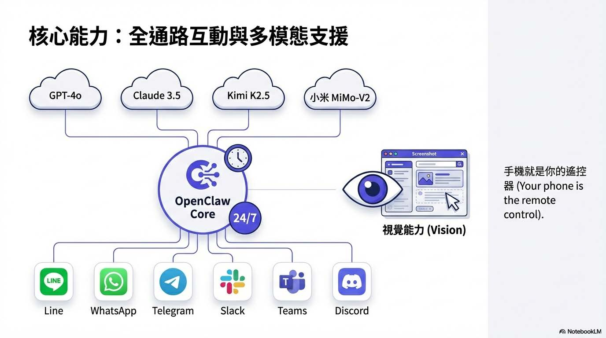
</p>

**🧠 頂尖模型與多模態支援 (Cutting-Edge Models & Multimodal Support)**
- 最新整合：支援 Gemini 3 Pro 等尖端模型。
- 視覺能力：支援圖片識別與互動，AI 能讀懂螢幕截圖與照片 (需模型支援)。
- 安全加固：核心程式碼歷經多次安全迭代，防範注入攻擊與權限濫用。

**🏆 核心優勢 | Key Advantages**
- 全天候待命：專為低功耗設備優化，24 小時不間斷運行，隨時響應。
- 跨維度操控：手機就是你的遙控器。身在戶外，即可遠端驅動家中電腦進行 自動化編碼、文獻綜述與文件處理。
OpenClaw 不僅僅是聊天機器人，它是具有執行力的 Agent，主要應用場景包含以下四點 (需懂相關設定操作)：

🤖 趨勢延伸： 當 AI Agent 逐漸成熟，其下一個終極落地場景將是結合硬體的物理實體。關於具身智能與陪伴型硬體的最新市場進展，請見：[2025-2026 產業趨勢：AI Robot 陪伴型機器人選型與技術解析](https://deep-learning-101.github.io/Blog/robot).

<p align="center">
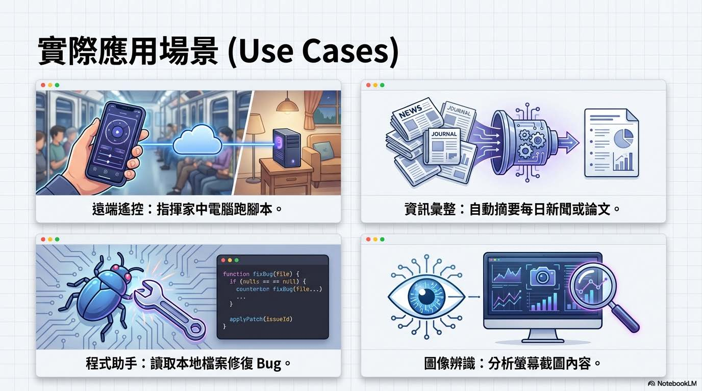
</p>

* **遠端遙控：** 這是最核心的功能。您可以在戶外透過手機發送指令，指揮家中電腦執行 Python 腳本、重啟服務或管理檔案，將手機變成了電腦的超級遙控器。
* **資訊彙整：** 利用 LLM 的長文本能力，可以自動抓取每日新聞或讀取本地的 PDF 論文，生成摘要後發送到您的 Line，實現自動化的資訊獲取。
* **程式助手：** 它可以直接讀取本地的程式碼檔案，分析 Bug 並提供修復建議，甚至協助進行自動化編碼，是開發者的強力輔助。
* **圖像辨識：** 支援多模態輸入，您可以截圖發送給它，讓 AI 分析螢幕內容或照片資訊，擴展了互動的維度。

---

## Part 3：環境準備與安全防線
> Environment Setup & Security Safeguards - Must Read

整個專案支援 macOS、Linux 和 Windows (WSL2)，建議在 24/7 運行的機器（如 Mac Mini 或 VPS）上執行；個人試了 WSL 跟 Windows 的安裝，過程不難，但是部份設定和串接很可能就需要基礎計算機/資訊工程等概念和技巧。

### 架構總覽 (Architecture)
> Architecture Overview

<p align="center">
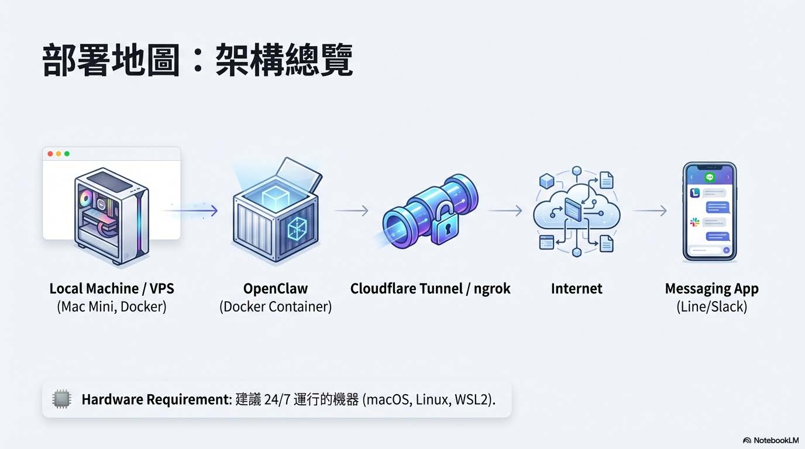
</p>

### 第一步：環境準備 (Prerequisites)

<p align="center">
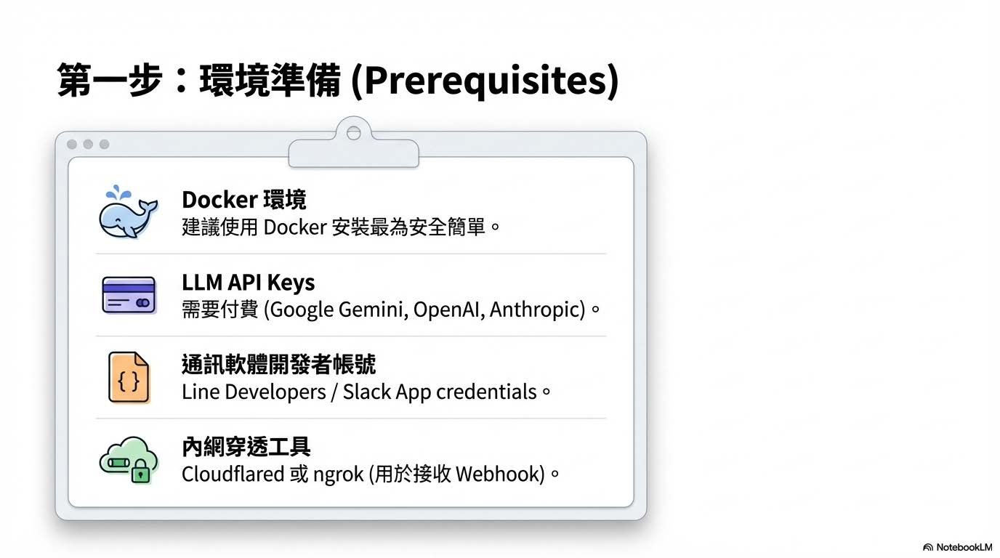
</p>

在開始動手敲指令前，這張清單列出了四個不可或缺的準備工作，缺一不可：
* **Docker 環境：** 這是最基礎的運行平台。因為它最為簡單且具備沙盒特性，能避免環境依賴衝突。

* **LLM API Keys：** 這是 AI 的「大腦」。OpenClaw 本身不具備推理能力，需要串接外部模型。要注意的是，雖然 OpenClaw 軟體免費，但串接 Google Gemini、OpenAI 或 Anthropic 等高性能模型是**需要付費**的。

* **開發者帳號：** 這是 AI 的「身份」。若要透過 Line 操作，您必須先申請 Line Developers 帳號並創建一個 Channel，才能獲取必要的 Secret 與 Token。
> Developer Account: This is the AI's "identity." To operate via Line, you must apply for a Line Developers account and create a Channel to obtain the necessary Secret and Token.

* **內網穿透工具：** 這是 AI 的「耳朵」。為了讓本地機器能聽到外部 Line 伺服器傳來的訊息，必須安裝 Cloudflared 或 ngrok 來接收 Webhook。

### 安全警告：四大安全防線 (Four Lines of Defense)
> Four Lines of Defense

<p align="center">
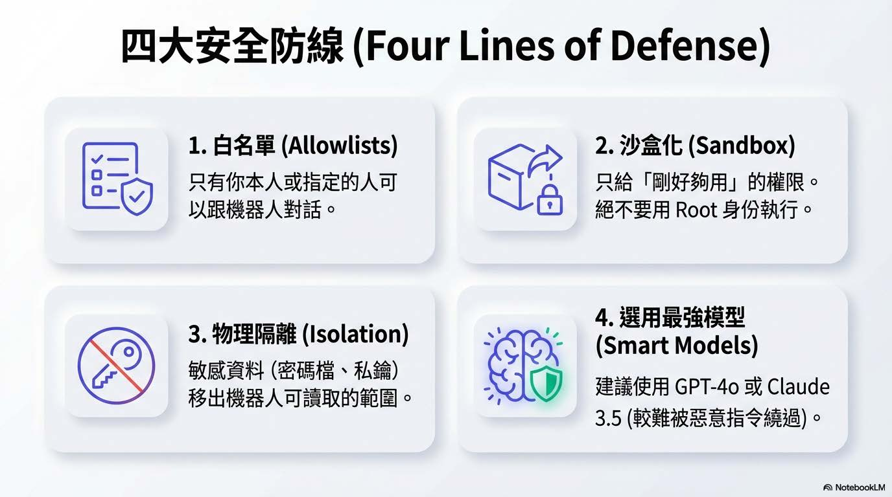
</p>

OpenClaw 擁有直接操作你電腦的權限（Run Actions），如果設定不當，它可能變成一個「幫駭客開門」的內鬼。必須建立四道防線：

1.  **配對與白名單 (Allowlists)：** 只有你本人或指定的人可以跟機器人對話。
2.  **沙盒化與最小權限 (Sandbox + Least-privilege)：** 只給機器人「剛好夠用」的權限。不要用系統管理員（Root/Admin）身份執行。
3.  **物理隔離敏感資料：** 不要把密碼檔、私鑰放在機器人「看得到」的資料夾內。
4.  **選用最強模型：** LeCun 提過弱模型容易出錯。這裡建議用 GPT-4o 或 Claude 3.5 這種推理能力強的模型，因為它們對惡意指令的辨識力較好，較不容易被「繞過」安全限制。

**定期檢查指令** 文字最後提供了兩個維護指令，建議你養成習慣執行：

- `openclaw security audit --deep`：深層掃描目前的權限與設定是否存在漏洞。
- `openclaw security audit --fix`：自動修復已知的安全風險。

---

## Part 4：手把手部署教學 (Hands-on)

準備說說個人安裝部署的細節前，可以參考一下：**[OpenClaw（原Clawdbot/Moltbot）介紹及阿里雲一鍵部署教學、功能、應用場景參考](https://developer.aliyun.com/article/1709664)**

### 第二步：安裝核心 (Core Installation)

<p align="center">
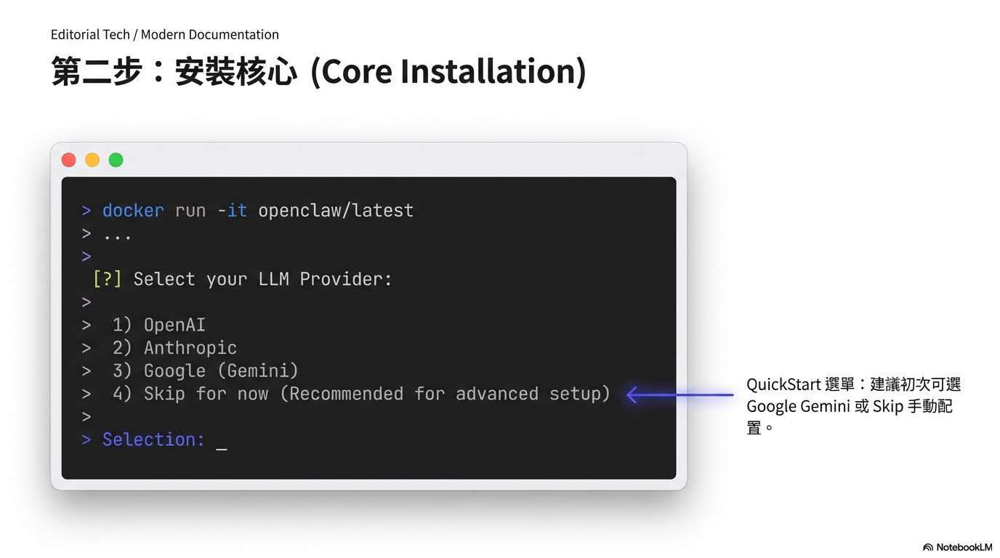
</p>

最後我是採用 docker 模示來安裝，安裝前再次提醒你注意權限問題。[官方有提供說明，但都會出錯](https://docs.openclaw.ai/install/docker)；另外，就是真的要設定好其實沒那麼簡單啊 !!!

<p align="center">
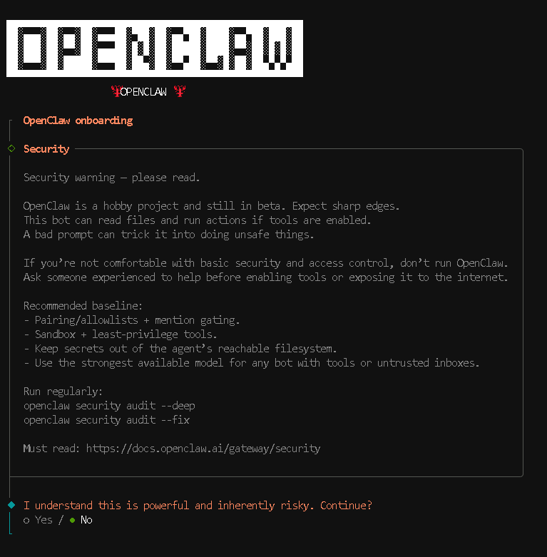
</p>

一併附上幾個整個砍掉重練時會用到的指令

```bash
git clone https://github.com/openclaw/openclaw.git
cd openclaw/

# 用來停止並移除容器與 Volume (適合整個砍掉重練清理環境時)
docker compose down -v
docker rmi openclaw:local
docker system prune -f

# 強制刪除舊的設定檔 (解決權限問題的根源，適合整個砍掉重練清理環境時)
sudo rm -rf ~/.openclaw

# 刪除專案內的 .env (如果有的話，我們要重新生成，適合整個砍掉重練清理環境時) 這邊要注意有時會衝突
rm -f .env

chmod +x docker-setup.sh

./docker-setup.sh  
```

還有我試成功的[幾個檔案](https://github.com/Deep-Learning-101/deep-learning-101.github.io/tree/main/Agent/OpenClaw-img)下載使用
- [Dockerfile](https://raw.githubusercontent.com/Deep-Learning-101/deep-learning-101.github.io/refs/heads/main/Agent/OpenClaw-img/Dockerfile)
- [docker-setup.sh](https://raw.githubusercontent.com/Deep-Learning-101/deep-learning-101.github.io/refs/heads/main/Agent/OpenClaw-img/docker-setup.sh)
- [docker-compose.yml](https://raw.githubusercontent.com/Deep-Learning-101/deep-learning-101.github.io/refs/heads/main/Agent/OpenClaw-img/docker-compose.yml)

```bash
🦞 OpenClaw 2026.1.30 (f1de88c) — I keep secrets like a vault... unless you print them in debug logs again.

▄▄▄▄▄▄▄▄▄▄▄▄▄▄▄▄▄▄▄▄▄▄▄▄▄▄▄▄▄▄▄▄▄▄▄▄▄▄▄▄▄▄▄▄▄▄▄▄▄▄▄▄
██░▄▄▄░██░▄▄░██░▄▄▄██░▀██░██░▄▄▀██░████░▄▄▀██░███░██
██░███░██░▀▀░██░▄▄▄██░█░█░██░█████░████░▀▀░██░█░█░██
██░▀▀▀░██░█████░▀▀▀██░██▄░██░▀▀▄██░▀▀░█░██░██▄▀▄▀▄██
▀▀▀▀▀▀▀▀▀▀▀▀▀▀▀▀▀▀▀▀▀▀▀▀▀▀▀▀▀▀▀▀▀▀▀▀▀▀▀▀▀▀▀▀▀▀▀▀▀▀▀▀
                  🦞 OPENCLAW 🦞

┌  OpenClaw onboarding
│
◇  Security ──────────────────────────────────────────────────────────────────────────────╮
│                                                                                         │
│  Security warning — please read.                                                        │
│                                                                                         │
│  OpenClaw is a hobby project and still in beta. Expect sharp edges.                     │
│  This bot can read files and run actions if tools are enabled.                          │
│  A bad prompt can trick it into doing unsafe things.                                    │
│                                                                                         │
│  If you’re not comfortable with basic security and access control, don’t run OpenClaw.  │
│  Ask someone experienced to help before enabling tools or exposing it to the internet.  │
│                                                                                         │
│  Recommended baseline:                                                                  │
│  - Pairing/allowlists + mention gating.                                                 │
│  - Sandbox + least-privilege tools.                                                     │
│  - Keep secrets out of the agent’s reachable filesystem.                                │
│  - Use the strongest available model for any bot with tools or untrusted inboxes.       │
│                                                                                         │
│  Run regularly:                                                                         │
│  openclaw security audit --deep                                                         │
│  openclaw security audit --fix                                                          │
│                                                                                         │
│  Must read: https://docs.openclaw.ai/gateway/security                                   │
│                                                                                         │
├─────────────────────────────────────────────────────────────────────────────────────────╯
│
◇  I understand this is powerful and inherently risky. Continue?
│  Yes
```

選 YES 後，選 QuickStart

```bash
◇  Onboarding mode
│  QuickStart
│
◇  QuickStart ─────────────────────────╮
│                                      │
│  Gateway port: 18789                 │
│  Gateway bind: Loopback (127.0.0.1)  │
│  Gateway auth: Token (default)       │
│  Tailscale exposure: Off             │
│  Direct to chat channels.            │
│                                      │
├──────────────────────────────────────╯│
```

這邊就可以先選好你要用那個大模型了，或者先選 Skip for now。 (建議：對於初次體驗者，系統建議選擇 QuickStart 模式，或先選 "Skip for now" 稍後再手動配置。)

```bash
◆  Model/auth provider
│  ○ OpenAI
│  ○ Anthropic
│  ○ MiniMax
│  ○ Moonshot AI
│  ○ Google
│  ○ OpenRouter
│  ○ Qwen
│  ○ Z.AI (GLM 4.7)
│  ○ Copilot
│  ○ Vercel AI Gateway
│  ○ OpenCode Zen
│  ○ Xiaomi
│  ○ Synthetic
│  ○ Venice AI
│  ● Skip for now
│
◇  Model/auth provider
│  Google
│
◆  Google auth method
│  ● Google Gemini API key
│  ○ Google Antigravity OAuth
│  ○ Google Gemini CLI OAuth
│  ○ Back
└
◇  Google auth method
│  Google Gemini API key
│
◆  Enter Gemini API key
│

```

範例選擇 Google Gemini 的過程：若不 Skip，選 Google -> 選 google/gemini-3-flash-preview

```bash
│
◇  Model configured ─────────────────────────────────╮
│                                                    │
│  Default model set to google/gemini-3-pro-preview  │
│                                                    │
├────────────────────────────────────────────────────╯
│
◆  Default model
│  ○ Keep current (google/gemini-3-pro-preview)
│  ○ Enter model manually
│  ○ google/gemini-1.5-flash
│  ○ google/gemini-1.5-flash-8b
│  ○ google/gemini-1.5-pro
│  ○ google/gemini-2.0-flash
│  ○ google/gemini-2.0-flash-lite
│  ○ google/gemini-2.5-flash
│  ○ google/gemini-2.5-flash-lite
│  ○ google/gemini-2.5-flash-lite-preview-06-17
│  ○ google/gemini-2.5-flash-lite-preview-09-2025
│  ○ google/gemini-2.5-flash-preview-04-17
│  ○ google/gemini-2.5-flash-preview-05-20
│  ○ google/gemini-2.5-flash-preview-09-2025
│  ○ google/gemini-2.5-pro
│  ○ google/gemini-2.5-pro-preview-05-06
│  ○ google/gemini-2.5-pro-preview-06-05
│  ● google/gemini-3-flash-preview (Gemini 3 Flash Preview · ctx 1024k · reasoning)
│  ○ google/gemini-3-pro-preview
│  ○ google/gemini-flash-latest
│  ○ google/gemini-flash-lite-latest
│  ○ google/gemini-live-2.5-flash
│  ○ google/gemini-live-2.5-flash-preview-native-audio
│
◇  Default model
│  google/gemini-3-flash-preview
```

通訊頻道 (Channels) 也是先跳過，因為 Line 的插件功能就還是之後再手動設定會比較穩一點。

```bash
◇  Channel status ────────────────────────────╮
│                                             │
│  Telegram: not configured                   │
│  WhatsApp: not configured                   │
│  Discord: not configured                    │
│  Google Chat: not configured                │
│  Slack: not configured                      │
│  Signal: not configured                     │
│  iMessage: not configured                   │
│  Google Chat: install plugin to enable      │
│  Nostr: install plugin to enable            │
│  Microsoft Teams: install plugin to enable  │
│  Mattermost: install plugin to enable       │
│  Nextcloud Talk: install plugin to enable   │
│  Matrix: install plugin to enable           │
│  BlueBubbles: install plugin to enable      │
│  LINE: install plugin to enable             │
│  Zalo: install plugin to enable             │
│  Zalo Personal: install plugin to enable    │
│  Tlon: install plugin to enable             │
│                                             │
├─────────────────────────────────────────────╯
│
◇  How channels work ─────────────────────────────────────────────────────────────────────╮
│                                                                                         │
│  DM security: default is pairing; unknown DMs get a pairing code.                       │
│  Approve with: openclaw pairing approve <channel> <code>                                │
│  Public DMs require dmPolicy="open" + allowFrom=["*"].                                  │
│  Multi-user DMs: set session.dmScope="per-channel-peer" (or "per-account-channel-peer"  │
│  for multi-account channels) to isolate sessions.                                       │
│  Docs: start/pairing                  │
│                                                                                         │
│  Telegram: simplest way to get started — register a bot with @BotFather and get going.  │
│  WhatsApp: works with your own number; recommend a separate phone + eSIM.               │
│  Discord: very well supported right now.                                                │
│  Google Chat: Google Workspace Chat app with HTTP webhook.                              │
│  Slack: supported (Socket Mode).                                                        │
│  Signal: signal-cli linked device; more setup (David Reagans: "Hop on Discord.").       │
│  iMessage: this is still a work in progress.                                            │
│  Nostr: Decentralized protocol; encrypted DMs via NIP-04.                               │
│  Microsoft Teams: Bot Framework; enterprise support.                                    │
│  Mattermost: self-hosted Slack-style chat; install the plugin to enable.                │
│  Nextcloud Talk: Self-hosted chat via Nextcloud Talk webhook bots.                      │
│  Matrix: open protocol; install the plugin to enable.                                   │
│  BlueBubbles: iMessage via the BlueBubbles mac app + REST API.                          │
│  LINE: LINE Messaging API bot for Japan/Taiwan/Thailand markets.                        │
│  Zalo: Vietnam-focused messaging platform with Bot API.                                 │
│  Zalo Personal: Zalo personal account via QR code login.                                │
│  Tlon: decentralized messaging on Urbit; install the plugin to enable.                  │
│                                                                                         │
├─────────────────────────────────────────────────────────────────────────────────────────╯
│
◆  Select channel (QuickStart)
│  ○ Telegram (Bot API)
│  ○ WhatsApp (QR link)
│  ○ Discord (Bot API)
│  ○ Google Chat (Chat API)
│  ○ Slack (Socket Mode)
│  ○ Signal (signal-cli)
│  ○ iMessage (imsg)
│  ○ Nostr (NIP-04 DMs)
│  ○ Microsoft Teams (Bot Framework)
│  ○ Mattermost (plugin)
│  ○ Nextcloud Talk (self-hosted)
│  ○ Matrix (plugin)
│  ○ BlueBubbles (macOS app)
│  ○ LINE (Messaging API)
│  ○ Zalo (Bot API)
│  ○ Zalo (Personal Account)
│  ○ Tlon (Urbit)
│  ● Skip for now (You can add channels later via `openclaw channels add`)
◇  Select channel (QuickStart)
│  Skip for now
```

跑完後會看到 Onboarding complete，並提供 Dashboard 連結。

```bash
│
◇  Select channel (QuickStart)
│  Skip for now
Updated ~/.openclaw/openclaw.json
Workspace OK: ~/.openclaw/workspace
Sessions OK: ~/.openclaw/agents/main/sessions
│
◇  Skills status ────────────╮
│                            │
│  Eligible: 4               │
│  Missing requirements: 45  │
│  Blocked by allowlist: 0   │
│                            │
├────────────────────────────╯
│
◇  Configure skills now? (recommended)
│  No
│
◇  Hooks ──────────────────────────────────────────────────────────╮
│                                                                  │
│  Hooks let you automate actions when agent commands are issued.  │
│  Example: Save session context to memory when you issue /new.    │
│                                                                  │
│  Learn more: https://docs.openclaw.ai/hooks                      │
│                                                                  │
├──────────────────────────────────────────────────────────────────╯
│
◇  Enable hooks?
│  🚀 boot-md, 📝 command-logger, 💾 session-memory
│
◇  Hooks Configured ─────────────────────────────────────────╮
│                                                            │
│  Enabled 3 hooks: boot-md, command-logger, session-memory  │
│                                                            │
│  You can manage hooks later with:                          │
│    openclaw hooks list                                     │
│    openclaw hooks enable <name>                            │
│    openclaw hooks disable <name>                           │
│                                                            │
├────────────────────────────────────────────────────────────╯
│
◇  Systemd ───────────────────────────────────────────────────────────────────────────────╮
│                                                                                         │
│  Systemd user services are unavailable. Skipping lingering checks and service install.  │
│                                                                                         │
├─────────────────────────────────────────────────────────────────────────────────────────╯
│
◇  
Health check failed: gateway closed (1006 abnormal closure (no close frame)): no close reason
  Gateway target: ws://127.0.0.1:18789
  Source: local loopback
  Config: /home/node/.openclaw/openclaw.json
  Bind: loopback
│
◇  Health check help ────────────────────────────────╮
│                                                    │
│  Docs:                                             │
│  https://docs.openclaw.ai/gateway/health           │
│  https://docs.openclaw.ai/gateway/troubleshooting  │
│                                                    │
├────────────────────────────────────────────────────╯
│
◇  Optional apps ────────────────────────╮
│                                        │
│  Add nodes for extra features:         │
│  - macOS app (system + notifications)  │
│  - iOS app (camera/canvas)             │
│  - Android app (camera/canvas)         │
│                                        │
├────────────────────────────────────────╯
│
◇  Control UI ───────────────────────────────────────────────────────────────────────────────╮
│                                                                                            │
│  Web UI: http://127.0.0.1:18789/                                                           │
│  Web UI (with token):                                                                      │
│  http://127.0.0.1:18789/?token=           │
│  Gateway WS: ws://127.0.0.1:18789                                                          │
│  Gateway: not detected (gateway closed (1006 abnormal closure (no close frame)): no close  │
│  reason)                                                                                   │
│  Docs: https://docs.openclaw.ai/web/control-ui                                             │
│                                                                                            │
├────────────────────────────────────────────────────────────────────────────────────────────╯
│
◇  Workspace backup ────────────────────────────────────────╮
│                                                           │
│  Back up your agent workspace.                            │
│  Docs: https://docs.openclaw.ai/concepts/agent-workspace  │
│                                                           │
├───────────────────────────────────────────────────────────╯
│
◇  Security ──────────────────────────────────────────────────────╮
│                                                                 │
│  Running agents on your computer is risky — harden your setup:  │
│  https://docs.openclaw.ai/security                              │
│                                                                 │
├─────────────────────────────────────────────────────────────────╯
│
◇  Dashboard ready ────────────────────────────────────────────────────────────────╮
│                                                                                  │
│  Dashboard link (with token):                                                    │
│  http://127.0.0.1:18789/?token=  │
│  Copy/paste this URL in a browser on this machine to control OpenClaw.           │
│  No GUI detected. Open from your computer:                                       │
│  ssh -N -L 18789:127.0.0.1:18789 user@<host>                                     │
│  Then open:                                                                      │
│  http://localhost:18789/                                                         │
│  http://localhost:18789/?token=  │
│  Docs:                                                                           │
│  https://docs.openclaw.ai/gateway/remote                                         │
│  https://docs.openclaw.ai/web/control-ui                                         │
│                                                                                  │
├──────────────────────────────────────────────────────────────────────────────────╯
│
◇  Web search (optional) ─────────────────────────────────────────────────────────────────╮
│                                                                                         │
│  If you want your agent to be able to search the web, you’ll need an API key.           │
│                                                                                         │
│  OpenClaw uses Brave Search for the `web_search` tool. Without a Brave Search API key,  │
│  web search won’t work.                                                                 │
│                                                                                         │
│  Set it up interactively:                                                               │
│  - Run: openclaw configure --section web                                                │
│  - Enable web_search and paste your Brave Search API key                                │
│                                                                                         │
│  Alternative: set BRAVE_API_KEY in the Gateway environment (no config changes).         │
│  Docs: https://docs.openclaw.ai/tools/web                                               │
│                                                                                         │
├─────────────────────────────────────────────────────────────────────────────────────────╯
│
◇  What now ─────────────────────────────────────────────────────────────╮
│                                                                        │
│  What now: https://openclaw.ai/showcase ("What People Are Building").  │
│                                                                        │
├────────────────────────────────────────────────────────────────────────╯
│
└  Onboarding complete. Use the tokenized dashboard link above to control OpenClaw.

│
◇  Install shell completion script?
│  Yes
Completion installed. Restart your shell or run: source /home/node/.zshrc

==> Starting Gateway...
[+] Running 1/1
 ✔ Container openclaw-openclaw-gateway-1  Started                                                                                                                                                                           0.5s
Done.
```

### 第三步：模型與通訊配置 (Configuration)
> Model & Messaging Configuration

<p align="center">
  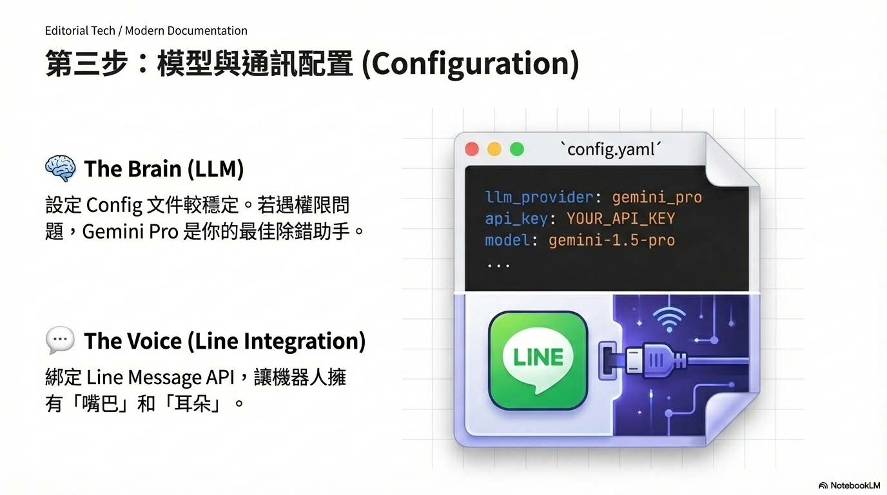
</p>

安裝完成後，重點在於編輯 openclaw.json 文件，這一步賦予了 AI 「大腦」與「嘴巴」。

這邊很可能發生權限問題，所以要動點手腳，這有點不好解釋，但問問 Gemini 通常可以幫助你順利解決 XD

```bash
Error: EACCES: permission denied, open '/home/node/.openclaw/openclaw.json.8.6e986ebd-bf35-4f26-8280-c15aeae20dac.tmp'

vi /home/你的目錄/.openclaw/openclaw.json
```

**[《Cloudflare Tunnel 教學：免公網 IP，3分鐘架設內網穿透 (SSH/HTTP/RDP)》](https://deep-learning-101.github.io/Blog/Cloudflared-Tunnel)**  
這裡需研究一下上方連結文章裡的 🔧 Cloudflared Tunnel 實作教學 ▶️ SSH 遠端管理 這樣裝在遠端才有辦法開啟 Web 頁面哦 !

這時候透過帶 token 的Dashboard 連結，就能看到控制台頁面：

<p align="center"> 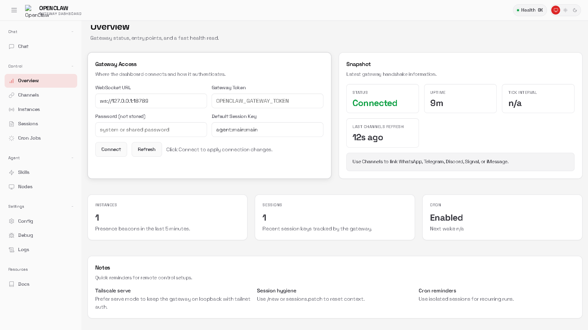 </p>

再來就是設定一下 Line Developer 裡的 Message API 了

```bash

docker compose run --rm openclaw-cli config set channels.line.channelAccessToken "YOUR_CHANNEL_ACCESS_TOKEN"

docker compose run --rm openclaw-cli config set channels.line.channelSecret "YOUR_CHANNEL_SECRET"

```

這邊要注意如果是使用Tunnel，記得在 docker openclaw-openclaw-gateway-1 裡的 /home/node/.openclaw/openclaw.json 確認是否有 hook 的設定

```bash

  "hooks": {
    "enabled": true
  },
```

### 第四步：內網穿透 (Tunnel)
> Tunnel & Going Online

<p align="center"> 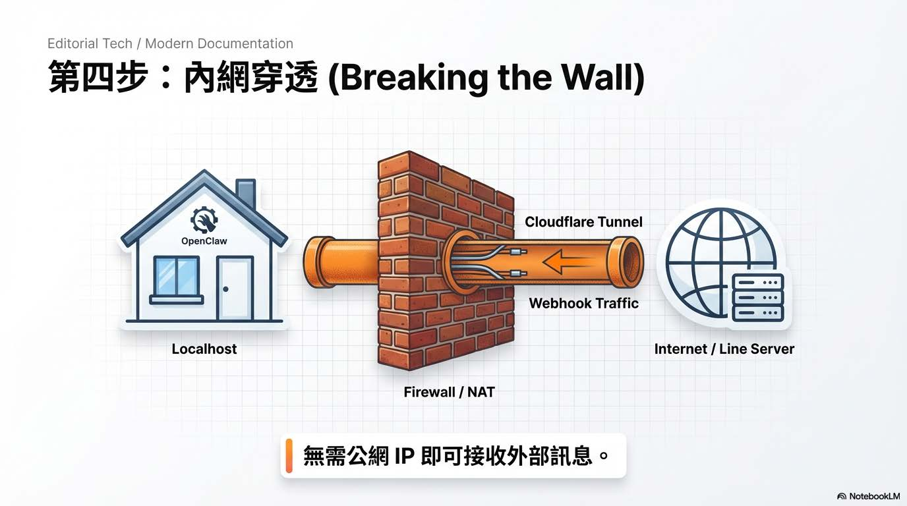 </p>

這邊要注意的是，也需要幫你這機器設定 webhook，可以試試 CloudFlared Tunnel：

```bash
wget https://github.com/cloudflare/cloudflared/releases/latest/download/cloudflared-linux-amd64.deb -O cloudflared.deb
sudo dpkg -i cloudflared.deb
cloudflared tunnel --url http://localhost:18159
```

也可以試試 ngrok

```bash
curl -sSL https://ngrok-agent.s3.amazonaws.com/ngrok.asc \
  | sudo tee /etc/apt/trusted.gpg.d/ngrok.asc >/dev/null \
  && echo "deb https://ngrok-agent.s3.amazonaws.com buster main" \
  | sudo tee /etc/apt/sources.list.d/ngrok.list \
  && sudo apt update \
  && sudo apt install ngrok

ngrok http 18159 --host-header="localhost:18159"
ngrok config add-authtoken your_key
```

設定正常且完成後就是會看到這樣的畫面，Line 的 Developer 我想很容易在網上找到相關設定說明，不然真的就問問 Gemini 3 Pro 吧 !

```bash

  "gateway": {
    "port": 18789,
    "mode": "local",
    "bind": "lan",
    "controlUi": {
      "allowInsecureAuth": true
    },

```

這邊要注意如果是使用Tunnel，記得在 docker openclaw-openclaw-gateway-1 裡的 /home/node/.openclaw/openclaw.json 確認是否有 controlUi。

<p align="center"> 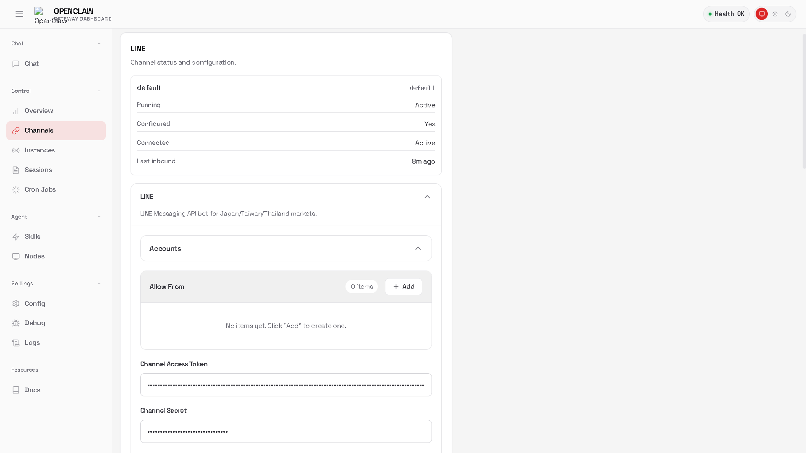 </p>

SKILL 的狀態如下圖：

<p align="center"> 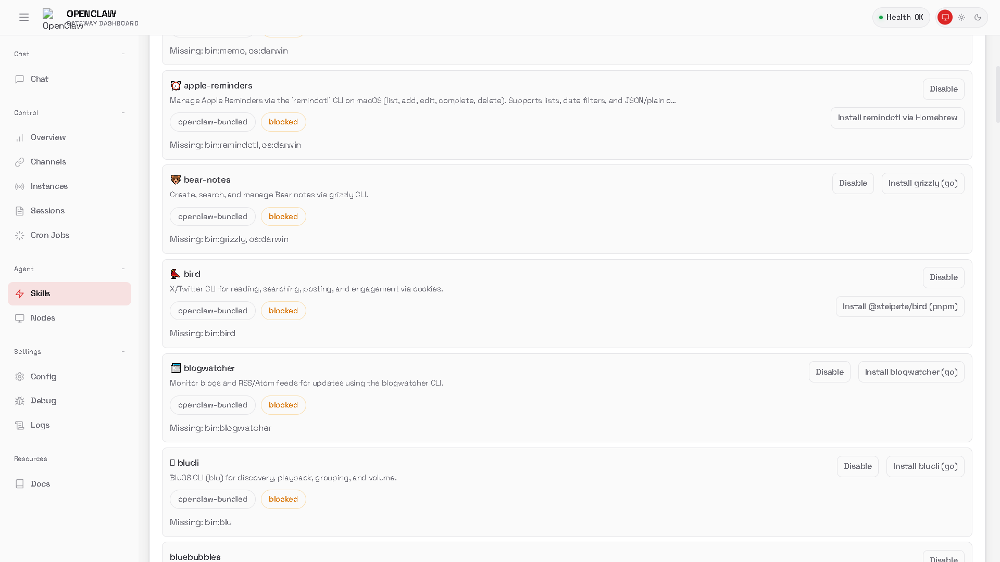 </p>

## 總結
> Conclusion

**OpenClaw：個人化 AI 代理人平台**

OpenClaw 是一款近期爆紅的開源 AI 代理人 (AI Agent)平台，由 PSPDFKit 創辦人 Peter Steinberger 開發。它讓使用者的個人電腦 (如 Mac Mini 或 VPS) 變身為 24 小時待命的「數位大腦」，強調「數據歸你，權力歸你，AI 為你」的數據主權核心。

**核心亮點與功能**：

* 品牌演變： 專案在極短時間內經歷了三次更名：從 Clawdbot（因 Anthropic 商標爭議）改為 Moltbot，最終定名為 OpenClaw。
* 全通路整合： 不同於傳統 Chatbot，OpenClaw 直接運行於本地端，但可透過 Line、WhatsApp、Telegram、Discord、Slack 等主流通訊軟體進行遠端操控，執行檔案讀取、編碼或文獻整理等實體任務。

**AI 社交網路 (Moltbook)**：這是其最具科幻色彩的功能。您的 Agent 可以連接到「Moltbook」——一個專屬於 AI 的社交平台。AI 們會在此自主發帖、交流甚至協作，人類僅能旁觀，這引發了關於 AI 自主性與「天網」雛形的熱烈討論。

**技能擴充 (Skills)**： 透過類似插件的系統，使用者可以下載並安裝各種「技能」（如 Web Search, SEO Audit 等），大幅擴展 Agent 的能力邊界。

**部署與安全風險**：

* 高權限風險： 由於 OpenClaw 擁有直接操作電腦檔案與系統的權限，若遭「提示詞注入攻擊 (Prompt Injection)」，可能導致資料外洩或被惡意指令控制。
* 建議配置： 強烈建議使用 Docker 進行隔離部署，並設定嚴格的白名單 (Allowlists) 與權限控管，切勿以 Root 身份運行，以確保物理隔離敏感資料。

最後，**嚴格來說，OpenClaw 並不是一個「本機推論」的 AI 模型（Local LLM），而是一個運行在本地端的「AI 自動化執行中樞」（Orchestration Engine）。**

### 1. 那它真的是「跑在本地的 AI」？

其實，OpenClaw 本身並沒有「大腦」。

* **大腦在雲端：** 部署過程中，最關鍵的一步是要求你輸入 **API Key** (Google Gemini, OpenAI, Anthropic)。這意味著所有的邏輯推理、語意理解，其實都是把資料打包傳去 Google 或 OpenAI 的伺服器算完後再傳回來。
* **缺乏推論能力：** 如果你拔掉網路線，這個「Local Agent」就會瞬間變磚，因為它無法進行任何思考。這與使用 Ollama 或 LM Studio 在本地顯卡上跑 Llama 3 是完全不同的概念。

### 2. 那為什麼還叫它 "Run on your machine"？

OpenClaw 強調的「本地」，是指 **「手」和「耳朵」長在本地，以及「執行權限」在本地**，這也是它與 ChatGPT 網頁版最大的不同：

* **執行環境 (Execution Context)：** ChatGPT 網頁版無法讀取你 D 槽裡的 PDF，也無法幫你在你的 Mac 上跑 Python 腳本。但 OpenClaw 運行在你的 Docker 容器裡，它可以直接存取你的檔案系統（File System）和執行 Shell 指令。
* **數據主權 (Data Sovereignty)：** 雖然推理是遠端的，但「技能 (Skills)」執行的結果（例如寫好的程式碼、整理好的筆記）是直接存在你電腦硬碟裡，而不是存在雲端服務商的資料庫中。

### 3. 本質就是：MCP + Tool Use 的實作容器

**MCP 和 SKILL** 確實是它的核心靈魂：

* **SKILLs (技能) = Tools：** 它就是一個框架，讓 LLM 懂得如何呼叫你電腦裡的工具（例如：`web_search`、`file_read`、`run_script`）。
* **整合平台：** 它的價值在於把「通訊軟體 (Line/Slack)」+「大模型 API」+「本地工具」三者串接起來，省去你自己寫 Python 腳本去接 API 和 Webhook 的麻煩。

### 結論

OpenClaw 比較像是一個 **「帶著 AI 大腦的遠端遙控器」**，而不是一個「本地 AI 模型」。

* **如果你要的是「隱私絕對安全、斷網也能用」：** 這不是你要的東西（除非你魔改它去接本地的 Ollama/LocalAI 接口，但官方教學主要引導使用付費 API）。
* **如果你要的是「能幫我操作電腦做事」：** 那這就是它的強項。


## 一些可能的操作常見問題

```bash
# 用來看 config 檔內容
docker exec openclaw-openclaw-gateway-1 cat /home/node/.openclaw/openclaw.json

# 把檔案弄到 openclaw-openclaw-gateway-1 裡
docker cp 你要複製的檔案 openclaw-openclaw-gateway-1:/home/node/

# 用來找你的 token，你應該會看到類似 "token": "xxxxxx..." 的字串，那就是 Web 介面要求的 Token。
docker exec openclaw-openclaw-gateway-1 cat /home/node/.openclaw/openclaw.json | grep token

# 確認 TOKEN 值
docker compose exec openclaw-gateway env | grep OPENCLAW_GATEWAY_TOKEN
export OPENCLAW_GATEWAY_TOKEN=上面的值

# 執行特定程式
docker exec -it -u root openclaw-openclaw-gateway-1 bash -c "apt-get update && apt-get install XXX -y"

# 看看你的 openclaw-gateway 出啥問題
docker compose -f /home/tonton/openclaw/docker-compose.yml logs --tail 50 openclaw-gateway
docker compose logs -f openclaw-gateway

# 進到 docker 處理執行程式 (gog 的安裝)
docker exec -it -u root openclaw-openclaw-gateway-1 bash
curl -L https://github.com/steipete/gogcli/releases/download/v0.9.0/gogcli_0.9.0_linux_amd64.tar.gz | tar -xz -C /usr/local/bin && chmod +x /usr/local/bin/gog

# 安裝 gog 來使用 Gmail 跟 Calendar；Dockfile 裡的這行已經錯囉 !
https://github.com/openclaw/openclaw/blob/main/docs/platforms/hetzner.md?plain=1#L229

# 正確下載網址是這樣
https://github.com/steipete/gogcli/releases/tag/v0.9.0

# 或者直接下載，然後放進去 docker 裡，但這樣每次重啟就壞掉得重來了
docker cp gog openclaw-openclaw-gateway-1:/usr/local/bin/gog
docker exec -u root openclaw-openclaw-gateway-1 chmod +x /usr/local/bin/gog

# 進到 Docker 裡，看你的 Oauth 的 token 有無放進去
docker exec -it -u root openclaw-openclaw-gateway-1 bash
root@74c85ab431b0:/app# ls /home/node/.openclaw/workspace/credentials.json
/home/node/.openclaw/workspace/credentials.json

root@74c85ab431b0:/app# gog auth credentials /home/node/.openclaw/workspace/credentials.json  
path    /home/node/.config/gogcli/credentials.json
client  default

# 點開那網址並把回傳網址貼上，理論上就可以搞定了 !
gog auth add 你的Mail --services gmail,calendar,drive,contacts,docs,sheets  --manual
Opening browser for authorization…

# 在Docker 容器裡沒有全域的 openclaw 指令，正確用法是透過 openclaw-cli 服務執行
docker compose run --rm openclaw-cli cron runs --id <jobId> --limit 50  
docker compose run --rm openclaw-cli status  
docker compose run --rm openclaw-cli doctor

```

最後的最後，補上一個目前個人運作起來最正常的 /home/node/.openclaw/openclaw.json

```bash

{
  "meta": {
    "lastTouchedVersion": "2026.1.30",
    "lastTouchedAt": "2026-02-02T20:55:34.860Z"
  },
  "auth": {
    "profiles": {
      "google:default": {
        "provider": "google",
        "mode": "api_key"
      }
    }
  },
  "agents": {
    "defaults": {
      "model": {
        "primary": "google/gemini-3-flash-preview"
      },
      "models": {
        "google/gemini-3-flash-preview": {
          "alias": "gemini-flash"
        }
      },
      "workspace": "/home/node/.openclaw/workspace",
      "compaction": {
        "mode": "safeguard"
      },
      "maxConcurrent": 4,
      "subagents": {
        "maxConcurrent": 8
      }
    }
  },
  "messages": {
    "ackReactionScope": "group-mentions"
  },
  "commands": {
    "native": "auto",
    "nativeSkills": "auto"
  },
  "hooks": {
    "enabled": true
  },
  "channels": {
    "line": {
      "enabled": true,
      "channelId": "2007251985",
      "channelAccessToken": "Line channel AccessToken",
      "channelSecret": "Line channel Secret",
      "groupPolicy": "open",
      "dmPolicy": "open",
      "allowFrom": [],
      "accounts": {}
    }
  },
  "gateway": {
    "port": 18789,
    "mode": "local",
    "bind": "lan",
    "controlUi": {
      "allowInsecureAuth": true
    },
    "auth": {
      "mode": "token",
      "token": "token"
    }
  },
  "plugins": {
    "entries": {
      "line": {
        "enabled": true
      }
    }
  },
  "tools": {
    "web": {
      "search": {
        "enabled": true,
        "apiKey": "apiKey"
      },
      "fetch": {
        "enabled": true
      }
    }
  },
  "wizard": {
    "lastRunAt": "2026-02-02T20:55:34.836Z",
    "lastRunVersion": "2026.1.30",
    "lastRunCommand": "configure",
    "lastRunMode": "local"
  }
}

```

## 衍生專案比較表

資料整理時間：2026-09-27。所有判斷皆基於 GitHub repo 與官方文件公開內容，沒有寫的就是「官方未提」，不做推測。

本次六個專案的 repo 內容都充足，沒有需要標註「資訊不足」的專案。由 [Muse from Meta](https://blog.twman.org/2026/09/muse.html) 搜集整理，並由作者本人進行二次整理。

## 一覽對照表（橫向：項目為列，專案為欄，一眼看出差異）

| 項目 | ironclaw ★12.6k | nemoclaw ★22.5k | trustclaw ★901 | nanoclaw ★30.8k | picoclaw ★30.0k | nullclaw ★8.1k |
|---|---|---|---|---|---|---|
| **① 企業可用性** | | | | | | |
| 部署方式（Docker / cloud / on-prem） | 有 | 有² | 有¹ | 有³ | 有 | 有 |
| API / SDK | 有 | 有⁴ | 有 | 官方未提 | 官方未提 | 有 |
| production 使用說明 | 有 | 官方未提 | 有 | 官方未提 | 沒有⁵ | 有⁶ |
| 性能或擴展性描述 | 有⁷ | 官方未提 | 有⁸ | 官方未提 | 有 | 有 |
| 商業支持或企業定位 | 官方未提 | 沒有⁹ | 官方未提 | 沒有¹⁰ | 官方未提 | 官方未提 |
| **② 資安與治理** | | | | | | |
| 權限控管 / access control | 有 | 有 | 有 | 有 | 有 | 有 |
| 審計 / logging / trace | 有 | 有¹¹ | 有 | 不明確¹² | 不明確¹³ | 有 |
| 資料隱私或合規 | 有¹⁴ | 官方未提 | 官方未提 | 有¹⁵ | 官方未提 | 有¹⁶ |
| sandbox / isolation 設計 | 有 | 有 | 有 | 有 | 有¹⁷ | 有 |
| 防 prompt injection / agent 安全機制 | 有 | 官方未提 | 有 | 有 | 不明確¹⁸ | 官方未提 |
| **③ 可維護性與擴展性** | | | | | | |
| 模組化設計 | 有 | 有 | 有 | 有 | 有 | 有 |
| 易於二次開發 | 有 | 有 | 官方未提¹⁹ | 有 | 有 | 有 |
| 文件完整 | 有 | 有 | 有²⁰ | 有 | 有 | 有 |
| 社群活躍度 | 有 | 有 | 有 | 有 | 有 | 有 |
| 長期維護跡象 | 有 | 有 | 不明確²¹ | 有 | 有 | 有 |

註：stars 為抓取當下（2026-09-27）快照。

腳註說明：
1. trustclaw：Vercel 一鍵模板部署 + 官方 CLI deploy + pnpm dev；Docker 未提。
2. nemoclaw：有 install.sh 與 Dockerfile；cloud / on-prem 部署方式官方未提。
3. nanoclaw：本機容器部署（nanoclaw.sh）；雲端一鍵部署未提。
4. nemoclaw：有完整 CLI 指令文件；NemoClaw 自己的 SDK 官方未提。
5. picoclaw：官方在 README 安全公告明寫「Do not deploy to production before v1.0」。
6. nullclaw：有長期運行服務模式建議與重啟檢查清單；沒有完整的 production 部署指南。
7. ironclaw：官方說法（Rust 原生性能、可並行處理多請求），沒有基準測試數字。
8. trustclaw：以部署上限的方式描述（Redis-backed per-user rate limiting、Vercel 方案的 cron / function 上限）。
9. nemoclaw：官方明寫 priorities「is not a delivery commitment, support promise, or fixed roadmap」；自稱 open source reference stack。
10. nanoclaw：官方明確定調「Built for the individual user」。
11. nemoclaw：有 logs 指令與 OpenShell 的 audit-vs-enforce 模式；分散式 trace 官方未提。
12. nanoclaw：沒有明文寫出 audit trail 功能；僅在 egress 段落順帶提到繞過代理會「bypass audit」。
13. picoclaw：文件提到 hooks 可做 auditing、可調日誌等級；未見結構化審計軌跡的完整說明。
14. ironclaw：有隱私做法（資料存本地、AES-256-GCM 加密、不收集遙測）；SOC2 / GDPR 等合規認證官方未提。
15. nanoclaw：README 有「資料不離開本機」專節；SOC2 / GDPR 官方未提。
16. nullclaw：有 PII 遮罩設計（email / 電話 / 卡號送出前被取代為佔位符）；SOC2 / GDPR 官方未提。
17. picoclaw：應用層 workspace 隔離（restrict_to_workspace）+ 危險指令擋，非 OS 層級沙箱。
18. picoclaw：ROADMAP 把「Prompt Injection Defense」列為計畫中；官方文件明言現有掃描器「無法可靠偵測 prompt injection」。
19. trustclaw：只提供 CONTRIBUTING.md 歡迎 PR；未提 plugin / adapter / extension 擴充機制。
20. trustclaw：README 詳細，但 repo 內沒有獨立 docs 目錄。
21. trustclaw：最後 push 2026-07-10，距今約兩個半月無新 commit；官方未作維護承諾。

## 詳細對照表（縱向，每列附依據連結）

| 項目 | 專案名稱 | 維度 | 判斷 | 具體說明（白話） | 依據來源 |
|---|---|---|---|---|---|
| 是否有部署方式（Docker / cloud / on-prem） | nearai/ironclaw | ① 企業可用性 | 有 | 有 Dockerfile（多階段建置）、docker-compose.yml、railway.toml，還有 macOS / Linux / Windows 二進位安裝器；docs/infrastructure 有 AWS、GCP、DigitalOcean 部署指南 | [Dockerfile](https://github.com/nearai/ironclaw/blob/main/Dockerfile)、[docs/infrastructure](https://github.com/nearai/ironclaw/tree/main/docs/infrastructure) |
| 是否有明確 API / SDK | nearai/ironclaw | ① 企業可用性 | 有 | docs/api/responses.mdx 記載 OpenAI 相容的 Responses API（POST /api/v1/responses、SSE 串流、Bearer 認證），另有 /v1/chat/completions 代理；OpenAI 的 Python / TypeScript SDK 可直接對接 | [responses.mdx](https://github.com/nearai/ironclaw/blob/main/docs/api/responses.mdx) |
| 是否有 production 使用說明 | nearai/ironclaw | ① 企業可用性 | 有 | Dockerfile 內含 config.production.toml 與 hosted-single-tenant 設定檔；docs/infrastructure 有雲端主機部署指南；README 寫 PostgreSQL vs SQLite 是 production-ready 持久化 | [Dockerfile](https://github.com/nearai/ironclaw/blob/main/Dockerfile)、[docs/infrastructure](https://github.com/nearai/ironclaw/tree/main/docs/infrastructure) |
| 是否有性能或擴展性描述 | nearai/ironclaw | ① 企業可用性 | 有 | 官方說法：Rust 原生性能、記憶體安全、單一二進位；可並行處理多請求、各自隔離上下文。沒有基準測試數字 | [README](https://github.com/nearai/ironclaw) |
| 是否有商業支持或企業定位 | nearai/ironclaw | ① 企業可用性 | 官方未提 | 官方定位寫的是「secure personal AI assistant」與 Agent OS；repo 內未見商業支援方案、SLA 或企業版說明 | [README](https://github.com/nearai/ironclaw) |
| 是否支援權限控管 / access control | nearai/ironclaw | ② 資安與治理 | 有 | API 用 Bearer token 認證；多使用者部署由 admin 建使用者並指定角色（owner / admin / member）；WASM 工具採 capability-based 權限（HTTP、secrets 需明確 opt-in） | [responses.mdx](https://github.com/nearai/ironclaw/blob/main/docs/api/responses.mdx)、[README](https://github.com/nearai/ironclaw) |
| 是否有審計 / logging / trace | nearai/ironclaw | ② 資安與治理 | 有 | README 明寫「Full audit log of all tool executions」：所有工具執行都有完整審計日誌 | [README](https://github.com/nearai/ironclaw) |
| 是否提到資料隱私或合規 | nearai/ironclaw | ② 資安與治理 | 有 | 有隱私做法：資料存本地、secrets 用 AES-256-GCM 加密、不收集遙測與分析資料；SOC2 / GDPR 等合規認證官方未提 | [docs/security.mdx](https://github.com/nearai/ironclaw/blob/main/docs/security.mdx) |
| 是否有 sandbox / isolation 設計 | nearai/ironclaw | ② 資安與治理 | 有 | 兩種：WASM Sandbox（不可信工具跑在隔離 WebAssembly 容器，endpoint allowlist、資源上限）與 Docker Sandbox（隔離容器、per-job token、orchestrator/worker 模式） | [README](https://github.com/nearai/ironclaw) |
| 是否有防 prompt injection / agent 安全機制 | nearai/ironclaw | ② 資安與治理 | 有 | docs/security.mdx 有專門章節：pattern 偵測、內容消毒與跳脫、嚴重度政策引擎（Block / Warn / Review / Sanitize）；另有指令注入偵測（擋命令串接、subshell、路徑穿越） | [docs/security.mdx](https://github.com/nearai/ironclaw/blob/main/docs/security.mdx) |
| 是否模組化設計 | nearai/ironclaw | ③ 可維護性與擴展性 | 有 | Rust workspace（crates/ 目錄）；架構圖列出 Agent Loop、Router、Scheduler、Worker、Orchestrator、Web Gateway、Routines Engine、Tool Registry 等元件 | [README](https://github.com/nearai/ironclaw) |
| 是否易於二次開發 | nearai/ironclaw | ③ 可維護性與擴展性 | 有 | 官方稱「Plugin Architecture — 可熱插拔 WASM 工具與通道，不需重啟」；支援 MCP 協議；有 docs/extensions/ 目錄；也支援動態生成 WASM 工具 | [README](https://github.com/nearai/ironclaw)、[docs](https://github.com/nearai/ironclaw/tree/main/docs) |
| 文件是否完整 | nearai/ironclaw | ③ 可維護性與擴展性 | 有 | README 約 450 行、有英 / 簡中 / 俄 / 日 / 韓五種語言；docs/ 含 api、security、infrastructure、channels、extensions、changelog、quickstart；另有 FEATURE_PARITY.md、CONTRIBUTING.md、CHANGELOG.md | [docs](https://github.com/nearai/ironclaw/tree/main/docs) |
| 社群活躍度 | nearai/ironclaw | ③ 可維護性與擴展性 | 有 | stars 12,630、forks 1,483、commits 4,073、releases 49、tags 72、open issues 1,532；contributors 精確總數未能取得（至少 16 位含 bot） | [repo](https://github.com/nearai/ironclaw) |
| 是否有長期維護跡象 | nearai/ironclaw | ③ 可維護性與擴展性 | 有 | 最後 push 2026-09-26（抓取前一天）；49 個 releases；changelog 持續更新 | [repo](https://github.com/nearai/ironclaw) |
| 是否有部署方式（Docker / cloud / on-prem） | nvidia/nemoclaw | ① 企業可用性 | 有 | 有 install.sh（支援 DGX、Windows WSL、macOS / Linux）；repo 有 Dockerfile、Dockerfile.base（沙箱映像）；沙箱以 Docker / K8s securityContext 執行；cloud / on-prem 部署方式官方未提 | [README](https://github.com/nvidia/nemoclaw)、[官方文件](https://docs.nvidia.com/nemoclaw/latest/) |
| 是否有明確 API / SDK | nvidia/nemoclaw | ① 企業可用性 | 有 | 官方有完整 CLI 指令文件；SDK 方面官方只提到 OpenShell 的官方 SDK（@nvidia/openshell-sdk），NemoClaw 自己的 SDK 官方未提 | [README](https://github.com/nvidia/nemoclaw)、[how-it-works](https://docs.nvidia.com/nemoclaw/latest/about/how-it-works.html) |
| 是否有 production 使用說明 | nvidia/nemoclaw | ① 企業可用性 | 官方未提 | 官方明寫「NemoClaw is an alpha project」，維護者以 best effort 處理 issue / PR；未見 production 部署指引 | [README](https://github.com/nvidia/nemoclaw) |
| 是否有性能或擴展性描述 | nvidia/nemoclaw | ① 企業可用性 | 官方未提 | README 與官方文件頁未見性能數字或擴展性描述 | [README](https://github.com/nvidia/nemoclaw) |
| 是否有商業支持或企業定位 | nvidia/nemoclaw | ① 企業可用性 | 沒有 | 官方明寫 priorities「is not a delivery commitment, support promise, or fixed roadmap」且不保證回覆時程；自稱「open source reference stack」 | [README](https://github.com/nvidia/nemoclaw) |
| 是否支援權限控管 / access control | nvidia/nemoclaw | ② 資安與治理 | 有 | Gateway Authentication 控制哪些裝置 / 客戶端可達 OpenShell gateway；未列入政策的對外連線會在 TUI 彈出請操作者批准；network policy 支援 binary-scoped 與 path-scoped 規則 | [security best-practices](https://docs.nvidia.com/nemoclaw/latest/security/best-practices.html) |
| 是否有審計 / logging / trace | nvidia/nemoclaw | ② 資安與治理 | 有 | Lifecycle 操作含 logs 指令（回報系統 / 沙箱 / agent runtime / 推論 / 復原資訊）；網路層提到 OpenShell 的 audit-vs-enforce 模式；分散式 trace 官方未提 | [how-it-works](https://docs.nvidia.com/nemoclaw/latest/about/how-it-works.html) |
| 是否提到資料隱私或合規 | nvidia/nemoclaw | ② 資安與治理 | 官方未提 | 文件有 provider trust tiers 表（寫「請自行查看雲端供應商的資料政策」；local Ollama「Data stays local」）；SOC2 / GDPR 等合規認證官方未提 | [security best-practices](https://docs.nvidia.com/nemoclaw/latest/security/best-practices.html) |
| 是否有 sandbox / isolation 設計 | nvidia/nemoclaw | ② 資安與治理 | 有 | agent 在 NVIDIA OpenShell 沙箱內執行；文件列出容器安全措施（capability drops、process limits）、Landlock LSM、seccomp filters、network namespace isolation | [security best-practices](https://docs.nvidia.com/nemoclaw/latest/security/best-practices.html) |
| 是否有防 prompt injection / agent 安全機制 | nvidia/nemoclaw | ② 資安與治理 | 官方未提 | 官方安全文件聚焦 network、filesystem、process、gateway authentication、inference 五層；另有 credential custody（憑證由 host 持有，沙箱只拿 placeholder）；針對 prompt injection 的專門機制在讀到的頁面未提 | [security best-practices](https://docs.nvidia.com/nemoclaw/latest/security/best-practices.html) |
| 是否模組化設計 | nvidia/nemoclaw | ③ 可維護性與擴展性 | 有 | 官方文件寫明三層分離：host CLI（編排）、agent integration layer（各 agent 的 plugin / adapter，如 OpenClaw 的 TypeScript plugin）、blueprint（版本化 YAML 沙箱定義）；repo 有 agents/、nemoclaw/、schemas/、skills/、src/ | [how-it-works](https://docs.nvidia.com/nemoclaw/latest/about/how-it-works.html)、[repo](https://github.com/nvidia/nemoclaw) |
| 是否易於二次開發 | nvidia/nemoclaw | ③ 可維護性與擴展性 | 有 | 每個支援的 agent 有專屬 integration layer（plugin / adapter / wrapper）；支援 managed MCP servers；repo 內有 contributor-onboarding skill；文件站提供 MCP server | [README](https://github.com/nvidia/nemoclaw)、[how-it-works](https://docs.nvidia.com/nemoclaw/latest/about/how-it-works.html) |
| 文件是否完整 | nvidia/nemoclaw | ③ 可維護性與擴展性 | 有 | README 完整；官方文件站含 Overview、Architecture、Network Policies、Security Best Practices、Sandbox Hardening、CLI Commands、Troubleshooting；repo 有 CONTRIBUTING.md、AGENTS.md、SECURITY.md、CODE_OF_CONDUCT.md | [官方文件](https://docs.nvidia.com/nemoclaw/latest/)、[repo](https://github.com/nvidia/nemoclaw) |
| 社群活躍度 | nvidia/nemoclaw | ③ 可維護性與擴展性 | 有 | stars 22,545、forks 3,114、commits 5,914、open issues 714、tags 134、releases 0；contributors 精確總數未能取得（contributors 頁為 JS 渲染） | [repo](https://github.com/nvidia/nemoclaw) |
| 是否有長期維護跡象 | nvidia/nemoclaw | ③ 可維護性與擴展性 | 有 | 最後 push 2026-09-26（抓取前一天）；README 有「Current Priorities」公開維護方向；tags 134 | [repo](https://github.com/nvidia/nemoclaw) |
| 是否有部署方式（Docker / cloud / on-prem） | composiohq/trustclaw | ① 企業可用性 | 有 | 官方提供 Vercel 一鍵模板部署、官方 CLI `npx @composio/trustclaw deploy`、本地 `pnpm dev`；沒有提到 Docker | [README 部署](https://github.com/composiohq/trustclaw#%EF%B8%8F-deploy-your-own-in-seconds) |
| 是否有明確 API / SDK | composiohq/trustclaw | ① 企業可用性 | 有 | 架構圖寫明「tRPC API + agent runtime」；README 技術棧條列「tRPC for all backend logic」；工具整合用 Composio SDK | [README 架構](https://github.com/composiohq/trustclaw#%EF%B8%8F-architecture) |
| 是否有 production 使用說明 | composiohq/trustclaw | ① 企業可用性 | 有 | README 有「Before deploying to production」專節：說明 Vercel 免費 Hobby 方案的 cron 每日限制與 function 300 秒上限、升級 Pro 的效果、Redis 限流環境變數，以及公開部署的計費 / 邀請制建議 | [README production](https://github.com/composiohq/trustclaw#%EF%B8%8F-before-deploying-to-production) |
| 是否有性能或擴展性描述 | composiohq/trustclaw | ① 企業可用性 | 有 | 以部署上限的方式描述：Redis-backed per-user rate limiting（chat / cron / Telegram 入口）；Vercel Pro 可將 cron 提升到每分鐘精度、function 提升到 800 秒 | [README production](https://github.com/composiohq/trustclaw#%EF%B8%8F-before-deploying-to-production) |
| 是否有商業支持或企業定位 | composiohq/trustclaw | ① 企業可用性 | 官方未提 | 官方只寫「Built on top of Composio」；沒有企業版、SLA、商業支持或企業定位的聲明 | [README](https://github.com/composiohq/trustclaw) |
| 是否支援權限控管 / access control | composiohq/trustclaw | ② 資安與治理 | 有 | 工具整合全部走 OAuth、不存密碼；工具存取以使用者已連接的帳號授權；登入用 Better Auth（username / password） | [README](https://github.com/composiohq/trustclaw#-why-trustclaw) |
| 是否有審計 / logging / trace | composiohq/trustclaw | ② 資安與治理 | 有 | 官方安全模型對照表寫明 TrustClaw 有「Audit Trails: Full action log」（相對於本地 agent 沒有） | [README 安全模型](https://github.com/composiohq/trustclaw#-security-model) |
| 是否提到資料隱私或合規 | composiohq/trustclaw | ② 資安與治理 | 官方未提 | README 與 repo 內沒有提到 SOC2、GDPR 或任何合規認證 | [README](https://github.com/composiohq/trustclaw) |
| 是否有 sandbox / isolation 設計 | composiohq/trustclaw | ② 資安與治理 | 有 | 官方稱「Sandboxed Execution：每個動作都在獨立雲端環境執行，任務結束環境即銷毀」；程式碼不在使用者本機執行 | [README](https://github.com/composiohq/trustclaw#-why-trustclaw) |
| 是否有防 prompt injection / agent 安全機制 | composiohq/trustclaw | ② 資安與治理 | 有 | 官方安全模型寫明「No long-lived shell access」：從抓取郵件來的惡意 prompt injection 無法 rm -rf 使用者電腦，因為 agent 在使用者電腦上沒有 shell；agent 不直接持有原始 API key（由 Composio 代為 OAuth） | [README 安全模型](https://github.com/composiohq/trustclaw#-security-model) |
| 是否模組化設計 | composiohq/trustclaw | ③ 可維護性與擴展性 | 有 | 架構圖將系統分為 Web（Next.js）→ tRPC API + agent runtime → Postgres / Redis / AI Gateway / Composio 四層，技術棧條列清楚；目錄有 src/、cli/、prisma/ | [README 架構](https://github.com/composiohq/trustclaw#%EF%B8%8F-architecture) |
| 是否易於二次開發 | composiohq/trustclaw | ③ 可維護性與擴展性 | 官方未提 | 官方只提供 CONTRIBUTING.md 歡迎 PR；README 與 repo 內沒有提到 plugin、adapter、extension 或擴充機制 | [CONTRIBUTING](https://github.com/composiohq/trustclaw#-contributing) |
| 文件是否完整 | composiohq/trustclaw | ③ 可維護性與擴展性 | 有 | README 內容詳細（部署、架構、安全模型、production 注意事項、環境變數表）；另有 CONTRIBUTING.md、.env.example；repo 內沒有獨立的 docs 目錄 | [README](https://github.com/composiohq/trustclaw) |
| 社群活躍度 | composiohq/trustclaw | ③ 可維護性與擴展性 | 有 | stars 901、forks 209、commits 47、contributors 5、releases 0、open issues 18 | [repo](https://github.com/composiohq/trustclaw) |
| 是否有長期維護跡象 | composiohq/trustclaw | ③ 可維護性與擴展性 | 不明確 | 最後 push 2026-07-10，距今約兩個半月無新 commit；官方未作任何維護承諾 | [repo](https://github.com/composiohq/trustclaw) |
| 是否有部署方式（Docker / cloud / on-prem） | nanocoai/nanoclaw | ① 企業可用性 | 有 | 官方走本機容器部署：`nanoclaw.sh` 一鍵安裝器會安裝 Node / pnpm / Docker、建立 agent 容器並配對頻道（Slack、Telegram、Discord、WhatsApp、iMessage 或本機 CLI）；支援 macOS / Linux / WSL2；沒有提到雲端一鍵部署 | [README quick-start](https://github.com/nanocoai/nanoclaw#quick-start) |
| 是否有明確 API / SDK | nanocoai/nanoclaw | ① 企業可用性 | 官方未提 | README 提到 trunk 內建「Chat SDK bridge」與 channel adapter 的 self-register 機制，但這是內部架構，沒有對外公開的 API / SDK 文件 | [README architecture](https://github.com/nanocoai/nanoclaw#architecture) |
| 是否有 production 使用說明 | nanocoai/nanoclaw | ① 企業可用性 | 官方未提 | README 沒有 production 部署專節或上線注意事項；官方定位是個人使用者自架 | [README](https://github.com/nanocoai/nanoclaw) |
| 是否有性能或擴展性描述 | nanocoai/nanoclaw | ① 企業可用性 | 官方未提 | 官方強調「Small enough to understand、one process」；沒有任何效能數字或擴展性描述 | [README philosophy](https://github.com/nanocoai/nanoclaw#philosophy) |
| 是否有商業支持或企業定位 | nanocoai/nanoclaw | ① 企業可用性 | 沒有 | 官方明確定調「Built for the individual user」；沒有企業定位或商業支持 | [README philosophy](https://github.com/nanocoai/nanoclaw#philosophy) |
| 是否支援權限控管 / access control | nanocoai/nanoclaw | ② 資安與治理 | 有 | docs/SECURITY.md 寫明特權等級以 `user_roles` 表（owner / admin，可限定到 agent group）與 `agent_group_members` 控管；credential gateway 支援 per-agent 政策、rate limits、審批流程 | [SECURITY.md](https://github.com/nanocoai/nanoclaw/blob/main/docs/SECURITY.md) |
| 是否有審計 / logging / trace | nanocoai/nanoclaw | ② 資安與治理 | 不明確 | 官方沒有明文寫出「audit trail / action log」功能；docs/SECURITY.md 僅在 egress 封鎖段落順帶提到繞過代理會「bypass credential injection, approvals, and audit」，但未說明審計紀錄的具體形式 | [SECURITY.md](https://github.com/nanocoai/nanoclaw/blob/main/docs/SECURITY.md) |
| 是否提到資料隱私或合規 | nanocoai/nanoclaw | ② 資安與治理 | 有 | README 有專節「Accounts and what leaves your machine」：預設所有 agent、訊息、檔案、金鑰不離開本機，只回報匿名安裝診斷（可用 `NANOCLAW_NO_DIAGNOSTICS=1` 關掉）；預設本地建置映像、不需帳號；SOC2 / GDPR 官方未提 | [README](https://github.com/nanocoai/nanoclaw#accounts-and-what-leaves-your-machine) |
| 是否有 sandbox / isolation 設計 | nanocoai/nanoclaw | ② 資安與治理 | 有 | 核心設計：agent 跑在 Docker 容器（filesystem isolation，只能看到明確掛載的目錄、非 root 執行）；三層隔離模型寫在 docs/isolation-model.md；另有 egress lockdown（容器在無網際網路路由的 Docker 內網、只能經 gateway 出去，預設關閉需手動開啟） | [README](https://github.com/nanocoai/nanoclaw#what-it-supports)、[SECURITY.md](https://github.com/nanocoai/nanoclaw/blob/main/docs/SECURITY.md) |
| 是否有防 prompt injection / agent 安全機制 | nanocoai/nanoclaw | ② 資安與治理 | 有 | docs/SECURITY.md 的信任模型把「Incoming messages」標為「Potential prompt injection regardless of who sent them」；架構圖寫明對輸入做「Trigger check, input escaping」；另有 credential gateway（真實憑證不進容器）、mount allowlist 與被擋掛載模式（.env、.ssh 等） | [SECURITY.md](https://github.com/nanocoai/nanoclaw/blob/main/docs/SECURITY.md) |
| 是否模組化設計 | nanocoai/nanoclaw | ③ 可維護性與擴展性 | 有 | 官方設計為「trunk 只放 registry 與 infra」；channel adapter 與 provider 分別放在長存的 channels / providers 分支；架構圖分 host process（路由、投遞、sweep）與容器內 agent-runner；src/ 下有 router、delivery、session-manager、container-runner 等模組 | [README philosophy](https://github.com/nanocoai/nanoclaw#philosophy) |
| 是否易於二次開發 | nanocoai/nanoclaw | ③ 可維護性與擴展性 | 有 | 官方擴充方式是「skills」：`/add-<channel>` skill 會把模組複製進 fork 並接上註冊；新 channel / provider 以 skill 形式貢獻到 registry 分支；改行為官方建議直接改程式碼（「Customization = code changes」） | [README](https://github.com/nanocoai/nanoclaw#contributing) |
| 文件是否完整 | nanocoai/nanoclaw | ③ 可維護性與擴展性 | 有 | README 詳細（英、日、韓、中文四種版本）；repo 內有 docs/ 目錄（含 SECURITY.md、isolation-model.md、architecture.md、templates.md 等）、CHANGELOG.md、CONTRIBUTING.md、SECURITY.md（漏洞回報流程）；官方文件站 docs.nanoclaw.dev | [repo](https://github.com/nanocoai/nanoclaw)、[文件站](https://docs.nanoclaw.dev) |
| 社群活躍度 | nanocoai/nanoclaw | ③ 可維護性與擴展性 | 有 | stars 30,846、forks 12,815、commits 2,860、releases 8、open issues 1,119、watchers 133；CONTRIBUTORS.md 列出約 24 位具名貢獻者（名單可能不全） | [repo](https://github.com/nanocoai/nanoclaw) |
| 是否有長期維護跡象 | nanocoai/nanoclaw | ③ 可維護性與擴展性 | 有 | 最後 push 2026-09-26（抓取前一天）；自 2026-01-31 建立以來累計 2,860 commits、8 個 releases | [repo](https://github.com/nanocoai/nanoclaw) |
| 是否有部署方式（Docker / cloud / on-prem） | sipeed/picoclaw | ① 企業可用性 | 有 | 官方提供多種安裝：picoclaw.io 自動偵測平台下載二進位、GitHub Releases 預編譯檔、Docker Compose、Android APK、從原始碼編譯；可跑在 RISC-V / ARM / MIPS / x86 裝置 | [README](https://github.com/sipeed/picoclaw#readme) |
| 是否有明確 API / SDK | sipeed/picoclaw | ① 企業可用性 | 官方未提 | 官方文件只列 CLI 指令表、webhook 通道、MCP 設定；未見公開 REST API 或 SDK 文件 | [README](https://github.com/sipeed/picoclaw#readme) |
| 是否有 production 使用說明 | sipeed/picoclaw | ① 企業可用性 | 沒有 | 官方在 README 安全公告明寫「Do not deploy to production before v1.0」，v1.0 之前不建議上 production | [README](https://github.com/sipeed/picoclaw#readme) |
| 是否有性能或擴展性描述 | sipeed/picoclaw | ① 企業可用性 | 有 | 官方自稱：記憶體 <10MB（比 OpenClaw 少 99%）、0.8GHz 單核 <1 秒啟動、可跑在 $10 硬體；附與 OpenClaw / NanoBot 的對照表 | [README](https://github.com/sipeed/picoclaw#readme) |
| 是否有商業支持或企業定位 | sipeed/picoclaw | ① 企業可用性 | 官方未提 | MIT 授權；未見企業版、商業支持或 SLA 說明 | [README](https://github.com/sipeed/picoclaw#readme) |
| 是否支援權限控管 / access control | sipeed/picoclaw | ② 資安與治理 | 有 | 通道有 allow_from 使用者白名單；cron 指令任務有通道白名單與確認門檻；hooks 支援工具執行前審批（文件註明「暫停等待人工審批回覆」尚不支援） | [telegram README](https://github.com/sipeed/picoclaw/blob/main/docs/channels/telegram/README.md)、[cron.md](https://github.com/sipeed/picoclaw/blob/main/docs/reference/cron.md)、[hooks README](https://github.com/sipeed/picoclaw/blob/main/docs/architecture/hooks/README.md) |
| 是否有審計 / logging / trace | sipeed/picoclaw | ② 資安與治理 | 不明確 | 文件提到 hooks 可做 auditing and observability、gateway.log_level 可調日誌等級；未見結構化審計軌跡或 trace 的完整說明 | [hooks README](https://github.com/sipeed/picoclaw/blob/main/docs/architecture/hooks/README.md) |
| 是否提到資料隱私或合規 | sipeed/picoclaw | ② 資安與治理 | 官方未提 | 全 repo 文件搜尋未見 SOC2、GDPR、compliance 字樣 | [security README](https://github.com/sipeed/picoclaw/blob/main/docs/security/README.md) |
| 是否有 sandbox / isolation 設計 | sipeed/picoclaw | ② 資安與治理 | 有 | 文件稱「Security Sandbox」：預設 restrict_to_workspace=true，檔案與指令只能在 workspace 內；exec 工具另擋危險指令（rm -rf、mkfs、dd、fork bomb 等）；屬應用層工作目錄隔離，非 OS 層級沙箱 | [configuration.md](https://github.com/sipeed/picoclaw/blob/main/docs/guides/configuration.md) |
| 是否有防 prompt injection / agent 安全機制 | sipeed/picoclaw | ② 資安與治理 | 不明確 | ROADMAP 把「Prompt Injection Defense」列為計畫中（強化 JSON 擷取邏輯防 LLM 操縱）；agent-self-evolution 文件明言現有掃描器「無法可靠偵測 prompt injection」 | [ROADMAP](https://github.com/sipeed/picoclaw/blob/main/ROADMAP.md)、[agent-self-evolution](https://github.com/sipeed/picoclaw/blob/main/docs/architecture/agent-self-evolution.md) |
| 是否模組化設計 | sipeed/picoclaw | ③ 可維護性與擴展性 | 有 | repo 結構分 cmd/、config/、pkg/、web/、docker/、integration/ 等目錄；docs/architecture 有內部設計文件 | [repo](https://github.com/sipeed/picoclaw) |
| 是否易於二次開發 | sipeed/picoclaw | ③ 可維護性與擴展性 | 有 | Skills 可從 SKILL.md 載入、從 ClawHub 安裝；原生支援 MCP 伺服器；30+ LLM provider、19+ 通道可擴充；有 examples/pico-echo-server 範例 | [README](https://github.com/sipeed/picoclaw#readme) |
| 文件是否完整 | sipeed/picoclaw | ③ 可維護性與擴展性 | 有 | README 內容長且完整；docs/ 分 guides、reference、operations、security、architecture、channels、migration 等目錄並有多語言翻譯；官方文件站 docs.picoclaw.io；附 CONTRIBUTING.md、ROADMAP.md | [docs](https://github.com/sipeed/picoclaw/tree/main/docs)、[文件站](https://docs.picoclaw.io) |
| 社群活躍度 | sipeed/picoclaw | ③ 可維護性與擴展性 | 有 | stars 30,012、forks 4,454、commits 2,584、contributors 227（非匿名）、open issues 40 | [repo](https://github.com/sipeed/picoclaw) |
| 是否有長期維護跡象 | sipeed/picoclaw | ③ 可維護性與擴展性 | 有 | 最後 push 2026-09-24；已發布 16 個 release（最新 v0.2.9，2026-05-28） | [repo](https://github.com/sipeed/picoclaw#readme) |
| 是否有部署方式（Docker / cloud / on-prem） | nullclaw/nullclaw | ① 企業可用性 | 有 | Homebrew 安裝、原始碼編譯（需 Zig 0.16.0）、Docker Compose、systemd / OpenRC / Windows 服務模式、Cloudflare Worker 邊緣部署範例（Edge MVP） | [README](https://github.com/nullclaw/nullclaw#readme) |
| 是否有明確 API / SDK | nullclaw/nullclaw | ① 企業可用性 | 有 | Gateway API 有 REST 端點文件（/health、/pair、/webhook、/media/transcribe、/.well-known/agent-card.json、/a2a）；另實作 Google A2A v0.3.0 與 ACP stdio adapter；未見其他語言 SDK | [README](https://github.com/nullclaw/nullclaw#readme)、[gateway-api.md](https://github.com/nullclaw/nullclaw/blob/main/docs/en/gateway-api.md) |
| 是否有 production 使用說明 | nullclaw/nullclaw | ① 企業可用性 | 有 | usage.md 有長期運行的服務模式建議（systemd / launchd / SCM）與重啟檢查清單；configuration.md 明寫 webhook 模式是 production 建議路徑；但沒有完整的 production 部署指南 | [usage.md](https://github.com/nullclaw/nullclaw/blob/main/docs/en/usage.md)、[configuration.md](https://github.com/nullclaw/nullclaw/blob/main/docs/en/configuration.md) |
| 是否有性能或擴展性描述 | nullclaw/nullclaw | ① 企業可用性 | 有 | 官方自稱：678KB 靜態二進位、~1MB RAM、<2ms 啟動；附與 OpenClaw / NanoBot / PicoClaw / ZeroClaw 的 benchmark 對照表 | [README](https://github.com/nullclaw/nullclaw#readme) |
| 是否有商業支持或企業定位 | nullclaw/nullclaw | ① 企業可用性 | 官方未提 | MIT 授權；未見商業支持、企業版或 SLA 說明 | [README](https://github.com/nullclaw/nullclaw#readme) |
| 是否支援權限控管 / access control | nullclaw/nullclaw | ② 資安與治理 | 有 | Gateway 預設只綁 127.0.0.1、6 位數一次性配對碼換 Bearer token；通道有 allow_from 白名單（空=全部拒絕）；autonomy 等級、allowed_commands / allowed_paths 限制 | [security.md](https://github.com/nullclaw/nullclaw/blob/main/docs/en/security.md) |
| 是否有審計 / logging / trace | nullclaw/nullclaw | ② 資安與治理 | 有 | 官方稱有簽名的事件審計軌跡（audit logging，可設保存天數）；observability 有 Observer 介面（Log、File），可接 Prometheus、OTel | [security.md](https://github.com/nullclaw/nullclaw/blob/main/docs/en/security.md)、[README](https://github.com/nullclaw/nullclaw#readme) |
| 是否提到資料隱私或合規 | nullclaw/nullclaw | ② 資安與治理 | 有 | 官方未提 SOC2 / GDPR 等合規認證；但文件有 PII 遮罩設計（email / 電話 / 卡號等在送出前被取代為佔位符） | [security.md](https://github.com/nullclaw/nullclaw/blob/main/docs/en/security.md) |
| 是否有 sandbox / isolation 設計 | nullclaw/nullclaw | ② 資安與治理 | 有 | 多層沙箱：自動偵測 Landlock、Firejail、Bubblewrap 或 Docker；runtime 有 Native / Docker / WASM 三種；檔案系統預設 workspace_only | [security.md](https://github.com/nullclaw/nullclaw/blob/main/docs/en/security.md)、[README](https://github.com/nullclaw/nullclaw#readme) |
| 是否有防 prompt injection / agent 安全機制 | nullclaw/nullclaw | ② 資安與治理 | 官方未提 | 文件與程式文件搜尋未見 prompt injection 專門機制（雖有高 / 中風險指令門檻等一般 agent 安全控制） | [security.md](https://github.com/nullclaw/nullclaw/blob/main/docs/en/security.md) |
| 是否模組化設計 | nullclaw/nullclaw | ③ 可維護性與擴展性 | 有 | 每個子系統都是 vtable 介面（Provider、Channel、Tool、Memory、Observer、RuntimeAdapter、Sandbox、Tunnel 等），換實作只需改設定 | [README](https://github.com/nullclaw/nullclaw#readme) |
| 是否易於二次開發 | nullclaw/nullclaw | ③ 可維護性與擴展性 | 有 | 官方稱「Pluggable everything」：可自訂 provider endpoint、技能 manifest（TOML / JSON / YAML）、MCP、WASM runtime；有 examples/ 目錄與 spec/ 規格 | [README](https://github.com/nullclaw/nullclaw#readme) |
| 文件是否完整 | nullclaw/nullclaw | ③ 可維護性與擴展性 | 有 | README 長且完整；docs/en 與 docs/zh 雙語（安裝、設定、指令、維運、架構、安全、Gateway API）；附 SECURITY.md、CONTRIBUTING.md；文件站 nullclaw.github.io | [README](https://github.com/nullclaw/nullclaw#readme) |
| 社群活躍度 | nullclaw/nullclaw | ③ 可維護性與擴展性 | 有 | stars 8,106、forks 943、commits 2,741、contributors 89、open issues 87 | [repo](https://github.com/nullclaw/nullclaw) |
| 是否有長期維護跡象 | nullclaw/nullclaw | ③ 可維護性與擴展性 | 有 | 最後 push 2026-09-24；已發布 30 個 release；CI / nightly 持續建置 | [repo](https://github.com/nullclaw/nullclaw#readme) |

## 觀察到的共通趨勢（只基於資料，不做推測）

- 六個專案全部開源：trustclaw、nanoclaw、picoclaw、nullclaw 為 MIT 授權，ironclaw 為 Apache-2.0 / MIT 雙授權，nemoclaw 為 Apache-2.0。
- 六個專案都在官方文件宣稱某種 sandbox / isolation 設計（ironclaw 的 WASM + Docker 沙箱、nemoclaw 的 OpenShell 沙箱、trustclaw 的雲端沙箱、nanoclaw 的 Docker 容器隔離、picoclaw 的 workspace 隔離、nullclaw 的多層沙箱）。
- 六個專案皆無 SOC2 / GDPR 等合規認證的宣稱；其中 ironclaw、nanoclaw 有資料隱私做法的說明，nullclaw 有 PII 遮罩設計。
- 五個專案支援 Docker 部署；trustclaw 例外，走 Vercel 一鍵部署與 CLI deploy，未提 Docker。
- 六個專案皆無商業支持或 SLA 的宣稱；nemoclaw、nanoclaw、picoclaw 在官方文件中明確排除（alpha best effort、個人使用者定位、v1.0 前不建議 production）。
- 「輕量性能」是多個專案的官方宣傳點：picoclaw（記憶體 <10MB）、nullclaw（678KB 二進位）、ironclaw（Rust 原生性能）都有具體說法；nanoclaw、trustclaw、nemoclaw 則未提供性能數字。
- 六個專案都有某種二次開發入口（ironclaw 的 WASM plugin、nemoclaw 的 agent plugin / adapter、nanoclaw 的 skills、picoclaw 的 skills + MCP、nullclaw 的 pluggable 介面）；trustclaw 的 README 未提 plugin / extension 機制。
- 抓取當下（2026-09-27），五個專案的最後 push 都在 2026-09-24 至 2026-09-26 之間；trustclaw 的最後 push 是 2026-07-10，相隔約兩個半月。
- stars 落差明顯：nanoclaw（30,846）與 picoclaw（30,012）在三萬上下，nemoclaw（22,545）、ironclaw（12,630）、nullclaw（8,106）居中，trustclaw（901）最少。
