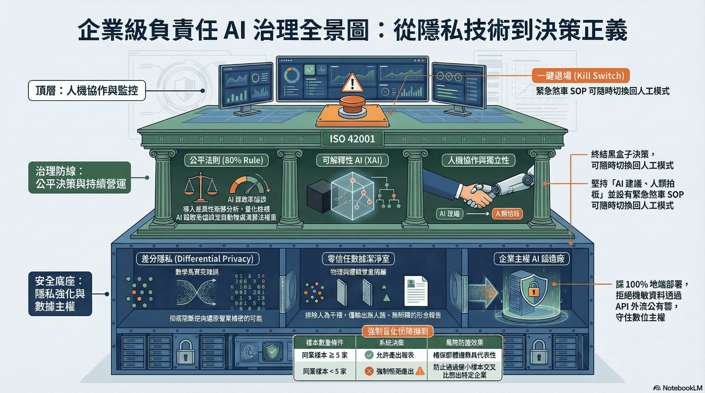
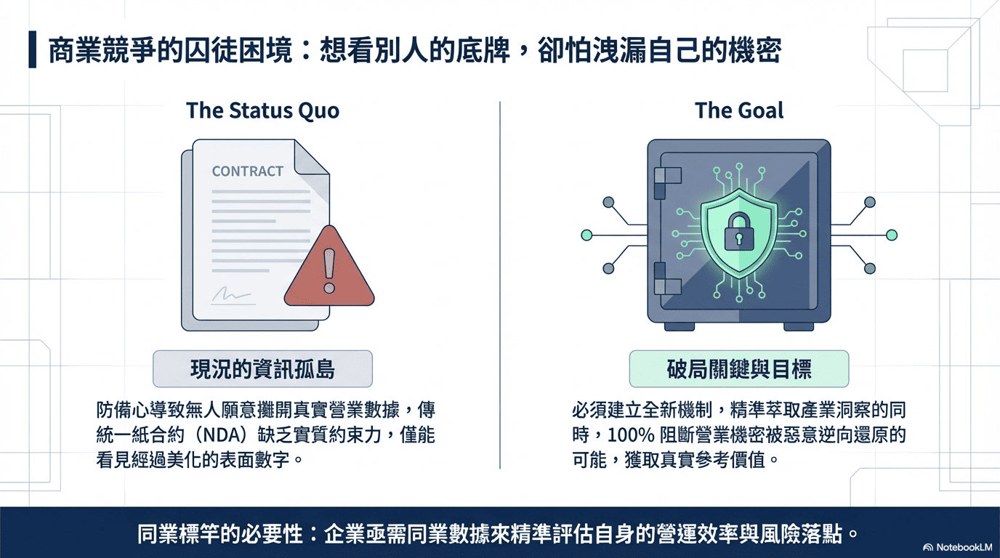
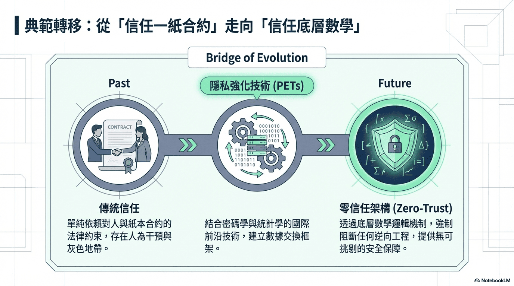
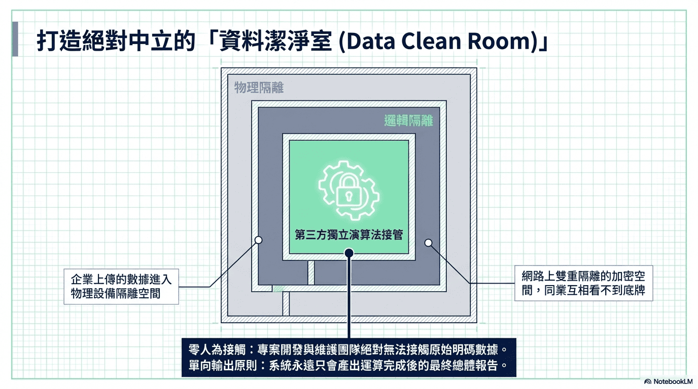
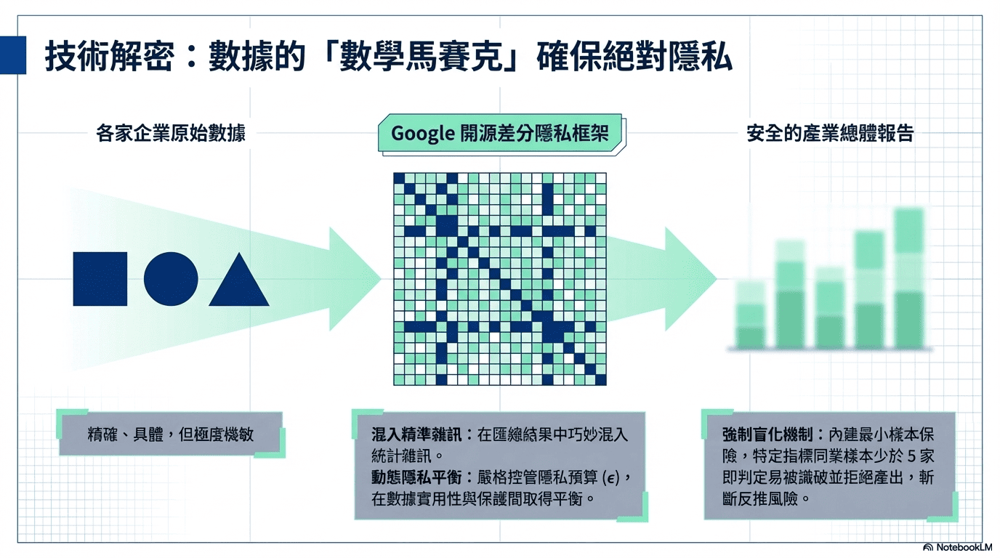
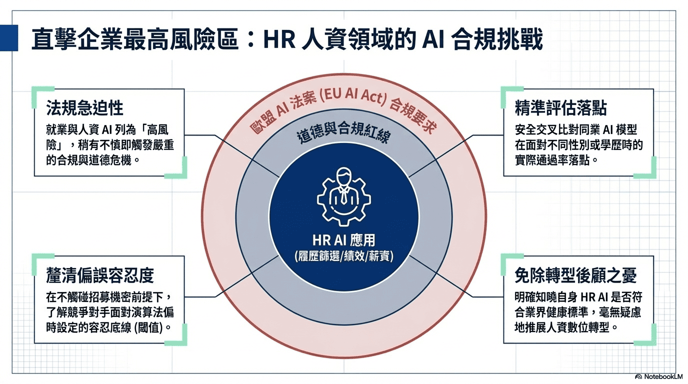
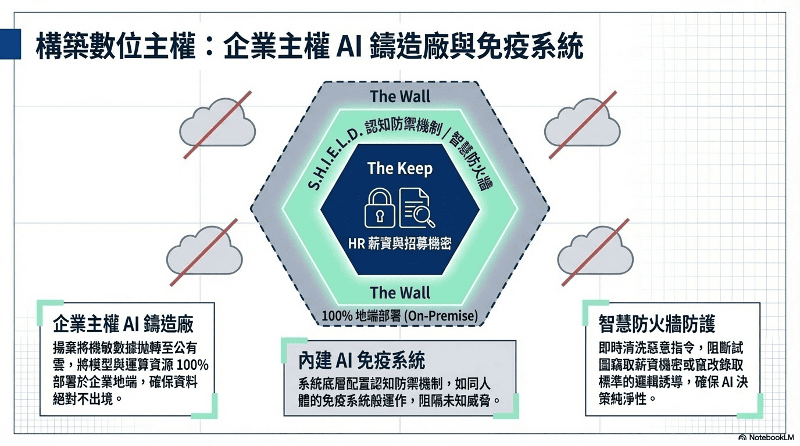
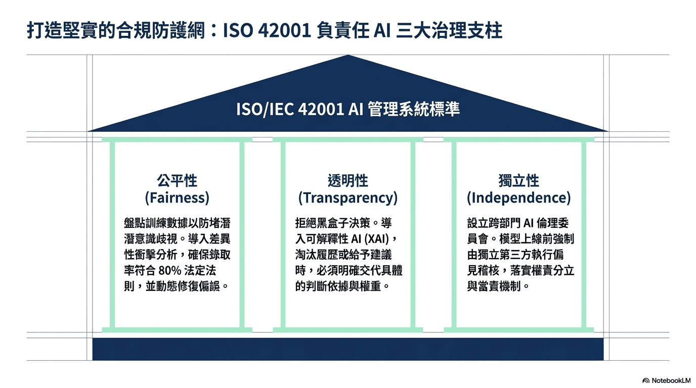
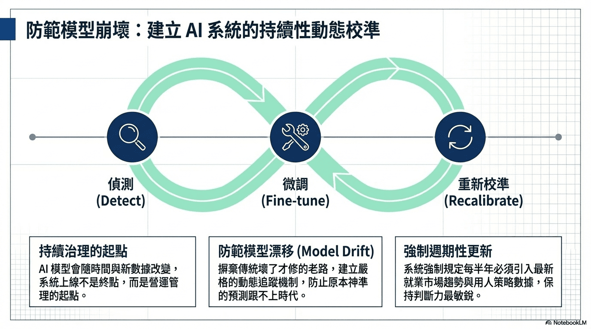
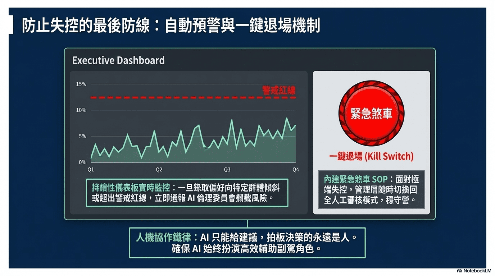



---



---

**作者**：[TonTon Huang Ph.D.](https://www.twman.org/)  
**日期**：2026年08月25日更新  

> 📌 **技術速覽**  
> 企業推動 AI 治理常面臨商業機密外洩與 HR 高風險領域的偏誤困境。基於零信任與差分隱私架構，結合 ISO/IEC 42001 規範與可執行的 Technical Controls，協助企業在不洩漏敏感 PII 資料的前提下進行標竿分析，並建構具備一鍵退場機制的人機協作安全底線。

**🎵 不聽可惜的 NotebookLM Podcast @ Google 🎵** <audio controls style="width:200px; height:20px;"><source src="./AI-Govs/ai-govs.mp3" type="audio/mpeg"></audio>

---

**企業 AI 的下一個競爭點，不是誰能做出最多 Agent，而是誰能讓 Agent 在可量化的風險、權限、成本與稽核條件下可靠地執行。**

🎯 [面對層出不窮的 AI 新框架，企業盲目跟風往往只會帶來高昂的試錯成本。如何跳出技術焦慮，從商業本質制定 AI 落地架構？](https://deep-learning-101.github.io/Blog/AIBeginner).

🎯 [重塑 AI 治理坐標系：Google DeepMind《Nature》Agentic Profiles 深度技術與治理復盤](https://deep-learning-101.github.io/Blog/Agentic-Profiles).

🎯 [Cloudflared Tunnel 解決了網絡層的邊界安全，但如果你架設的是企業內部 AI 服務，更需要解決應用層的「輸入輸出安全檢查」。](https://deep-learning-101.github.io/cyber/LLM-Guard).

🎯 [**Sovereign Heuristic Intelligence & Enterprise Logic Defense (主權啟發式情資與企業邏輯防禦系統)**](https://deep-learning-101.github.io/SHIELD/)

🎯 [企業知識庫 RAG 系統品質如何量化？RAGAS 四大指標（Faithfulness、Context Recall）、黃金測試集與 A/B 測試完整實戰。](https://deep-learning-101.github.io/RAG#evaluation)

---

**📋 本文目錄**

* [AI Governance：從政策到可執行控制](#govs-intro)
* [企業 Agent 治理三件套：Registry、Gateway、Identity](#agent-arch)
* [壹、標竿分析的矛盾：「知己知彼，卻不露底牌」](#benchmarking)
    * [一、資訊共享的囚徒困境](#benchmarking-1)
    * [二、解決方案：從「信任人」轉向「信任數學」](#benchmarking-2)
* [貳、零信任標竿分析實作：差分隱私三道防線](#dp-mechanism)
* [參、落地實踐：高風險 HR 領域的 AI 導入](#hr-ai)
* [肆、負責任的 AI：ISO 42001 治理支柱與執行保障](#responsible-ai)
    * [一、公平性與偏誤量化](#fairness)
    * [二、透明性與可解釋性](#transparency)
    * [三、獨立性與當責機制](#independence)
    * [四、Human-in-the-loop 不能只是「請人看看」](#hitl)
    * [五、Agent 的 Tool Permission 必須比 Model Permission 更嚴格](#tool-permission)
* [伍、永續營運與持續監控：防止模型崩壞的最後防線](#ops)
    * [一、防範模型漂移](#model-drift)
    * [二、持續性儀表板與自動化預警](#dashboard)
    * [三、建立可量測的「黃金範本」與去識別化精煉](#golden-sample)
    * [四、人機協作與接管機制](#human-takeover)
    * [五、治理最終應形成可稽核的 Evidence Package](#evidence-package)
    * [六、資料層：Agent 的記憶底座與進化燃料](#data-layer)

---

<a id="govs-intro"></a>

企業最常見的 AI Governance 問題，不是沒有 Policy，而是：

> Policy 寫完之後，系統到底有沒有真的執行？

例如：「不得將機密資料送到未經批准的模型。」這是一條政策。但是企業真正需要的是：

```text
User -> AI Gateway -> Data Classification -> DLP / PII Detection -> Model Policy Engine -> Approved Model -> Output Guard -> Audit Log
```

這才叫「政策被技術執行」。

**AI Governance 不是一份 PDF；它應該是一組可以執行的 Technical Controls。**

| Governance Principle | 可執行控制                                             |
| -------------------- | ------------------------------------------------- |
| Fairness             | Bias Dataset、Group Evaluation、Disparate Impact    |
| Transparency         | Prompt / Context / Model / Tool Tracing           |
| Explainability       | Evidence Retrieval、Source Citation、Decision Trace |
| Accountability       | User Identity、Immutable Audit Log                 |
| Human Oversight      | Approval Gate、Breakpoint                          |
| Privacy              | DLP、PII Redaction、Encryption                      |
| Security             | Prompt Injection Detection、Tool Allowlist         |
| Least Privilege      | RBAC / ABAC、Scoped Tool Permission                |
| Cost Governance      | Token Budget、Rate Limit、Model Routing             |
| Model Risk           | Benchmark、Red Team、Release Gate                   |
| Supply Chain         | SBOM、Model Provenance、License Review              |
| Incident Response    | Alert、Rollback、Kill Switch                        |

換句話說：

> **AI Governance 的終點不是一份 Governance Policy，而是一組可驗證的 Controls。**

---

# 企業級 AI 標竿分析與負責任 AI 治理建議

<div style="display: flex; justify-content: center;">

  <div style="position: relative; width: 100%; max-width: 460px; aspect-ratio: 16 / 9;">
    <iframe
      src="https://www.youtube.com/embed/uAnHw1kXNaY"
      style="position: absolute; width: 100%; height: 100%; left: 0; top: 0;"
      frameborder="0"
      allow="accelerometer; autoplay; clipboard-write; encrypted-media; gyroscope; picture-in-picture"
      allowfullscreen>
    </iframe>
  </div>
</div>

---

<a id="agent-arch"></a>

每一套 AI / Agent 都應該進入企業 Registry，而不是由不同部門自行採購；最少記錄：

```text
System ID、Owner、Business Purpose、Model、Model Version、Data Classification、Allowed Users、Allowed Tools、Risk Tier、Evaluation Result、Human Approval Required、Deployment Location、Vendor、License、Last Review、Kill Switch
```

如此一來，企業才能真正回答：

> 公司到底用了多少 AI？

> 哪些 AI 可以接觸機密資料？

> 哪些 AI 可以執行交易？

> 哪些 Agent 可以呼叫外部 API？

> 哪一個 Model 最近換過版本？

---

企業不應讓：

```text
Employee → OpenAI / Gemini / Claude / Local LLM
```

成為主要架構；更成熟的做法是：

```text
Employee / Application
          ↓
      AI Gateway
          ↓
 ┌────────┼─────────┐
 ↓        ↓         ↓
Cloud    Private   Local
LLM      Model     Model
```

Gateway 負責：

```text
Authentication、Authorization、DLP、Prompt Filtering、Model Routing、Token Budget、Rate Limit、Tool Authorization、Output Filtering、Audit Logging
```

如此企業未來即使更換模型供應商，也不需要重新建立整套治理架構。

> **工程驗證**：當一個 Agent 試圖存取高成本旗艦模型時，Gateway 可自動降級至政策許可的輕量模型；當財務部的 MCP Server 被 Agent 呼叫時，Gateway 強制執行「唯讀策略」——Agent 能查詢數據，但無法寫入或刪除。這不是演示功能，而是生產系統中「治理政策被技術真正執行」的具體體現，是讓 Policy 從 PDF 走進架構的第一步。

此外，每一個部署的 Agent 都應擁有獨立身份憑證（如 **SPIFFE ID**），成為可追蹤、可審計的「智能體護照」。搭配集中式 **Agent Registry**，企業才能真正回答：「公司到底跑了多少 Agent？哪些 Agent 可以呼叫外部 API？哪些 Agent 可以存取機密資料？」——這些問題的答案，是治理能落地的前提條件，不是錦上添花。

當 Agent 透過 SPIFFE ID 向 RAG 知識庫發起查詢時，同一憑證應流入向量資料庫的 Identity-Aware Retrieval 層——每次向量搜索都攜帶 Agent 的身份與角色，讓 metadata pre-filter 按照 SPIFFE ID 對應的部門與機密等級，決定哪些 chunk 可被取出；而非由 LLM 輸出端的護欄事後攔截。→ [企業 RAG 知識庫的 Identity-Aware Retrieval 完整設計](../RAG#rag-acl)

---

### [**🧠 企業級可信賴 AI 治理** (認知與語意的貼身保鑣： 阻擋「AI 提示詞攻擊與系統幻覺」，不讓 AI 大腦被騙或做錯決定。)](https://deep-learning-101.github.io/SHIELD/#trustworthy-ai-governance)

👉 核心目標：保護 AI 大腦的神經智力，確保不被騙、不亂講話、絕對合規。

* **透明性 (Transparency)**：「讓黑箱變成玻璃箱」；系統有沒有偷偷做事？使用者問了 A，系統背後到底拿了哪些資料去組裝 Prompt？把每一次對話的輸入、檢索到的文件 (Context)、耗時、Token 消耗，全部記錄 (Tracing)。
* **可解釋性 (Explainability)**：「給出決策的理由」；當使用者問「你憑什麼給出這個答案」時，系統能給出證據。當 AI 說「這份標案不合規」時，必須標示出「AI 是基於資料庫裡的文檔 X 做出的回答，而不是自己幻想的。」
* **公平性 (Fairness)**：「一視同仁，沒有偏見」；不能因為申請人的性別、年齡或企業規模，而在沒有法規依據的情況下給出較差的評分。透過統計學與紅隊測試，掃描模型在不同群體上的「通過率」是否有異常落差。
* **人類自主 (Human in the loop)**：「關鍵決策，必須由人類批准」；寫好對外報價單或法律裁定草案，但寄出或生效前，必須由人類點擊「Approve」。工作流中設定「中斷點 (Breakpoints)」，跑到一半會暫停，等待人類確認後才繼續。
* **問責機制 (Accountability)**：「出事了，找誰算帳？」；證明系統出錯不是因為設計不良，而是模型極限，且我們有完整的稽核軌跡。把「在什麼時間、用什麼權限、觸發哪個 AI 節點、被誰審核通過」打包成不可篡改的日誌。

<a id="benchmarking"></a>

## 壹、標竿分析的矛盾：「知己知彼，卻不露底牌」

<p align="center">

</p>

<a id="benchmarking-1"></a>

### 一、資訊共享的囚徒困境
企業想知道自己在市場上的真實競爭力，需要透過**同業標竿分析 (Benchmarking)** 來評估自身的營運效率與風險管理落點，這點無庸置疑。然而，傳統調查始終跨不過一道企業的防備心門檻：為了防範競爭對手，沒有企業願意把真實的營業數據、風險漏洞或核心演算法攤在陽光下，導致提供競爭對手致命把柄。這種「想看別人，卻不願被看」的心態，直接導致市場上充斥著經過層層美化的表面數字，而缺乏真實參考價值及具備公信力的基準數據。

<p align="center">

</p>

<a id="benchmarking-2"></a>

### 二、解決方案：從「信任人」轉向「信任數學」
為了突破這個資訊孤島的矛盾與僵局，不能僅單純依賴傳統對「人」與「紙本合約」的保密協定 (NDA) 的表面的法律約束；而是透過密碼學與統計學的結合，改採國際前沿的**隱私強化技術 (PETs)**，建構 **「零信任 (Zero-Trust)」** 的數據交換框架；此框架不僅確保順利萃取出具備指標性的產業洞察，更重要的是，藉由數學底層邏輯機制，確保徹底阻斷被惡意逆向還原任何營業機密的可能；提供安全保障。

---

<a id="dp-mechanism"></a>

## 貳、零信任標竿分析實作：差分隱私三道防線

<p align="center">

</p>

### 一、隱私增強計算環境（Data Clean Room）

企業上傳的數據進入物理與邏輯**雙重隔離的加密環境**——開發團隊同樣無法接觸原始明碼，所有運算由第三方獨立演算法接管，輸出僅為最終彙總報告，從架構層面消除內部洩漏風險。

<p align="center">

</p>

### 二、差分隱私的三道防線

基於 Google 開源差分隱私框架，系統透過三道機制確保無法逆向推算個別企業數據：

1. **隱私預算（$\epsilon$）控管**：嚴格限制每次查詢的資訊洩漏量上限，讓數據實用性與隱私保護之間的平衡可量化、可稽核。
2. **統計雜訊注入**：在匯總結果中加入校準雜訊，使任何維度的交叉比對都無法精確還原特定公司數字。
3. **強制盲化**：若某指標的同業樣本數 < 5 家，系統直接拒絕輸出——群體過小時差分隱私的數學保證失效，拒絕是最後一道硬性防線。

---

<a id="hr-ai"></a>

## 參、落地實踐：高風險 HR 領域的 AI 導入與比較

<p align="center">

</p>

在確立了「安全且匿名」的標竿分析基礎設施後，將此機制率先應用於企業高度關注的人力資源 (HR) 領域。因為，隨著 AI 未來將有機會逐漸開始深度介入接管履歷篩選、績效評估甚至薪資建議，HR 已成為企業內部應用 AI 的「最高風險區」。**歐盟 AI 法案 (EU AI Act)** 更是已明確將就業與人資相關的 AI 系統列為 **「高風險」**。企業稍有不慎，踩到的不僅是道德紅線，更是嚴重的合規危機。

為了協助企業精準控管風險，透過前述的差分隱私機制，在完全不觸碰各家企業招募機密的前提下，安全地收集並交叉比對各家企業的 HR AI 表現，協助企業釐清：

* **同業的 AI 篩選模型**，在面對不同性別或學歷時，實際的通過率落點在哪？是否存在潛在的歧視盲區？
* **當競爭對手面臨不可避免的「演算法偏誤」時**，他們內部設定的容忍底線 (閾值) 究竟是多少？

透過這些匿名的加密盲化基準對齊數據，企業不再需要閉門造車，且將能明確知道自己的 HR AI 是否符合業界的「健康標準」，從頭到尾，毫無後顧之憂地推展人資數位轉型，徹底免除招募機密外洩的疑慮。

<p align="center">

</p>

然而，要讓上述高機敏的 HR AI 應用真正安全落地，企業必須在底層架構確立絕對的 **「數位主權」**。建議揚棄將機敏招募與薪資數據透過 API 拋轉至公有雲的作法，改採 **「[企業主權 AI 鑄造廠](https://deep-learning-101.github.io/SHIELD/#sovereign-ai-foundry)」** 概念，將模型與運算資源 100% 部署於企業地端，確保 **資料不出境** 的最高合規性。系統底層將內建如同 AI 免疫系統的認知防禦機制，能即時清洗惡意指令、阻斷試圖竊取薪資機密或竄改錄取標準的邏輯誘導，確保 AI 決策的純淨性，為人資數位轉型構築最堅實的安全底座。

---

<a id="responsible-ai"></a>

## 肆、負責任的 AI：ISO 42001 治理支柱與執行保障

為了確保系統完全符合 **ISO/IEC 42001 (AI 管理系統標準)** 等國際規範，從三大核心治理支柱出發，並輔以執行層面的人機協作與 Tool Permission 管控：[全景觀測與可信賴 AI 治理 (Trustworthy AI Governance)](https://deep-learning-101.github.io/SHIELD/#trustworthy-ai-governance)

<p align="center">

</p>

<a id="fairness"></a>

### 一、公平性與偏誤量化
目前主流的大型語言模型 (LLM) 其實藏著一個致命的盲區：它們是靠著無差別吸收海量歷史數據餵養長大的，這意味著，模型在訓練過程中，極容易把人類職場上長久以來根深蒂固的『潛意識歧視』直接複製貼上，變成它未來的決策邏輯。例如，模型可能會偷偷把「兵役狀況」當作篩選性別的代理變數。為了防堵這點，必須系統性地盤點訓練數據，並導入「差異性衝擊分析 (Disparate Impact)」等科學化數學模型。透過這類量化指標，我們能嚴格檢視 AI 對不同族群的錄取率是否達到法定的業界常參考的 **80% 法則比例**。一旦偵測到偏誤，系統將主動透過演算法權重調整來進行修復，從根本確保選才的公平性。

<a id="transparency"></a>

### 二、透明性與可解釋性
為了解決在 HR 領域，不能接受「因為 AI 說不行，所以不行」這種黑盒子決策的痛點，需導入 **可解釋性 AI (XAI)** 技術。這意味著，未來當 AI 決定淘汰某份履歷、或是給出特定的績效建議時，它都必須交代出具體的「判斷依據與權重」。這不僅能建立完善的知情同意流程，更能確保企業在面對求職者或監管機構的質疑時，隨時都能拿出清晰、透明的決策軌跡。

<a id="independence"></a>

### 三、獨立性與當責機制
一套安全的系統，不能既當球員又當裁判。因此，在制度面上，強烈建議並將協助企業設立跨部門的 **「AI 倫理委員會」** (涵蓋 HR、法務、資安與外部專家)。同時，在技術流程中設下硬性規定：任何 AI 模型在正式上線前，都必須交由未參與開發的獨立第三方團隊進行深度的 **「偏見稽核」**。透過這種權責分立的當責機制，確保系統上線後的每一天，都在企業的絕對掌控之中。

<a id="hitl"></a>

### 四、Human-in-the-loop 不能只是「請人看看」

真正的 Human Oversight 必須是技術性的：

```text
Agent Plan
    ↓
Risk Check
    ↓
Low Risk → Execute
    │
    └── High Risk
             ↓
       Human Approval
             ↓
          Execute
```

例如：

```text
讀取文件       → 自動
整理資料       → 自動
建立草稿       → 自動
發送 Email     → 人工核准
修改 ERP       → 人工核准
財務付款       → 強制人工核准
```

這才是真正的 Breakpoint，而不是把一句：

> 「AI 產生的結果請人工確認」

放在畫面上。

<a id="tool-permission"></a>

### 五、Agent 的 Tool Permission 必須比 Model Permission 更嚴格

一個模型能回答什麼，和 Agent 能做什麼，是完全不同的風險。

例如：

```text
LLM -> read_email -> search_database -> create_ticket -> send_email -> execute_payment
```

最後一層的風險，不是「模型有沒有幻覺」，而是：

> **如果模型判斷錯了，它到底能對現實世界造成什麼後果？**

因此 Tool 應採用：

```text
Allowlist + Least Privilege + Scoped Credentials + Sandbox + Human Approval + Rate Limit
```

**RAG 知識庫讀取是一種典型的 Scoped Tool**：Agent 呼叫知識庫時，同樣適用 Least Privilege 原則——不應給所有 Agent 全庫讀取權，而是按 Agent 的 SPIFFE ID 動態決定可取回哪些 chunk。若 Agent 身份憑證未正確傳入向量資料庫的 metadata filter 層，向量相似度再高也不應回傳未授權的文件片段。換部門、離職等人員異動只需更新 Identity Provider（如 Azure AD），無需重建任何 embedding index，ACL 即時生效。→ [企業 RAG 的 Identity-Aware Retrieval 五層架構設計](../RAG#rag-acl)

---

<a id="ops"></a>

## 伍、永續營運與持續監控：防止模型崩壞的最後防線

AI 模型跟傳統軟體最根本的不同在於：它會隨著時間與新數據不斷改變。因此，把系統順利推上線絕對不是專案的終點，而是「持續治理」的起點。為了確保這套系統能長治久安，需建立一套滴水不漏的營運機制：

<p align="center">

</p>

<a id="model-drift"></a>

### 一、防範模型漂移
就業市場的趨勢和企業的用人策略隨時都在變。如果放任不管，原本神準的 AI 預測，久了也會慢慢「跟不上時代」，這在技術上稱為**模型漂移 (Model Drift)**。為了解決這個問題，我們不走傳統軟體「壞了才修」的老路，而是建立嚴格的動態追蹤機制。系統會定期檢視 AI 的預測準確率，並強制規定每半年必須引入最新數據，為模型進行微調與重新校準，確保它的判斷力隨時保持在最敏銳、最貼近現況的狀態。

<p align="center">

</p>

### 邁向 Hallucination Risk Reduction / Evidence-Grounded Generation：[S.H.I.E.L.D.](https://deep-learning-101.github.io/SHIELD/) 雙層護欄
AI 治理的最後一哩路是抵禦惡意攻擊與技術先天缺陷。企業應導入類似 S.H.I.E.L.D. 的「內外雙層防禦」架構：
* **外層防禦 (Outer Defense)：** 建立 24/7 監控機制，主動偵測明暗網威脅，並在系統漏洞被利用前自動生成阻斷規則，有效縮短 0-day 攻擊的空窗期。
* **內層防禦 (Inner Defense)：** 設置專屬的邏輯防火牆，防範「提示詞注入 (Prompt Injection)」，確保模型不會因為使用者的惡意誘導而洩漏機密。
* **無向量檢索 (Vectorless RAG)：** 針對 RAG 架構中常見的幻覺問題，放棄模糊的向量空間，改以更精確的邏輯鎖定範圍，實現低成本的精準回應，確保 AI 給出的每一項建議都能回溯至真實條文。

<a id="dashboard"></a>

### 二、持續性儀表板與自動化預警
在系統後台建置一個直觀的監控面板，實時緊盯 AI 的決策有沒有「走鐘」。只要系統偵測到 AI 的錄取偏好開始向特定群體傾斜，或是超出了我們設定的警戒紅線，就會立刻觸發警報，並第一時間通報 AI 倫理委員會介入處理，把潛在的歧視風險攔截在災難發生之前。

**Agent 協同可觀測性（進階）**：當 Agent 系統規模化後，單靠數值指標已不足夠。建議導入**有向無環圖（DAG）** 視覺化，清楚呈現 Agent ↔ Agent、Agent ↔ MCP Server 之間的協同拓撲；每一步大模型耗時、Token 消耗、工具調用與錯誤都應可完整 trace back，讓「哪個環節拖了後腿」從直覺猜測變成可稽核的事實——這也是「Evidence Package」的重要組成部分。

**上線前壓力測試——Agent Simulation**：在推向生產之前，可利用 Agent Simulation 工具模擬數萬個不同性格的虛擬使用者（含刁鑽用戶、邊緣案例），讓系統在上線前就暴露弱點。這個環節在 Demo 階段完全看不出必要性，但在生產環境中是防止第一天就翻車的救命機制。「ROI 是可觀測性的第一性原理——你衡量不了 Agent 創造的價值，你就無法優化它。」

<a id="golden-sample"></a>

### 三、建立可量測的「黃金範本 (Golden Sample)」與去識別化精煉
在 HR 或法規等高風險領域，要確保模型不帶偏見且合乎倫理，必須先建立一套作為「期末考卷」的黃金範本。實務上，企業應導入自動化去識別化工具（如 Microsoft Presidio），將原始履歷或機密卷宗內的個人敏感資訊（PII）徹底遮蔽或替換。這套經過「資料精煉」的黃金範本，將能作為後續評量 LLM 輸出公平性、正確性（例如要求正確率 ≥ 70%）與幻覺率（要求 < 20%）的絕對依據，讓 AI 治理具備真正的「可量測性」。若底層採用 RAG 知識庫架構，建議搭配 [RAGAS 評估框架](https://deep-learning-101.github.io/RAG#evaluation)對 Faithfulness（忠實度）與 Context Recall 進行量化追蹤，讓幻覺率目標有具體可稽核的評測依據。

<a id="human-takeover"></a>

### 四、人機協作與接管機制
在 HR 這種牽涉個人職涯的高風險領域，必須踩死一條鐵律：**「AI 只能給建議，拍板決策的永遠是人」**。AI 在這裡的角色是高效的輔助副駕，絕非取代 HR。為了應對最極端的演算法失控狀況，系統內建了標準的緊急煞車 SOP。只要情況不對，管理層隨時能啟動 **「一鍵退場」** 功能，瞬間切換回全人工審核模式，確保企業營運與法規遵循享有絕對的安全底線。

<a id="evidence-package"></a>

### 五、治理最終應該形成一個可稽核的 Evidence Package

企業 Audit 或監管單位真正需要的，不是：

> 「我們有 AI Ethics Committee。」

而是：

```text
Who -> Used Which Model -> Received Which Context -> Called Which Tool -> With Which Permission -> Produced Which Output -> Who Approved It -> What Happened Afterwards
```

因此每一次重要 AI execution 都應該產生：**Audit Evidence**，而不是只有 application log；這也是 AI Governance 從「顧問報告」走向「Enterprise Engineering」最重要的一步。

<a id="data-layer"></a>

### 六、資料層：Agent 的記憶底座與進化燃料

Agent 治理不只是在 Gateway 和觀測層做文章；**資料層的設計，決定了 Agent 能走多遠。**

- **Spanner（Agent 記憶底座）**：融合關係、圖、向量與全球一致性，讓 Agent 能在同一個資料庫中處理跨境合規任務的多層邏輯推理——這是傳統純向量 RAG 做不到的。對出海企業而言，Spanner 使得海關商品歸類、多國法規匹配等需要跨資料源受控推理的場景成為可能，並能形成**可解釋、可追蹤的推理網絡**，直接對應 Evidence Package 的可稽核要求。
- **AlloyDB（AI 函數原生整合）**：在資料庫內直接調用 AI 函數，減少資料搬運次數與 Token 消耗，讓 Agent 在貼近資料的地方完成推理，而非把原始資料搬到模型端再處理。
- **資料飛輪**：使用越多 → 沉澱越多 → 反饋給 Agent 持續進化。這不是行銷語言，而是架構設計的選擇：有意識地把每次 Agent 交互沉澱為改善信號，才能讓系統從「部署後不變」走向「越用越好」，也讓治理投入形成可量化的長期回報。

> 資料飛輪轉不起來的 Agent，遲早會被使用者拋棄。治理要有效，資料設計必須從第一天就考慮。

  <script type="application/ld+json">
  {
    "@context": "https://schema.org",
    "@graph": [
      {
        "@type": "TechArticle",
        "mainEntityOfPage": {
          "@type": "WebPage",
          "@id": "https://deep-learning-101.github.io/Blog/AI-Govs"
        },
        "headline": "企業級 AI 治理框架 2026：AI Gateway、Agent Identity 與差分隱私零信任架構實踐",
        "description": "大型企業如何安全進行同業 AI 標竿分析、管理 Agent 艦隊？本文深度解析 AI Gateway 工程實作（含 Agent Identity、Registry、Observability DAG 視覺化）、差分隱私標竿分析機制、HR 高風險領域偏誤量化、Spanner 資料層治理，以及 ISO/IEC 42001 稽核準備要點。",
        "image": "https://raw.githubusercontent.com/Deep-Learning-101/TonTon/refs/heads/main/_includes/DL101-Logo.jpg",
        "author": {
          "@type": "Person",
          "name": "TonTon Huang Ph.D.",
          "url": "https://twman.org/"
        },
        "publisher": {
          "@type": "Organization",
          "name": "Deep Learning 101, Taiwan",
          "url": "https://deep-learning-101.github.io/"
        },
        "datePublished": "2026-01-01T08:00:00+08:00",
        "dateModified": "2026-08-25T08:00:00+08:00"
      },
      {
        "@type": "FAQPage",
        "mainEntity": [
          {
            "@type": "Question",
            "name": "企業推動 AI 治理如何兼顧資料分享與資安合規？",
            "acceptedAnswer": {
              "@type": "Answer",
              "text": "應導入零信任架構、差分隱私（Differential Privacy）與 PII 去識別化機制，並遵循 ISO/IEC 42001 規範，建構「AI 給予建議、人類最終決策」的人機協作一鍵退場安全底線，確保資料不出境的最高合規性。"
            }
          },
          {
            "@type": "Question",
            "name": "什麼是差分隱私？企業如何用它進行 AI 標竿分析？",
            "acceptedAnswer": {
              "@type": "Answer",
              "text": "差分隱私（Differential Privacy）透過在匯總統計結果中注入校準的「統計雜訊」，搭配嚴格控管隱私預算（ε），讓企業能在不洩漏任何單一公司商業機密的前提下進行同業標竿比較。系統額外設有強制盲化保險：若某指標同業樣本少於 5 家則拒絕輸出，從根本防止逆向還原。"
            }
          },
          {
            "@type": "Question",
            "name": "EU AI Act（歐盟 AI 法案）對 HR 人資 AI 有何規範要求？",
            "acceptedAnswer": {
              "@type": "Answer",
              "text": "EU AI Act 明確將就業與人資相關 AI 系統列為「高風險」類別，要求企業進行偏誤量化（Disparate Impact 分析）、建立可解釋性機制（XAI）、設立跨部門 AI 倫理委員會，並在系統正式上線前通過獨立第三方偏見稽核，以符合 80% 法則比例要求。"
            }
          },
          {
            "@type": "Question",
            "name": "ISO/IEC 42001 AI 管理系統標準有哪些核心治理要求？",
            "acceptedAnswer": {
              "@type": "Answer",
              "text": "ISO/IEC 42001 的三大治理支柱為：公平性（透過差異性衝擊分析量化偏誤並修正演算法權重）、透明性（導入 XAI 可解釋性技術，讓每項 AI 決策都能交代判斷依據）、獨立性（設立不兼任開發的 AI 倫理委員會進行偏見稽核，確保權責分立）。"
            }
          },
          {
            "@type": "Question",
            "name": "企業 AI 系統為何需要「一鍵退場（Kill Switch）」機制？",
            "acceptedAnswer": {
              "@type": "Answer",
              "text": "AI 模型會隨時間與新資料發生「模型漂移（Model Drift）」，導致決策偏差。一鍵退場機制讓管理層在 AI 出現歧視偏好或超出警戒紅線時，能瞬間切換回全人工審核模式，是防止演算法失控、確保企業法規遵循的最後安全底線，也是 AI 永續治理的核心要件。"
            }
          },
          {
            "@type": "Question",
            "name": "企業 Agent 要從 Demo 推向生產，治理層面最少需要哪些基礎設施？",
            "acceptedAnswer": {
              "@type": "Answer",
              "text": "至少需要四項治理基礎設施：①Agent Identity（SPIFFE ID 等獨立身份憑證，讓每個 Agent 可追蹤、可審計）；②Agent Registry（集中登記所有 Agent 與 MCP Server，消除影子 Agent）；③Agent Gateway（Ingress/Egress 雙向安全策略，可限制特定 Agent 存取模型類型，可對敏感資料 MCP Server 設唯讀政策）；④Agent Observability（DAG 視覺化協同拓撲 + 完整 trace，讓每步大模型耗時、Token 消耗、工具調用均可稽核）。缺少其中任何一項，Agent 在生產中就等同裸奔。"
            }
          }
        ]
      }
    ]
  }
  </script>