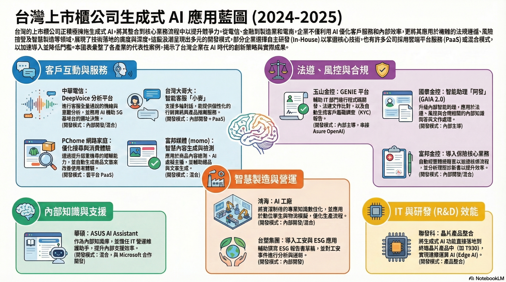
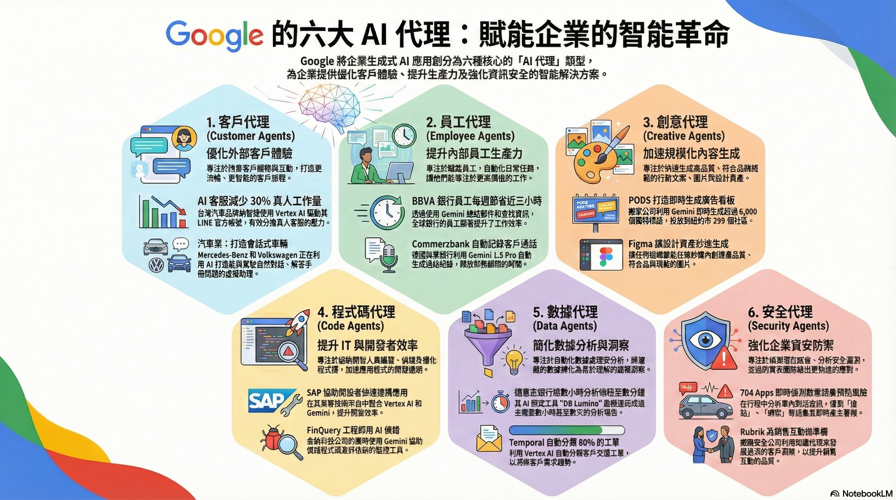



---



---

  

    🎵 不聽可惜的 NotebookLM 
    <audio controls>
      <source src="../notebooklm-mp3/AIBeginner.mp3" type="audio/mpeg">
    </audio>
    
企業導入 AI 的聽君一席話，如聽一席話入門全攻略

  

  

    🎵 不聽可惜的 NotebookLM 
    <audio controls>
      <source src="../notebooklm-mp3/AIBeginnerMistakes.mp3" type="audio/mpeg">
    </audio>
    
認真 企業導入 AI 全攻略

  

  

    

      <iframe
        src="https://www.youtube.com/embed/IZGqfbj5AF4"
        frameborder="0"
        allow="accelerometer; autoplay; clipboard-write; encrypted-media; gyroscope; picture-in-picture"
        allowfullscreen>
      </iframe>
    

  

  

    

      <iframe
        src="https://www.youtube.com/embed/59ojQx_dLFo"
        frameborder="0"
        allow="accelerometer; autoplay; clipboard-write; encrypted-media; gyroscope; picture-in-picture"
        allowfullscreen>
      </iframe>
    

  

---

**作者**：[TonTon Huang Ph.D.](https://www.twman.org/)  
**日期**：2025年07月21日更新

---

* [台灣上市櫃公司 GenAI 實際落地案例總表 (2024-2025)](#genai2025)
* [Gen AI 落地實戰：Google 的「從靈感到食譜」全球策略](#google101)
* [企業 AI新賽局 入門策略實踐路線圖：從策略到治理，避開致命陷阱](#AIBeginner)
* [Introduction (導論)](#introduction)
* [Prologue: Why Now? (序：為何是現在？)](#prologue-why-now)
* **Chapter 1: Unlocking AI (解鎖AI)**
    * [Mistake 1: Strategy Disconnect (致命錯誤1：戰略脫節)](#c1-mistake-1-strategy-disconnect)
    * [Mistake 2: Expectation Gap (致命錯誤2：期望鴻溝)](#c1-mistake-2-expectation-gap)
* **Chapter 2: Building the Foundation (打造後勤基地)**
    * [Mistake 3: Data Dilemma (致命錯誤3：數據困境)](#c2-mistake-3-data-dilemma)
    * [Mistake 4: Skipping the Basics (致命錯誤4：跳過基礎)](#c2-mistake-4-skipping-basics)
* **Chapter 3: The AI Blueprint (擘劃AI藍圖)**
    * [Mistake 5: Lacking the Human Factor (致命錯誤5：缺乏人性)](#c3-mistake-5-lacking-human-factor)
    * [Mistake 6: Talent & Governance Gap (致命錯誤6：人才治理不足)](#c3-mistake-6-talent-governance-gap)
* **Chapter 4: The GenAI Minefield (應對GenAI)**
    * [Mistake 7: Authenticity Crisis (致命錯誤7：真實性危機)](#c4-mistake-7-authenticity-crisis)
    * [Mistake 8: Blind Trust (致命錯誤8：盲目信任)](#c4-mistake-8-blind-trust)
    * [Mistake 9: Data Leakage (致命錯誤9：機密資料)](#c4-mistake-9-data-leakage)
    * [Mistake 10: IP Risk (致命錯誤10：智財權風險)](#c4-mistake-10-ip-risk)
* [Conclusion (結論)](#conclusion)

-----

<h2 id="genai2025">台灣上市櫃公司 GenAI 實際落地案例總表 (2024-2025)</h2>

*(僅基於 2024-2025 年可查證之公開新聞)*

> **🚀 本文重點摘要 (TL;DR)：**
> 企業導入 AI 不僅是技術升級，更是商業模式的重構。
> 本文整理了企業在 **AI 新賽局** 中應具備的策略思維，並詳細列出 **10 大常見致命錯誤**（如數據外洩、缺乏評估指標），幫助決策者避開轉型陷阱。

如表格所呈現，可以注意到兩大主流，應用最廣的是「對外」的客戶互動 (第1類) 和「對內」的 IT/研發 (第2類)；產業特性明顯： 金融/電信業 集中在「客服」和「法遵/IT」。 製造/半導體 則全力投入「研發」和「工廠製造 (第3類)」。模式清晰： 企業並非為了 AI 而 AI，而是將 GenAI 明確地應用於其最關鍵的成本中心（如客服、製造）或價值中心（如研發、行銷）。

## 台灣上市櫃公司 GenAI 落地應用整合總表（2024–2025，可查證公開資料）

| 核心應用領域 | 核心應用類型 | 公司（產業代表） | 實際落地案例 / 平台名稱 | 參考鏈結 | 開發模式 |
| :--- | :--- | :--- | :--- | :--- | :--- |
| **1. 客戶互動與服務** | • 客服全量分析 • 智能客服 • 搜尋 / 消費者體驗優化 | 中華電信（電信） | DeepVoice 分析平台：客服全量通話情緒與意圖分析，AI 輔助 5G 基地台選址 | [DeepVoice](https://www.cht.com.tw/home/enterprise/news/latest-news/2024/0727-1400) | In-House / 混合 |
|  |  | 台灣大哥大（電信） | 智能客服「小麥」：支援多輪對話，個性化行銷與產品推薦 | [智能客服 小麥](https://www.cio.com.tw/taiwans-big-brother-corporate-services-join-hands-to-help-business-use-generative-ai-to-strengthen-competitiveness/) | In-House + PaaS |
|  |  | PChome 網路家庭（電商） | 提升搜尋與消費者體驗：語意搜尋理解力提升，自動生成商品文案 | [PChome](https://www.moneydj.com/kmdj/news/newsviewer.aspx?a=2c58fe2d-92b6-4537-8266-ae574e08f11a) | 雲平台 (PaaS, Google Cloud) |
|  |  | 富邦媒體 (momo) | 商品內容檢測：AI 虛擬主播、智慧選品輔助文案生成 | [momo](https://www.ithome.com.tw/news/171279) | 混合 (In-House + PaaS) |
| **2. 法遵、風控與合規** | • KYC / 法規比對 • 核保 / 理賠摘要 • 內容合規偵測 | 玉山金控（金融） | GENIE 平台：輔助 IT 程式碼、法遵文件比對、KYC 報告生成 | [GENIE](https://www.ithome.com.tw/news/162551) | In-House 主導 (串接 Azure OpenAI) |
|  |  | 國泰金控（金融） | GAIA 2.0 升級版智能助理「阿發」 | [GAIA 2.0](https://www.cathayholdings.com/holdings/lastest_news/news_archive/newsarticle?newsID=8-0C1qzaP0aGC2qHopqJCg) | In-House 主導 |
|  |  | 富邦金控（金融） | 導入保險核心業務：核保自動摘要體檢報告、理賠診斷書分析 | [富邦保險](https://www.wealth.com.tw/articles/523ae02c-79a9-4cf4-86cd-3d8ac41886c4) | In-House / 混合 |
| **3. 智慧製造與營運** | • 專家知識數位化 • 製程 / 能效優化 | 鴻海（製造） | AI 工廠：學習老師傅經驗、數位孿生與物流模擬 | [AI 工廠](https://www.cio.com.tw/91467/) | In-House / 混合 |
|  |  | 台塑集團（傳產） | 工安、ESG 導入：輔助撰寫 ESG 報告書草稿、工安事件分析與通報 | [台塑 ESG](https://esg.businesstoday.com.tw/article/category/180689/post/202502260030) | In-House (透過台塑網) |
| **4. 內部知識與支援** | • 內部知識庫 / AI Agent • IT / 營運維護助手 | 華碩（科技） | ASUS AI Assistant：內部知識庫、IT 營運維護助手 | [ASUS AI](https://www.digitimes.com.tw/tech/dt/n/shwnws.asp?id=0000737026_71U1LXM51QRSZD7G0HKXG) | 混合 (共同開發, 與 Microsoft 合作) |
| **5. IT 與研發 (R&D) 效能** | • 程式碼輔助 • 研發流程加速 | 聯發科（科技） | 晶片產品 (如 T930)：GenAI 功能落地到終端 (Edge AI) | [MediaTek](https://www.compotechasia.com/a/press/2025/0514/60698.html) | 產品整合 |

---

<h2 id="google101">Gen AI 落地實戰：Google 的「從靈感到食譜」全球策略</h2>

Google Cloud 近期發布的兩篇文章，完美地詮釋了 GenAI 從「為何做 (Why)」到「如何做 (How)」的全球趨勢：
* [1,001 real-world gen AI use cases from the world's leading organizations](https://blog.google/products/google-cloud/gen-ai-business-use-cases/) - Oct 09, 2025
    * 文章中，Google 揭示了全球企業的 GenAI 案例在 1.5 年內從 101 個激增至 1,001 個。這傳達了一個明確的訊號：**GenAI 已是主流，而非實驗**。
    * 文中更直接亮出可證明的商業回報，例如 **Mercari** 預期 500% ROI 並減少 20% 工作量，**Virgin Voyages** 一次生成數千個廣告。這旨在向企業 C 級主管證明，GenAI 是可帶來真實利潤的商業決策。  
* [101 gen AI use cases with technical blueprints](https://cloud.google.com/blog/u/2/products/ai-machine-learning/real-world-gen-ai-use-cases-with-technical-blueprints) - August 22, 2025
    * 文章中，Google 接著提供了「技術藍圖」。這是在回應企業的下一個問題：「我們沒有人才，該怎麼辦？」
    * Google 的答案是提供可複製的「架構食譜」和工具（如 Vertex AI, Gemini），讓企業**不必重新發明輪子**，大幅降低導入的技術門檻和人才依賴。

---

#### 一、 趨勢解讀：從 101 到 1,001 的爆炸式增長 (The "Why/What")

在文章 "[1,001 real-world gen AI use cases from the world's leading organizations](https://blog.google/products/google-cloud/gen-ai-business-use-cases/)" 中，Google 揭示了全球企業的 Gen AI 案例在短短不到一年半的時間內，從 101 個激增至 1,001 個（10 倍增長）。這種「前所未有的速度」證明了 Gen AI 不再是實驗性的技術，而是各行各業正在快速採納的主流工具。

量化回報：Gen AI 帶來真實利潤
這份清單明確指出 Gen AI 帶來的商業價值，並非僅是技術炫技。這旨在向企業 C 級主管證明，Gen AI 是可帶來真實利潤的商業決策。

| 應用案例（Industry） | 成果與回報（Impact & ROI） |
|----------------------|----------------------------|
| 零售 / 電商（Mercari） | 預期投資報酬率（ROI）高達 500%，同時客服工作量減少 20%。 |
| 旅遊 / 行銷（Virgin Voyages） | 利用 Veo 的文本轉影片功能，一次性創建數千個超個性化廣告和電子郵件。 |
| 金融服務（United Wholesale Mortgage） | 在九個月內，將承保人員的生產力提高一倍以上。 |
| 零售 / 搜尋（Toolstation） | 將無結果搜索從 2% 降至 0.1%，搜索相關收入增加 5.5%。 |
| 電信 / 客服（Bell Canada） | 透過 AI 驅動的客服代理和 Agent Assist，為客戶運營節省了 2,000 萬美元。 |
| 製造 / 稽核（AES） | 自動化能源安全稽核，稽核成本降低 99%，時間從 14 天縮短到 1 小時。 |

---

#### 二、 落地指南：Google 推薦的「食譜」策略 (The "How")

當企業問到：「我們沒有足夠的 AI 專家，該怎麼落地？」Google 在另一篇文章 "[101 gen AI use cases with technical blueprints](https://cloud.google.com/blog/u/2/products/ai-machine-learning/real-world-gen-ai-use-cases-with-technical-blueprints)" 中提供了答案：提供 101 個架構藍圖（architectural blueprints），作為實戰的啟動點。

1. 藍圖的意義：降低技術門檻
這些藍圖提供了技術性的補充說明，讓企業可以不必重新發明輪子，大幅降低導入的技術門檻和人才依賴。每個藍圖都包含解決特定業務挑戰的設計模式 (Design Pattern) 和所需使用的技術堆棧 (Tech Stack)。

2. Gen AI 落地核心技術堆棧
無論應用在何種產業，成功的 Gen AI 落地都離不開以下幾個核心組件：

| 技術組件（Component） | 核心功能說明（Core Functionality） |
|----------------------|----------------------------------|
| Gemini（Flash / Pro / Nano） | 最智慧的模型，用於對話、摘要、代碼生成、多模態理解。 |
| Vertex AI | 統一的 AI / ML 平台，用於模型訓練、部署、監管，確保模型安全運行。 |
| Vertex AI Search | 企業級智能搜索工具，將非結構化數據索引，以便使用自然語言提問。 |
| BigQuery | 數據分析的核心，用於統一所有數據，為 AI 模型提供基礎數據集。 |
| Document AI | 自動化文件處理，從 PDF、發票、合約中提取並結構化數據。 |

---

#### 三、 Google 的六大 AI 代理類型 (The "Agents")

為了讓這個「組合拳」策略更有體感，Google 進一步將應用分為六種 AI 代理類型，作為企業思考 Gen AI 導入策略時的絕佳切入點：

**1. 客戶代理 (Customer Agents)：**

* **目的：** 專注於優化外部客戶體驗、客服與互動。
* **實際案例：**
    * **汽車業：** **MercedesBenz** 正在打造能與駕駛自然對話的汽車；**Volkswagen** 在其 app 中建置了虛擬助理，讓車主能用語音詢問手冊問題，甚至用相機拍攝儀表板燈號來獲取資訊。
    * **電信/科技業：** 台灣的 **LUXGEN (納智捷)** 使用 Vertex AI 驅動其 LINE 官方帳號的 AI 客服，減少了 30% 的真人客服工作量。

**2. 員工代理 (Employee Agents)：**

* **目的：** 專注於提升內部員工的生產力。
* **實際案例：**
    * **金融業：** 全球銀行 **BBVA** 的員工使用 Gemini 總結郵件、查找資訊，平均每週節省近三小時；**Commerzbank (德國商業銀行)** 利用 Gemini 1.5 Pro 自動記錄客戶通話，釋放了財務顧問的時間。
    * **製造業：** **Geotab** (全球最大車載資通訊公司之一) 的員工使用 Google Workspace 中的 Gemini 來進行研究、文件摘要、審查法律文件等。

**3. 創意代理 (Creative Agents)：**

* **目的：** 專注於加速與規模化內容的生成。
* **實際案例：**
    * **媒體/廣告業：** **PODS** (搬家與儲存公司) 利用 Gemini 打造了「世界上最智能的廣告看板」，能在紐約市 299 個社區即時生成超過 6,000 個獨特標語。
    * **設計業：** **Figma** 讓任何組織都能在幾秒鐘內創建高品質、符合品牌規範的圖片和資產。

**4. 程式碼代理 (Code Agents)：**

* **目的：** 專注於提升 IT 與開發者的效率。
* **實際案例：**
    * **科技業：** **SAP** 正在其業務技術平台中使用 Vertex AI 和 Gemini，讓開發者能更快建構應用。
    * **金融業：** **FinQuery** (金融科技公司) 的工程師團隊使用 Gemini 來協助偵錯程式碼和評估新的監控工具。

**5. 數據代理 (Data Agents)：**

* **目的：** 專注於簡化數據分析與洞察。
* **實際案例：**
    * **金融業：** **Deutsche Bank (德意志銀行)** 創建了 "DB Lumina"，一個 AI 研究工具，能將過去需要數小時甚至數天的分析報告時間縮短到幾分鐘。
    * **科技業：** **Temporal** (開發平台) 利用 Vertex AI 自動將 80% 的工單 (support tickets) 分類，以洞察客戶需求趨勢。

**6. 安全代理 (Security Agents)：**

* **目的：** 專注於強化企業的資安防禦。
* **實際案例：**
    * **資安業：** **Rubrik** (網路安全公司) 正在利用 Agentspace 中的知識代理來發展更深的客戶洞察，並為銷售互動做準備。
    * **運輸業：** **704 Apps** (運輸 App) 在行程中利用 Gemini 分析車內對話的音訊，以偵測「搶劫」、「綁架」等敵意詞彙，即時產生警報以預防風險。

---

#### 四、 總結：AI 落地的兩大保障與策略啟示

這兩份來源共同展示了 Gen AI 成功的秘訣：快速（Fast）和可複製（Reproducible）。

速度與規模： 10 倍的案例增長和可證明的 ROI（如 Mercari 的 500%）證明等待觀望已無優勢。

降低門檻： 101 個技術藍圖提供了明確的「食譜」，讓企業能利用現有工具大幅減少人才依賴。

**分析結論：**

這種「(1) 案例創造需求」->「(2) 藍圖降低門檻」->「(3) 代理定義場景」的策略，清楚地表明了 Gen AI 正在進入**規模化導入**的階段。這也為台灣企業提供了明確的訊號：即使內部缺乏頂尖 AI 人才，也能透過善用雲端服務商的工具和藍圖，從最成熟的「客戶代理」(如表格中的中華電信、華航) 或「員工代理」(如玉山金控) 開始，快速啟動轉型。AI 真正的價值不在於取代人類，而在於增強我們的能力，讓我們更有效率、更有洞察力。

---

<h2 id="AIBeginner">企業 AI新賽局 入門策略實踐路線圖：從策略到治理，避開致命陷阱</h2>

第一波夯起來的時間估計是 2016年 Google DeepMind 的 Alpha Go 吧，但深度學習確實很難實際的被應用到各行各業，特別是台灣，在那幾年，做個規則式的聊天機器人，或者廣告點擊，可能就會先用新聞稿把自己吹成 AI 大神或新創了。第二波就是 Open AI 橫空出世的ChatGPT了，然後四處都能看到大家都說自己有GenAI，可惜可能連個幾張消費型的4090等級的GPU都沒有，更別說已屬上世代的V100 或者連 GCP、AWS跟Azure的GPU都沒啟用設定過吧？就目前體驗，雖然已有不少國外的新聞或資訊報導可能碰上的問題。  

但這裡是 **『台灣』**，通常更可能發生：
- 高層心血來潮的玻璃心：因為新聞都在報 GenAI，所以不跟著 Gen 一下好像都對不起自己的職級；BUT，高層完全不懂也不想懂更不想花錢，就是做就對了 !
- 昂貴設備的高風險投資：據記憶，曾處理過 A100*4 以及 RTX 6000 Ada * 8 (皆約$330萬新台幣)，這是地端自建價格；至於[雲端API請參考這](https://deep-learning-101.github.io/Blog/TW-LLM-Benchmark#%E7%B8%BD%E9%AB%94%E6%88%B0%E7%95%A5%E6%AF%94%E8%BC%83%E4%B8%89%E5%A4%A7%E5%85%AC%E6%9C%89%E9%9B%B2-ai-%E5%B9%B3%E5%8F%B0)
- 必要性的業務優化需求：千萬不要為了 AI 而 AI，而是要有專業人員先參與評估可以優化那些內部業務需求，如果不知道，也不想找人評估，那行政單據OCR應該會是最容易讓高層看到效果的試金石了。
- 低薪資但高回報的人力：全台都在喊需要AI人才，特別讓人懷念所謂的資安即國安的口號；無奈，不說所謂只給的出香蕉來請猴子，現在是怕給了也找不到猴子啊。

儘管如前所述，台灣企業在導入 AI 的過程中，確實存在高層心態、成本投入 與人才 等多重挑戰；然而，這並不代表所有企業都只是停滯不前高大上；在金融、電信、製造與半導體龍頭，已陸續發布了具體的 GenAI 落地產品或內部流程優化案例可以參考。

---

<h2 id="introduction">導論</h2>

企業導入 AI 的旅程，就如同在充滿潛在回報但也遍布陷阱的挑戰。多數專案的然後沒有然後，並非因為 AI 技術本身，而是因為某個關鍵階段迷失了方向。本本將根據自身體驗以及相關文章提供的指南，供一份實踐路線圖，提供企業從「如何開始」出發，走過戰略、基礎建設、人員治理等關鍵階段，並特別標示出在每個階段最容易犯下的錯誤，以及如何應對生成式 AI（GenAI）帶來的全新挑戰。

<h2 id="prologue-why-now">序：為何是現在？</h2>

- 解鎖AI：從最基礎的概念出發，釐清人工智慧、機器學習、深度學習到當前最熱門的生成式AI之間的關係與區別。
- 洞見AI：跨越不同行業，展示AI如何在金融、行銷、營運、醫療等領域解決真實的商業問題，創造可衡量的價值。
- 擘劃AI：提供一個策略框架，探討企業在導入AI時必須考量的組織、數據、人才與風險管理等關鍵議題，並提供具體的起步建議。

<h2 id="chapter-1-unlocking-ai">第一章：解鎖AI</h2>

### 建立一套清晰的AI詞彙與概念體系 {#c1-ai-vocabulary}

- 通用人工智慧 (Artificial General Intelligence, AGI)
- 狹義人工智慧 (Artificial Narrow Intelligence, ANI)

#### 機器學習：預測的藝術
垃圾郵件過濾器：傳統的作法是工程師手動編寫數百條規則（例如，「如果郵件標題包含『免費』、『中獎』就歸為垃圾郵件」），但這種方法僵化且容易失效；機器學習的做法？
- 機器學習的主要功能是進行預測與分類。它擅長回答以下兩類問題：
    - 分類問題：「這位客戶會流失嗎？」（是/否）、「這筆信用卡交易是詐欺嗎？」（是/否）。
    - 預測（迴歸）問題：「我們下個季度的銷售額會是多少？」（一個具體的數值）、「這棟房子的合理售價是多少？」（一個具體的數值）。
值得注意的是，傳統的機器學習模型最擅長處理的是結構化數據，也就是那些可以整齊地存放在試算表或資料庫中的數據，例如銷售數字、客戶基本資料、庫存量等。

#### 深度學習：讓數據「開口說話」
- 深度學習(DL)是機器學習的一個更強大、更先進的子集。它並非一項全新的技術，而是機器學習技術在處理特定問題上的一種演進與深化。幼兒學習辨識貓的過程。我們不會對一個孩子說：「貓有毛、有鬍鬚、有尖耳朵」。相反地，我們只是不斷地指給他看各種各樣的貓——黑貓、白貓、坐著的貓、奔跑的貓。透過觀察大量範例，孩子的大腦會自動形成一個複雜的、多層次的概念模型來辨識「貓」。
- 深度學習的超能力在於其處理非結構化數據的卓越表現。非結構化數據是指那些無法輕易放入傳統資料庫的數據，例如圖片、影片、聲音、自然語言文本等。

#### 生成式AI：創造的黎明
- 生成式AI (Generative AI) 是AI領域的一項典範轉移。與我們前面討論的、主要用於分析或分類現有數據的AI不同，生成式AI的核心能力是創造全新的、原創的內容。這些內容可以是文字、圖像、程式碼、音樂，甚至是影片。
- 在商業上，生成式AI的主要功能是創造、摘要與互動。它能夠回應這樣的指令：「為我的新產品草擬一封行銷郵件」、「將這份長篇報告總結成500字的摘要」，或者「扮演一個專業的客服人員，回答客戶問題」。它正從一個分析工具，轉變為一個知識工作者的強大協作夥伴。

### 為戰略設定正確的航向與規劃
這是所有 AI 專案計畫的起點，也是最容易犯下根本性錯誤的地方。方向錯了，再努力也是枉然，更別說是跟著想曝光的高層瞎搞了。

#### 如何開始：
AI 計畫的起點**絕對不是「我們需要 AI」**，應該是 **「我們有一個棘手的業務問題」**。

<h4 id="c1-mistake-1-strategy-disconnect">致命錯誤 1：戰略脫節</h4>

**陷阱**：在沒有明確業務目標的情況下，僅因 **「競爭對手在做」** 或 **「高層一時興起」** 而啟動專案。
- 這類專案從一開始就缺乏存在的理由，最終因無法證明其商業價值而被放棄。
- 最常碰到的便是新聞都在播AI，高層也很常聽到AI，所以就希望大家用力 **拍腦袋** 想想看能夠怎樣 AI；但這通常正是最會然後沒有然後的案例。

<h4 id="c1-mistake-2-expectation-gap">致命錯誤 2：期望與現實的鴻溝</h4>

**陷阱**：將 AI 視為能立即解決所有問題的「魔法」，卻嚴重 **「低估了背後所需的數據準備、基礎設施和人才投入」**。
- 如同 [Bernard Marr 在 The AI Graveyard: 7 Deadly Mistakes That Kill Most Enterprise AI Projects](https://bernardmarr.com/the-ai-graveyard-7-deadly-mistakes-that-kill-most-enterprise-ai-projects/) 所提到：一家公司曾因其數據分散在 27 個老舊系統中，導致耗資 250 萬美元的 AI 專案徹底失敗，這就是期望與現實脫節的慘痛代價。
- 但在台灣，估計不太可能有公司高層突然的投入250萬美元 (7000多萬新台幣) 要做AI，所以這點通常是還沒發生或者只是發個新聞稿，然後就沒有然後了 !

#### 正確航線：
- 首先應識別出一個具體、可衡量且對公司至關重要的業務挑戰（例如：如何將業務處理時間縮短降低 20%）。
- 採取漸進式方法。從一個小規模、能快速看到成效的試點專案開始，驗證可行性、累積經驗並建立內部信心，然後再逐步擴大。
- [看看 Meta 和 Open AI等公司為了做AI在人力與硬體上投入了多少](https://iknow.stpi.niar.org.tw/Post/Read.aspx?PostID=21985) ?
- 至少找一個 **「相對有實戰及學術經驗的人」(EX: 至少有資訊領域碩博士學歷，或已在資訊科技領域工作多年)**，不要想著便宜好辦事，或者找壓根不是資訊背景或隨便上個幾堂課的網紅 。

<h2 id="chapter-2-building-the-foundation">第二章：打造堅實基礎的後勤基地</h2>

如果說 AI 是前線的作戰部隊，那數據和基礎設施就是決定戰爭勝敗的後勤。

### 如何開始：
在啟動 AI 專案前，先誠實地評估自身的數據狀況。企業應先具備穩定的數據倉儲、商業智慧（BI）和基礎分析能力。

<h3 id="c2-mistake-3-data-dilemma">致命錯誤 3：數據困境（垃圾進，垃圾出）</h3>

**陷阱**：這是 AI 專案失敗最常見的技術原因。組織往往假設現有數據「足夠好」，卻忽略了數據品質不佳、格式不一、標籤混亂等問題。
- 一個醫療系統曾試圖用 AI 預測病患再入院率，最終卻因各設施的數據編碼不一致，導致模型學到的是「數據的混亂」而非「醫療的規律」。

<h3 id="c2-mistake-4-skipping-basics">致命錯誤 4：跳過基礎工作</h3>

**陷阱**：在連基礎的銷售報告都無法統一的情況下，就想直接打造先進的 AI 定價系統。
- 這如同在沙上蓋樓，註定會崩塌。AI 是數據成熟度的演進，而非技術上的蛙跳。

<h2 id="chapter-3-ai-blueprint">第三章：擘劃您的AI藍圖：組建團隊並制定從策略到實踐的規則</h2>

再好的技術和數據，如果沒有合適的人來使用和管理，也只是一堆昂貴的擺設。

### 如何開始：
建立一個跨職能的 AI 團隊或卓越中心，並從專案第一天起就讓最終使用者（例如工廠主管、行銷人員）真心願意參與進來；畢竟，這事不在他們原本所謂的 KPI 上，80%的人估計都不願意另外花時間來協助正站在風口上的所謂 AI 團隊。

<h3 id="c3-mistake-5-lacking-human-factor">致命錯誤 5：缺乏人性化因素</h3>

**陷阱**：將 AI 專案視為純粹的 IT 任務，完全忽略使用者的感受和工作流程。
- 一樣參考 [Bernard Marr 在 The AI Graveyard: 7 Deadly Mistakes That Kill Most Enterprise AI Projects](https://bernardmarr.com/the-ai-graveyard-7-deadly-mistakes-that-kill-most-enterprise-ai-projects/) 所提到：一個耗資 180 萬美元的製造業 AI 系統，就因工廠主管們不信任、不理解而完全不使用其建議，最終宣告失敗。
- 不過，這裡是台灣，180萬美元相當於5000多萬台幣，估計不會有這麼衝動的高層。

<h3 id="c3-mistake-6-talent-governance-gap">致命錯誤 6：人才與治理不足</h3>

**陷阱**：缺乏兼具技術與商業頭腦的人才，同時又沒有明確的治理架構。這會導致各部門各自為政、重複投資。
- 還是 [Bernard Marr 在 The AI Graveyard: 7 Deadly Mistakes That Kill Most Enterprise AI Projects](https://bernardmarr.com/the-ai-graveyard-7-deadly-mistakes-that-kill-most-enterprise-ai-projects/) 所提到：一家電信公司就曾因七個部門各自開發 AI，最終浪費數百萬美元，專案也被迫取消。
- 同上，這裡是台灣，這卻是非常可能發生的場景，與對岸所謂敵對國家的內卷相比較，台灣較常見的反倒是高層各擁山頭，誰也不讓誰，但也誰都做不出啥鬼東西。

<h2 id="chapter-4-genai-minefield">第四章：應對 GenAI — Navigating the New Minefield</h2>

GenAI 帶來了巨大的機遇，但也埋下了全新的、更隱蔽的地雷。管理這些風險，是當下最重要的課題。

### 如何開始：

立即制定一份清晰的 GenAI 使用政策。這是所有後續風險管理的基石，也是一個「不費吹灰之力」卻至關重要的決定。若無政策，就等於默許所有風險的發生。

<h3 id="c4-mistake-7-authenticity-crisis">致命錯誤 7：取代人類創造力，引發真實性危機</h3>

**陷阱**：過度依賴 GenAI 產出通用、缺乏靈魂的內容，會讓品牌顯得廉價。
- 遊戲發行商動視暴雪（Activision Blizzard）就因使用「AI 垃圾」取代人類創作而引發粉絲強烈反彈。GenAI 應是增強創意的工具，而非替代品。

<h3 id="c4-mistake-8-blind-trust">致命錯誤 8：盲目信任產出，忽略人為監督</h3>

**陷阱**：GenAI 會犯錯，高達 46% 的 AI 生成文本可能包含事實錯誤。
- 科技媒體 CNET 就因其 AI 生成的報導錯誤百出而嚴重損害聲譽。任何關鍵產出都必須有「人在迴路中」進行審核。

<h3 id="c4-mistake-9-data-leakage">致命錯誤 9：未能保護機密資料</h3>

**陷阱**：員工可能在不知情下，將公司機密或客戶個資輸入 ChatGPT 等公共工具，造成數據外洩。
- 三星員工的案例已為全球企業敲響警鐘。

<h3 id="c4-mistake-10-ip-risk">致命錯誤 10：忽視智慧財產權風險</h3>

**陷阱**：在商業上使用由可能包含版權資料訓練的 GenAI 所產出的內容，可能讓企業在未來面臨侵權訴訟的風險。

---

<h2 id="conclusion">結論：成功的 AI 遠征需要一張好地圖</h2>

企業導入 AI 的成功，取決於是否能在每個階段都做出正確的決策。這份路線圖與其中的錯誤警示，就是幫助您規劃路徑、避開陷阱的地圖。謹慎、有策略且治理良好的方法，是通往可持續成功的唯一途徑。

