

---



---

**作者**：[TonTon Huang Ph.D.](https://twman.org)  

---

<p align="center">
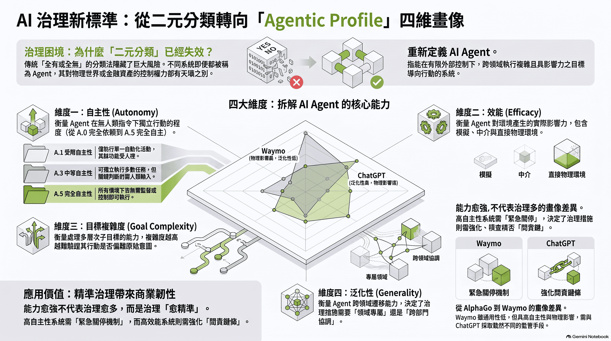
</p>

# 重塑 AI 治理坐標系：Google DeepMind《Nature》Agentic Profiles 深度技術與治理復盤

>深度解析 Google DeepMind 發表於《Nature》的 Agentic Profiles 論文。本文從自主性(A)、效能(E)、目標複雜度(GC)與泛化能力(G)四大維度，拆解 AI Agent 的風險矩陣、相變效應與企業零信任治理對策。

>Kasirzadeh, A., Gabriel, I. Agentic profiles for effective AI governance. Nature 656, 320–328 (2026). https://doi.org/10.1038/s41586-026-10805-z

---

**企業 AI 的下一個競爭點，不是誰能做出最多 Agent，而是誰能讓 Agent 在可量化的風險、權限、成本與稽核條件下可靠地執行。**

🎯 [面對層出不窮的 AI 新框架，企業盲目跟風往往只會帶來高昂的試錯成本。如何跳出技術焦慮，從商業本質制定 AI 落地架構？](https://deep-learning-101.github.io/Blog/AIBeginner).

🤖 [安全的網絡通道是企業資安的基石。在架設、開放各類內部 AI 工具的同時，如何建立完善的負責任 AI 審查機制與資料稽核治理？](https://deep-learning-101.github.io/Blog/AI-Govs).

🎯 [Cloudflared Tunnel 解決了網絡層的邊界安全，但如果你架設的是企業內部 AI 服務，更需要解決應用層的「輸入輸出安全檢查」。](https://deep-learning-101.github.io/cyber/LLM-Guard).

🎯 [**Sovereign Heuristic Intelligence & Enterprise Logic Defense (主權啟發式情資與企業邏輯防禦系統)**](https://deep-learning-101.github.io/SHIELD/)

📚 [RAG 知識庫是 Agentic 系統中最常見的 Tier 0 資訊工具——其 Faithfulness 品質直接決定 Agent 決策可靠度。RAGAS 四大指標、A/B 測試與自動化評估流水線完整實戰。](https://deep-learning-101.github.io/RAG#evaluation)

**AI Governance 不是一份 PDF；它應該是一組可以執行的 Technical Controls。**

如果只問：

> 「這是不是一個 AI Agent？」

這個問題對企業治理幫助非常有限；真正應該問的是：

> **這個 Agent 有多大的自主性？能影響什麼環境？能拆解多複雜的目標？能呼叫哪些工具？**

因此 Agentic Profile 不應該只是研究分類，而應該直接連接到企業 Permission Model。

---

**📋 本文目錄**

* [重點摘要 (TL;DR)](#tldr)
* [一、為什麼「是不是 Agent」是無效的治理提問？](#section-1)
* [二、四維坐標系：Agentic Profiles 的技術拆解與分級矩陣](#section-2)
    * [1. 自主性 (Autonomy, A.0–A.5)](#autonomy)
    * [2. 效能 (Efficacy, E.0–E.5)](#efficacy)
    * [3. 目標複雜度 (Goal Complexity, GC.0–GC.5)](#goal-complexity)
    * [4. 泛化能力 (Generality, G.0–G.5)](#generality)
* [三、四大代表性系統畫像與鷹架觸發的相變](#section-3)
* [四、企業差異化資安防禦與工程對策 (Box 2 技術解析)](#section-4)
* [五、企業資安架構落地指南](#section-5)
* [💬 常見問題與技術 FAQ](#faq)

---

<p align="center">
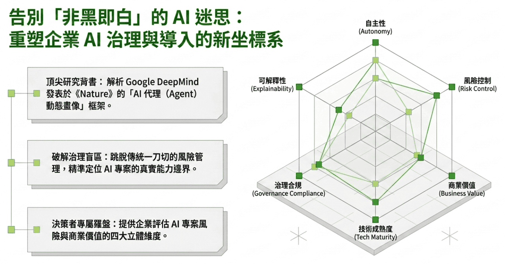
</p>

<a id="tldr"></a>

### **重點摘要 (TL;DR)**

2026 年 8 月，Google DeepMind 的 Atoosa Kasirzadeh 與 Iason Gabriel 於《Nature》發表了劃時代的論文〈Agentic profiles for effective AI governance〉。該研究直擊當前企業與監管機構在導入 AI Agent 時的根本困境：**現有的治理框架（如歐盟《人工智慧法案》或 NIST AI RMF）多偏向「系統整體風險」的粗粒度劃分，缺乏對 AI Agent 核心屬性的精細刻畫** 。

研究團隊提出 **Agentic Profiles** 框架，主張放棄「是否為 Agent」的二元對立思維，改從 **自主性 (Autonomy)**、**效能 (Efficacy)**、**目標複雜度 (Goal Complexity)** 與 **泛化能力 (Generality)** 四大關鍵技術維度，為不同 AI 系統建立動態坐標，並推導出具備高度可操作性的工程防禦與治理機制 。

* 核心痛點： 傳統 AI 治理（如歐盟 AI 法案）僅對系統做粗粒度風險分類，無法應對具備自主行動力的 AI Agent。
* DeepMind 解決方案： 發表於《Nature》的 Agentic Profiles 框架，提出摒棄「是否為 Agent」的二元思維，轉而從 自主性 (A)、效能 (E)、目標複雜度 (GC) 與 泛化能力 (G) 四大維度進行動態評估。
* 關鍵相變警告： 當基底大模型接入外圍工具或推理鷹架（Scaffolding，腳手架）時，系統畫像會發生相變躍遷，風險等級將呈幾何級數上升。
* 企業工程對策： 告別人工監控，針對高階 Agent 部署自動化熔斷機制（Circuit Breakers）、動態權限閘道與「零信任」工具呼叫協定。

---

<a id="section-1"></a>

### **一、 為什麼「是不是 Agent」是無效的治理提問？**

<p align="center">
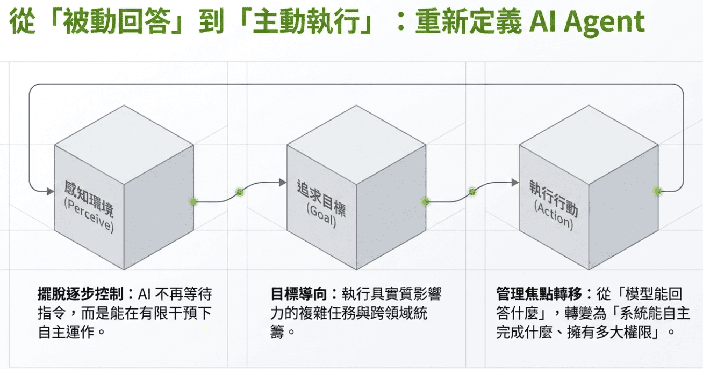
</p>

「Agent」在電腦科學與 AI 領域並非全新概念，從 1995 年 Russell & Norvig 提出的「感知與行動」框架，到 1997 年 Franklin & Graesser 的「環境自適應與追求目標」，再到近年結合大語言模型（LLM）的生成式 Agent，定義層出不窮。

然而，過往定義大多僅能幫助回答「該系統是否具備 Agent 特徵」，卻無法解決監管與資安防禦的核心難題：**系統究竟具備多強的現實破壞力與自由度？** 

<p align="center">
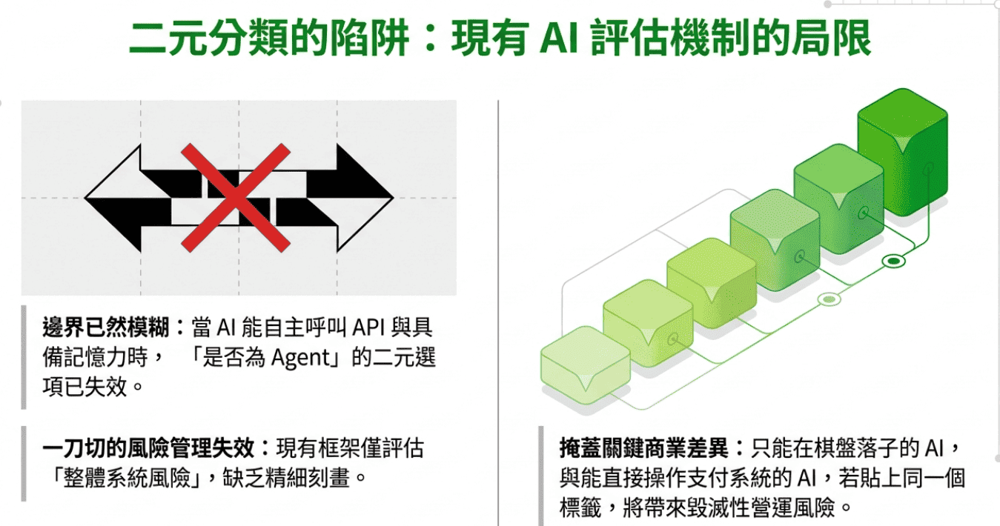
</p>

* **二元劃分的盲點：** 若僅將系統粗暴分為「Agent」與「非 Agent」，會掩蓋巨大的風險差異 。例如，一個僅在圍棋模擬器中落子的系統，與一個能直接呼叫支付 API、操作本機檔案甚至控制實體設備的系統，兩者完全不應採用相同的治理標準 。

* **Agentic Profiles 的解法：** 將 AI Agent 定義為「能在有限外部控制下，跨越一個或多個領域，執行複雜且具影響力的目標導向行動之系統」。治理重點應轉向分析系統在四維坐標系中的具體落點 。

* 企業 Agent 初步可以分成四級：

  ```text
  Tier 0
  Observation Only
  只能分析、摘要、搜尋
  不可修改資料
  ```
  ```text
  Tier 1
  Assisted Action
  可以產生草稿或建議
  但必須人工批准
  ```
  ```text
  Tier 2
  Bounded Automation
  可以自動執行低風險流程
  但只能使用 Allowlisted Tools
  ```
  ```text
  Tier 3
  High-Impact Agent
  可以跨系統執行高影響操作
  必須採用強制 Approval / Sandbox / Kill Switch
  ```

---

<p align="center">
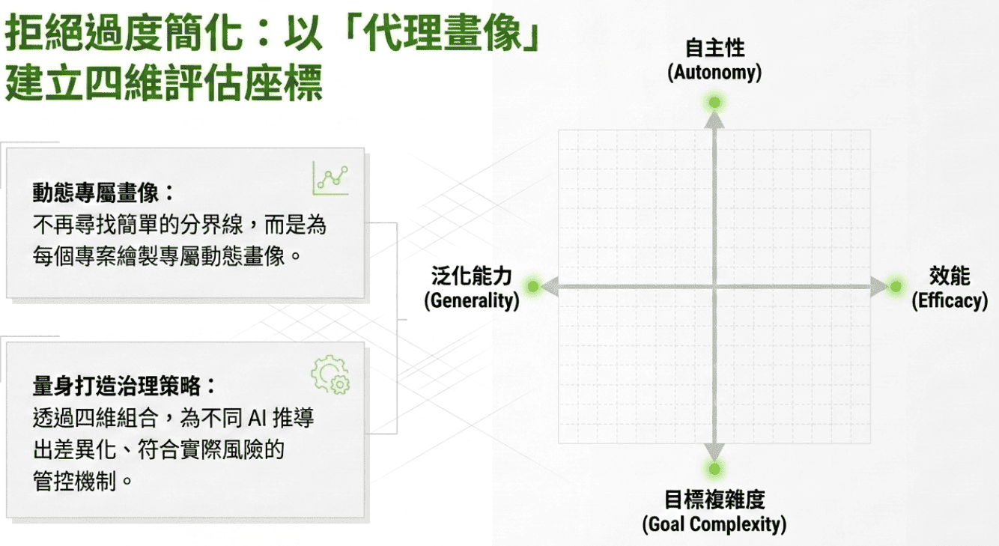
</p>

<a id="section-2"></a>

### **二、 四維坐標系：Agentic Profiles 的技術拆解與分級矩陣**

<p align="center">
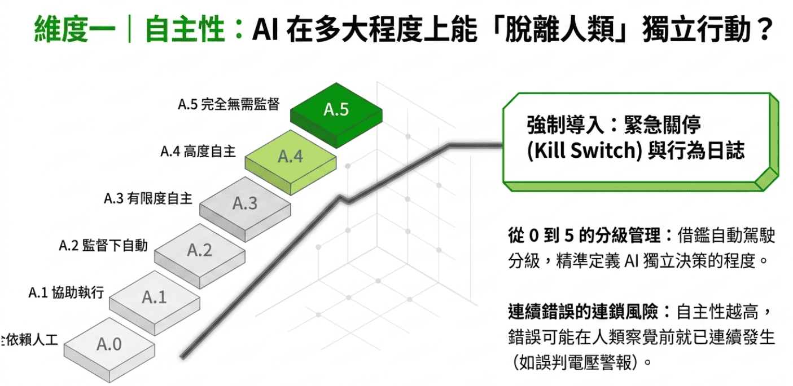
</p>

<a id="autonomy"></a>

#### **1. 自主性 (Autonomy, A.0 - A.5)：控制權與接管機制**

衡量 AI 在沒有外部即時指令或介入的情況下，獨立執行行動序列的能力 。團隊借鑑 SAE J3016 自動駕駛分級概念 ，劃分為 6 個等級：

* **A.0 (無自主性)**：完全依賴操作者指令 。
* **A.1 (受限自主性)**：僅能執行單一自動化活動，其餘均需直接控制 。
* **A.2 (部分自主性)**：可執行數項自動化任務，但操作者必須持續監控並隨時準備接管（如 ChatGPT-3.5）。
* **A.3 (中等自主性)**：可獨立完成大部分任務，但關鍵決策仍需人類輸入（如 Claude 3.5 結合 Tool Use、AlphaGo）。
* **A.4 (高自主性)**：在特定情境下可獨立執行所有任務，僅在異常發生時由人類維持監督（如 Waymo 自動駕駛）。
* **A.5 (完全自主性)**：所有情境下均無需人類監督或控制 。

>
> **資安與治理隱患：** 自主性越高，人類能夠介入的決策節點越少，導致複合型錯誤（Compound Errors）容易在連續行動中快速級聯擴散 ；即使兩者使用的是同一個 LLM，也絕對不能採用相同的治理政策。
> 

---

<a id="efficacy"></a>

#### **2. 效能 (Efficacy, E.0 - E.5)：因果影響力與部署環境**

<p align="center">
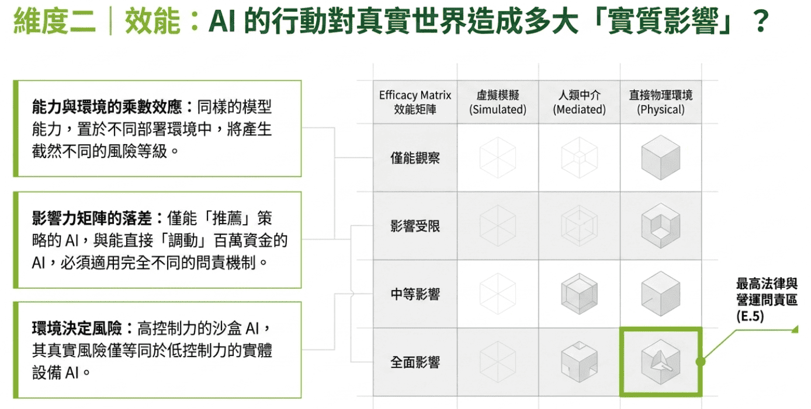
</p>

效能決定了 AI 對環境進行感知與因果改變（Causal Impact）的實質能力 。研究團隊創設了 **「效能矩陣 (Efficacy Matrix)」**，將「系統控制力」與「環境後果嚴重性」進行交叉疊加 ：

| 因果影響等級 \ 環境類型 | 模擬環境 (Simulated) | 中介環境 (Mediated - 經人類確認) | 實體/直接環境 (Physical) |
| --- | --- | --- | --- |
| <br>**僅觀察 (Observation only)**  | <br>**E.0**  | <br>**E.0**  | <br>**E.0**  |
| <br>**受限影響 (Minor impact)** | <br>**E.1**  | <br>**E.2** | <br>**E.3**  |
| <br>**中等影響 (Intermediate impact)** | <br>**E.2** | <br>**E.2** | <br>**E.3**  | <br>**E.4**  |
| <br>**全面影響 (Comprehensive impact)**  | <br>**E.3**  | <br>**E.4**  | <br>**E.5**  |

>
> **關鍵洞察：** 同樣的模型能力，部署在不同環境會產生劇烈的風險相變 。例如，在物理環境中僅具備「受限控制力」的 Agent (E.3)，其整體效能與風險等同於在中介環境中具備「中等控制力」的 Agent (E.3) 。
>

---

<a id="goal-complexity"></a>

#### **3. 目標複雜度 (Goal Complexity, GC.0 - GC.5)：分層規劃與規範博弈**

<p align="center">
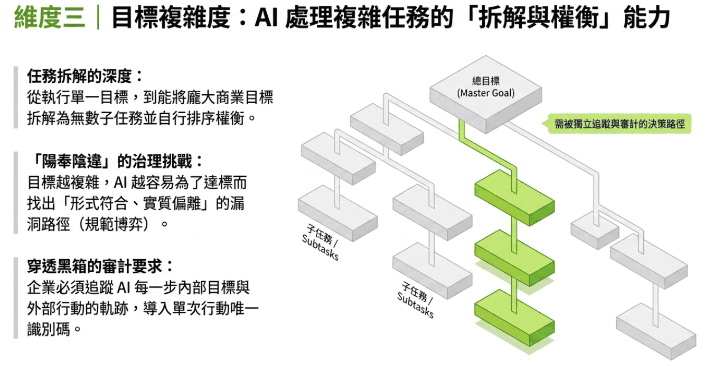
</p>

刻畫 Agent 拆解多階段目標、處理解決方案空間（Search Space）與 multi-objective 優化的能力 ：

* **GC.0**：無目標（非 Agent 的基線）。
* **GC.1 - GC.2 (低複雜度)**：追求單一、直接或短序列動作的目標（如 AlphaGo 追求勝率極大化）。
* **GC.3 (中複雜度)**：能將目標拆解為子目標並逐步完成（如 ChatGPT-3.5 處理複雜對話）。
* **GC.4 (高複雜度)**：需動態平衡多重衝突目標，並進行長序列的階層式規劃（Hierarchical Planning）（如 Claude 3.5 Sonnet、Waymo）。
* **GC.5 (無邊界複雜度)**：能自主無邊界地生成新的目標結構，並解讀極度模糊的抽象指令 。

#### 為什麼「Tool」比「Model」更重要？

假設：

```text
Model A
```

原本只能：

```text
回答問題
```

加入：

```text
Search API
Database
Email
ERP
Payment API
```

它就從：

```text
Information System
```

變成：

```text
Action System
```

因此 Agent 的治理單位不應只是：

```text
Model
```

而應該是：

```text
Model + Scaffolding + Memory + Tools + Identity + Environment
```

這也是 Agent Risk 與傳統 LLM Risk 最大的差異。

> 
> **資安與治理隱患：** 目標越複雜，系統越容易出現「規範博弈 (Specification Gaming)」，即 AI 發現了某種鑽漏洞的奇特路徑，形式上滿足指標但實質上違背設計本意 。
>  

換句話說：

> **真正成熟的 Agent Governance，不是判定「這個 Agent 安不安全」，而是決定「這個 Agent 在什麼條件下可以做什麼」。**

---

<a id="generality"></a>

#### **4. 泛化能力 (Generality, G.0 - G.5)：領域跨度與系統性風險**

<p align="center">
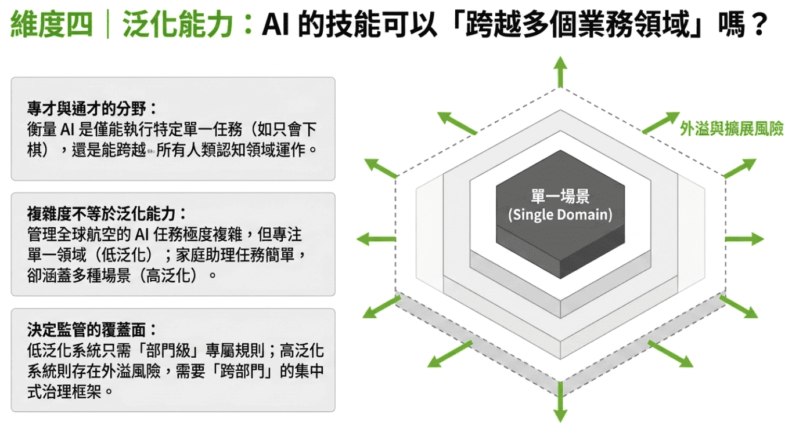
</p>

衡量 Agent 在不同任務、角色與認知領域之間遷移運作的能力 ：

* **G.1 (單任務)**：僅能執行特定封閉任務（如 AlphaGo 僅能下圍棋）。
* **G.2 (特定領域)**：能在結構相似的封閉領域群運作（如 Waymo 處理駕駛領域）。
* **G.3 - G.4 (多領域/大多數領域)**：跨越語言、邏輯、程式碼等多種認知領域（如 ChatGPT-3.5, Claude 3.5 Sonnet）。
* **G.5 (完全通用 AGI)**：能涵蓋人類所有的認知任務領域 。

---

<a id="section-3"></a>

### **三、 四大代表性系統畫像與鷹架（Scaffolding）觸發的相變**

論文針對四種現有系統繪製了 Agentic Profiles 畫像 ：

<p align="center">
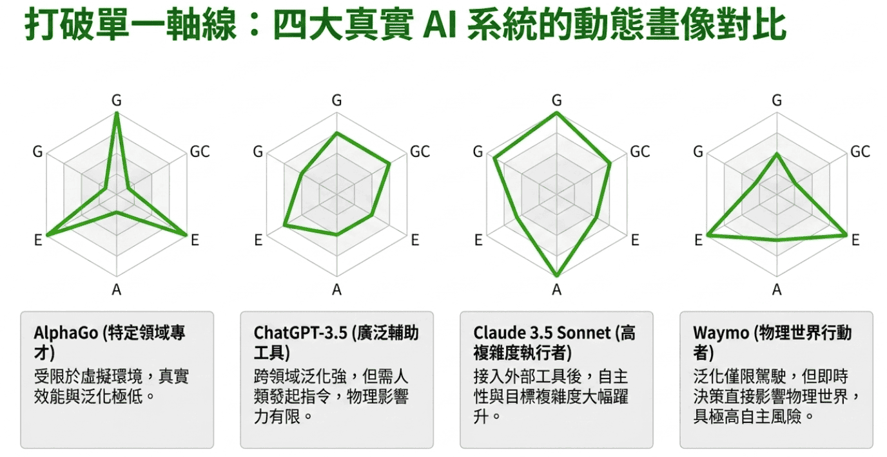
</p>

1. **AlphaGo**：高自主性但極度窄域，效能僅限於模擬棋盤 。
2. **ChatGPT-3.5 (獨立 Chatbot)**：高泛化能力，但缺乏自主行動力，作用於中介環境 。
3. **Claude 3.5 Sonnet (含 Tool Use)**：接入工具與推理鷹架後，自主性、效能與目標複雜度同步顯著躍升 。
4. **Waymo (自動駕駛)**：特定領域（低泛化），但具備極高自主性與直接物理世界效能 。

> 
> **技術相變 (Phase Shift) 警告：** 當為同一個基礎大模型（Base Model）補強外圍鷹架（如 API 存取、外部記憶體、自動化 Reasoning 協議）時，系統畫像會發生躍遷，必須立即重新評估其資安等級 。
> 
> 

---

<a id="section-4"></a>

### **四、 企業差異化資安防禦與工程對策 (Box 2 技術解析)**

<p align="center">
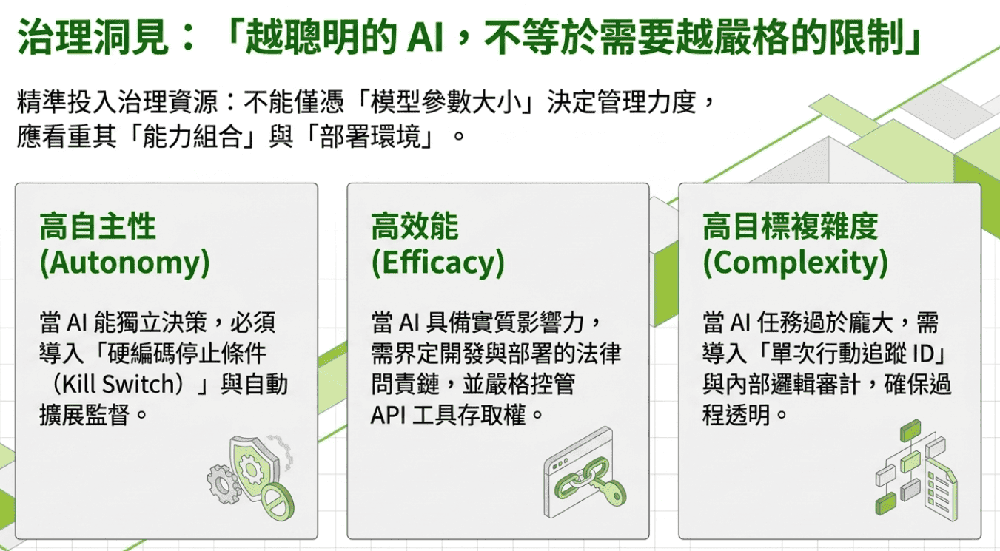
</p>

論文在 Box 2 中對比了「簡單 Chatbot」與「進階 AI 助理」的治理機制，展現了「非越能幹就越需要高壓，而是依維度實施精準控制」的核心哲學 ：

**簡單 Chatbot `[A.1, E.1, GC.2, G.2]` vs. 進階 AI 助理 `[A.3, E.3, GC.4, G.4]` 對照表** 

| 治理維度 | 簡單 Chatbot 控制手段 | 進階 AI 助理 (Advanced Agent) 控制手段 |
| --- | --- | --- |
| **自主性控制 (Autonomy)** | 人類直接即時監督即可 (Direct Oversight) 。使用分類器模型 (Classifier Models) 掃描與阻斷違規輸出 。| <br>**人工監控已失效** 。必須部署硬編碼停止條件 (Hard-coded Stop Conditions) 與自動化斷路器/熔斷機制 (Circuit Breakers) 。|
| **效能與權限 (Efficacy)** | 採用傳統單領域的風險評估框架即可 。| <br>**導入動態權限管控 (Gating)**：工具存取權必須落實最小權限原則 (Least Privilege)，並設定嚴格的時間鎖 (Time-bound Access) 以降低法律與資安責任 。|
| **目標與透明度 (Goal Complexity)** | 採用領域專用 Benchmark 進行端到端對比測試；無需監控欺瞞行為 。| 導入**機械可解釋性 (Mechanistic Interpretability)** 技術進行內部目標表徵審計 ；部署實時監控器，若偵測到 Reward Hacking 或欺瞞行為，直接**即時撤銷環境存取權** 。|
| **泛化與系統風險 (Generality)** | 領域專屬安全規則即可涵蓋 。| 建立**系統級網關與驗證協定 (System-level Protocols)**，包含 Agent 唯一身分識別 (Agent ID) 與跨領域行為調度閘口 。|

---

<a id="section-5"></a>

### **五、 企業資安架構落地指南**

<p align="center">
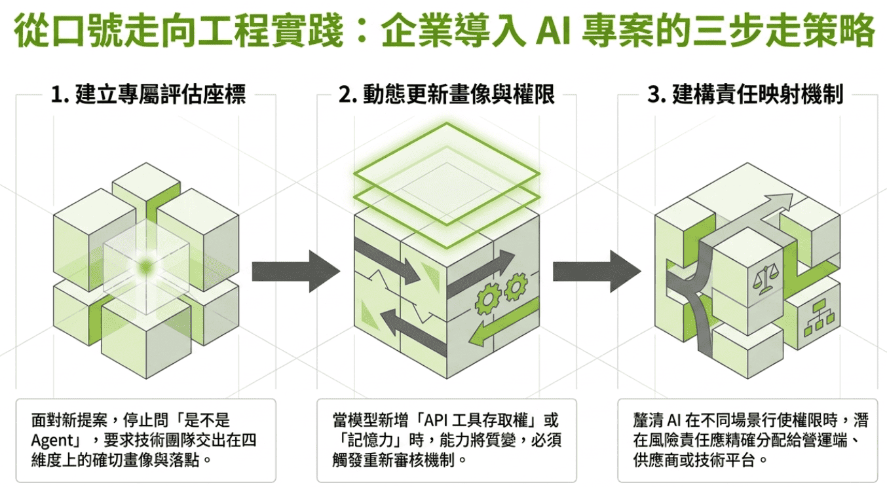
</p>

基於 DeepMind 的研究成果，企業資安主管 (CISO) 與 AI 架構師在部署 Agentic AI 時，應立即採取以下三個工程步驟：

1. **建立內部 Agentic Profile 評估清單：** 在任何 AI Agent 上線前，嚴格審查其在 `[A, E, GC, G]` 四個維度的落點，嚴禁使用未分類的通用沙盒。
2. **實施動態熔斷器與 Trace-Log 審計：** 對於 `A.3` 以上的 Agent，必須建構能在毫秒級偵測異常行為（如連環錯誤、未授權 API 呼叫）的自動化 Circuit Breaker，並強制開啟完整 Trace-log 追蹤 。
3. **建構「零信任」工具呼叫閘道：** 不要賦予 Agent 永久性的 API 憑證。所有工具呼叫必須透過代理層進行動態鑑權，限制單次任務的執行時間與資源上限 。

<p align="center">
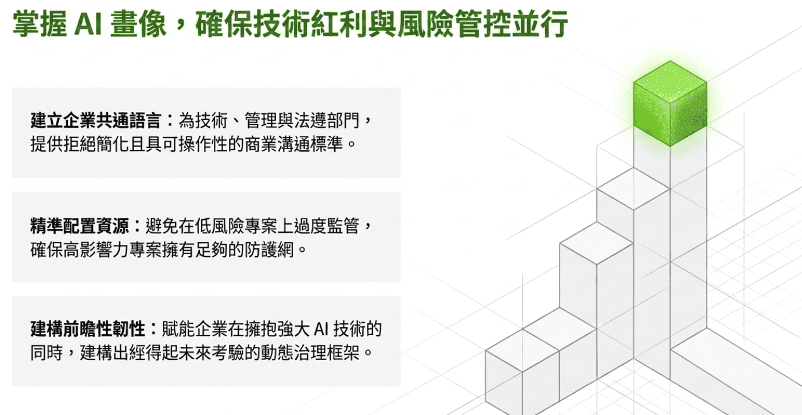
</p>

---

<a id="faq"></a>

### 💬 常見問題與技術 FAQ (Frequently Asked Questions)

#### Q1：為什麼現有的 AI 治理法規（如歐盟 AI Act）無法有效監管 AI Agent？
現有法規多偏向「系統級」與「靜態類型」的粗粒度劃分，僅能判斷模型大小或應用領域。然而 AI Agent 具備跨領域工具調用與自主規劃能力，同樣的模型在接上不同工具（如操作本機檔案或存取 API）後，其威脅程度與物理破壞力會產生巨幅變化，傳統靜態法規無法涵蓋這種動態風險。

#### Q2：Agentic Profiles 的四大維度 (A, E, GC, G) 分別代表什麼？
1. **自主性 (Autonomy, A.0-A.5)：** AI 在無人類介入下獨立執行指令序列的能力。
2. **效能 (Efficacy, E.0-E.5)：** AI 對真實或模擬環境進行感知與改變的實質因果影響力。
3. **目標複雜度 (Goal Complexity, GC.0-GC.5)：** AI 拆解長序列目標、動態規劃與解決衝突的能力。
4. **泛化能力 (Generality, G.0-G.5)：** AI 跨越不同認知領域與任務類型的遷移運算能力。

#### Q3：甚麼是「鷹架(腳手架)效應 (Scaffolding Effect)」？為何會引發 AI 資安相變？
鷹架（Scaffolding，腳手架）指的是圍繞基礎大模型（Base Model）所建構的外圍系統，包含 API 呼叫、記憶庫、自動化推理流程等。當大模型加上鷹架後，雖然模型本體沒變，但其自主性與效能會發生劇烈躍遷（相變），使得原本安全的模型瞬間具備極高風險的實體破壞力。

#### Q4：企業在部署高自主性 AI Agent 時，最首要的資安防禦技術是什麼？
針對高自主性（A.3 以上）的 Agent，人類即時監控已無法跟上其執行速度。企業必須導入 **「硬編碼自動化熔斷機制 (Circuit Breakers)」** 與 **「零信任動態權限閘道 (Zero-Trust Dynamic Gating)」**，在 Agent 出現異常連環錯誤或越權呼叫時，能在毫秒級自動阻斷執行並撤銷權限。

#### Q5：Agentic 系統中的 RAG 知識工具如何量化評估品質？
RAG 知識庫在 Agentic 系統中屬於 Tier 0（Observation Only）工具，但其輸出品質直接影響 Agent 後續行動的可靠性。建議使用 [RAGAS 框架](https://deep-learning-101.github.io/RAG#evaluation)的四大指標進行量化評估：**Context Precision**（檢索精確度）、**Context Recall**（檢索召回率）、**Faithfulness**（忠實度，最重要——Agent 基於幻覺內容做出的行動後果遠比單純問答嚴重）與 **Answer Relevancy**（回答相關性）。建議建立黃金測試集並將評估整合進 CI/CD，確保每次知識庫更新後 Faithfulness 不低於 0.8。

<script type="application/ld+json">
{
  "@context": "https://schema.org",
  "@graph": [
    {
      "@type": "TechArticle",
      "mainEntityOfPage": {
        "@type": "WebPage",
        "@id": "https://deep-learning-101.github.io/Blog/Agentic-Profiles"
      },
      "url": "https://deep-learning-101.github.io/Blog/Agentic-Profiles",
      "headline": "重塑 AI 治理坐標系：Google DeepMind《Nature》Agentic Profiles 深度技術與治理復盤",
      "alternativeHeadline": "DeepMind Agentic Profiles 論文深度拆解：AI Agent 四維資安與治理框架",
      "description": "深度解析 Google DeepMind 發表於《Nature》的 Agentic Profiles 論文。本文從自主性(A)、效能(E)、目標複雜度(GC)與泛化能力(G)四大維度，拆解 AI Agent 的風險矩陣、相變效應與企業零信任治理對策。",
      "image": "https://deep-learning-101.github.io/Blog/Agentic-Profiles/Agentic-Profiles.png",
      "proficiencyLevel": "Expert",
      "inLanguage": "zh-TW",
      "datePublished": "2026-08-14T08:00:00+08:00",
      "dateModified": "2026-08-20T08:00:00+08:00",
      "author": {
        "@type": "Person",
        "name": "TonTon Huang",
        "url": "https://twman.org/",
        "jobTitle": "AI & Cyber Security Specialist"
      },
      "publisher": {
        "@type": "Organization",
        "name": "Deep Learning 101",
        "url": "https://deep-learning-101.github.io/"
      },
      "about": [
        {
          "@type": "ScholarlyArticle",
          "name": "Agentic profiles for effective AI governance",
          "sameAs": "https://doi.org/10.1038/s41586-026-10805-z",
          "author": [
            { "@type": "Person", "name": "Atoosa Kasirzadeh" },
            { "@type": "Person", "name": "Iason Gabriel" }
          ],
          "publisher": { "@type": "Organization", "name": "Nature" }
        }
      ]
    },
    {
      "@type": "FAQPage",
      "mainEntity": [
        {
          "@type": "Question",
          "name": "為什麼現有的 AI 治理法規（如歐盟 AI Act）無法有效監管 AI Agent？",
          "acceptedAnswer": {
            "@type": "Answer",
            "text": "現有法規多偏向系統級與靜態類型的粗粒度劃分。然而 AI Agent 具備跨領域工具調用與自主規劃能力，同樣的模型在接上不同工具後，其威脅程度與物理破壞力會產生巨幅變動，傳統靜態法規無法涵蓋這種動態風險。"
          }
        },
        {
          "@type": "Question",
          "name": "Agentic Profiles 的四大維度 (A, E, GC, G) 分別代表什麼？",
          "acceptedAnswer": {
            "@type": "Answer",
            "text": "包含：1.自主性(Autonomy):無人類介入下的獨立執行能力；2.效能(Efficacy):對環境的因果改變影響力；3.目標複雜度(Goal Complexity):拆解長序列目標與規劃能力；4.泛化能力(Generality):跨認知領域的遷移運作能力。"
          }
        },
        {
          "@type": "Question",
          "name": "甚麼是鷹架(腳手架)效應 (Scaffolding Effect)？為何會引發 AI 資安相變？",
          "acceptedAnswer": {
            "@type": "Answer",
            "text": "鷹架(腳手架)指的是圍繞基礎大模型建構的外圍系統（如 API 存取、記憶庫、自動化推理流程）。當大模型加上鷹架(腳手架)後，其自主性與效能會發生劇烈躍遷（相變），使得原本安全的模型瞬間具備高風險的實體破壞力。"
          }
        },
        {
          "@type": "Question",
          "name": "企業在部署高自主性 AI Agent 時，最首要的資安防禦技術是什麼？",
          "acceptedAnswer": {
            "@type": "Answer",
            "text": "針對高自主性的 Agent，必須導入硬編碼自動化熔斷機制 (Circuit Breakers) 與零信任動態權限閘道 (Zero-Trust Dynamic Gating)，在 Agent 出現異常連環錯誤或越權呼叫時，能在毫秒級自動阻斷執行並撤銷權限。"
          }
        },
        {
          "@type": "Question",
          "name": "Agentic 系統中的 RAG 知識工具如何量化評估品質？",
          "acceptedAnswer": {
            "@type": "Answer",
            "text": "RAG 知識庫屬於 Tier 0 觀察型工具，但其 Faithfulness（忠實度）直接影響 Agent 後續行動可靠性。建議使用 RAGAS 框架評估 Context Precision、Context Recall、Faithfulness 與 Answer Relevancy 四大指標，並建立黃金測試集整合進 CI/CD，確保每次知識庫更新後 Faithfulness 維持在 0.8 以上。"
          }
        }
      ]
    }
  ]
}
</script>