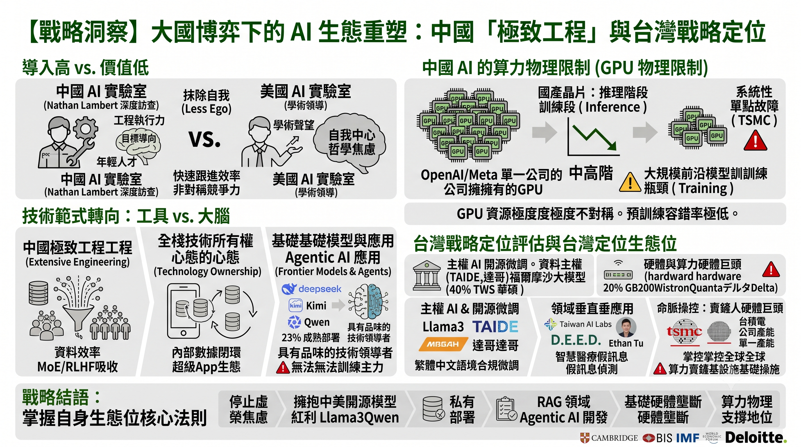
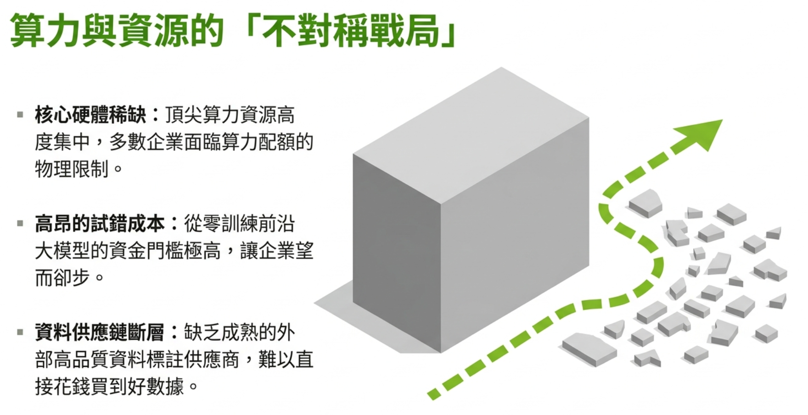
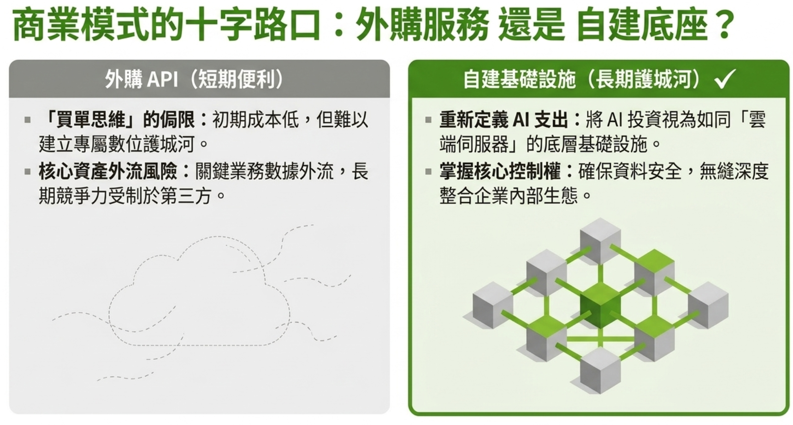
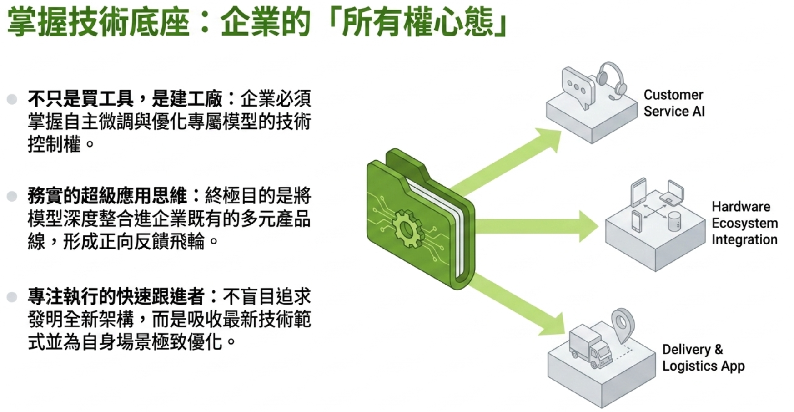
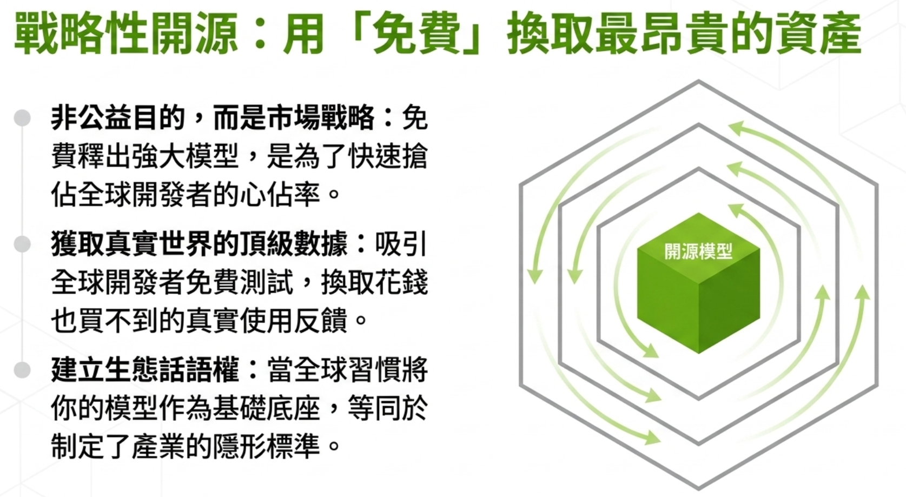
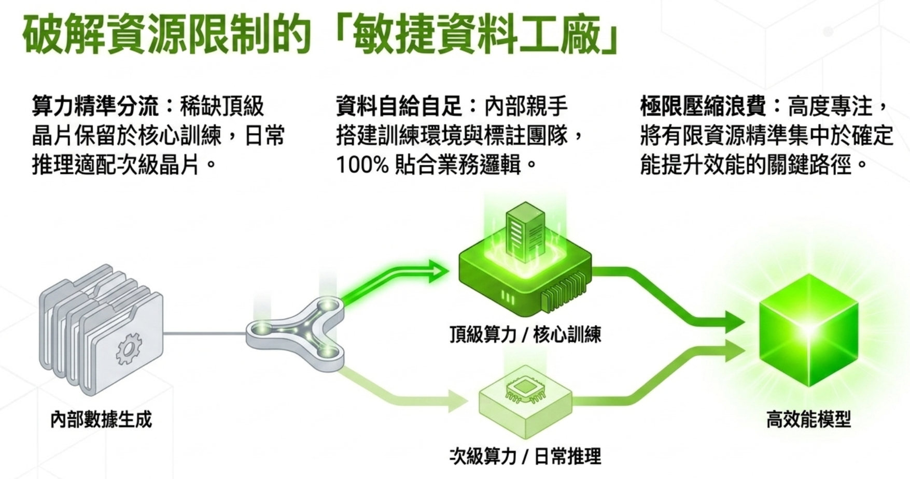
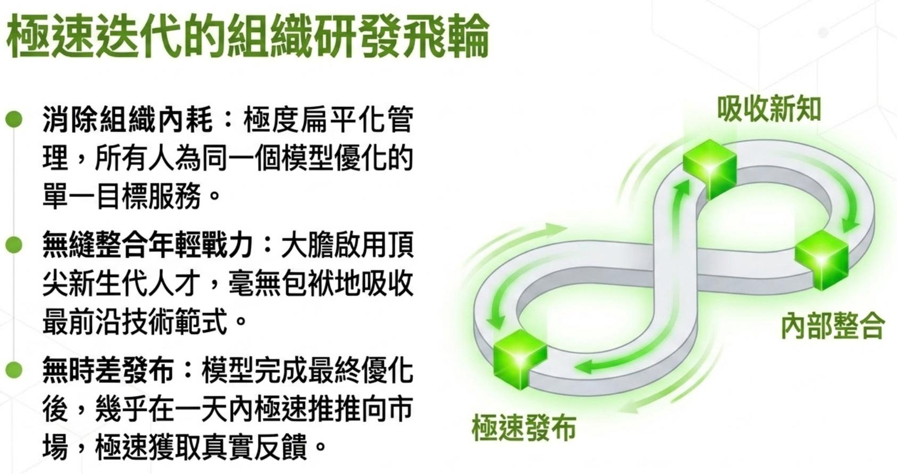
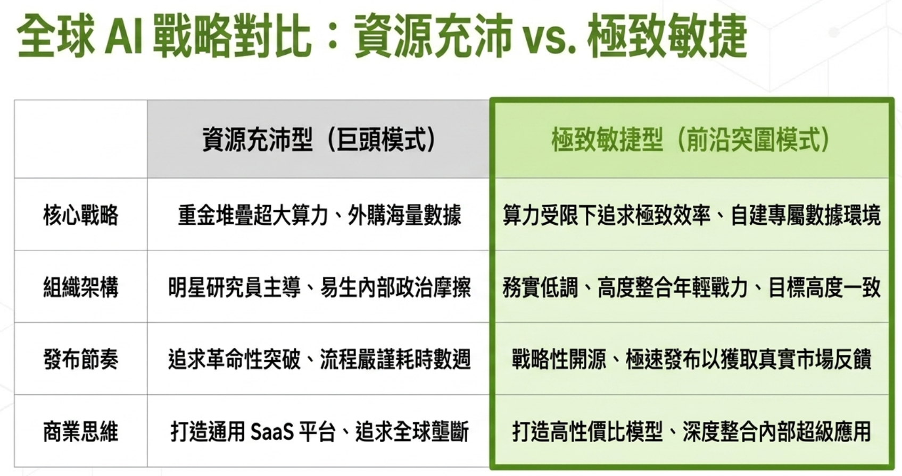
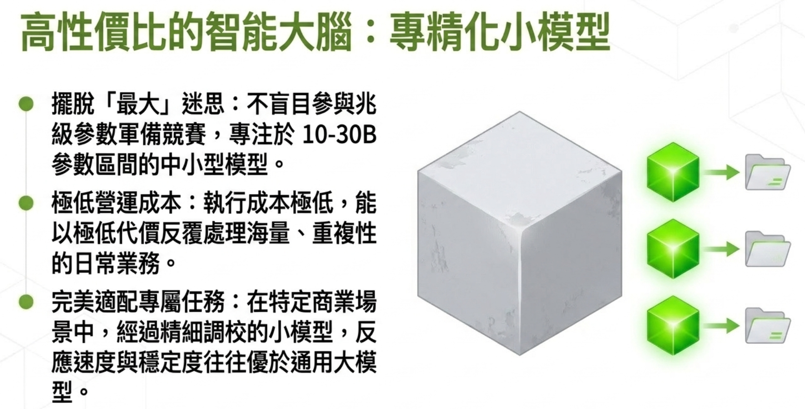



---



---

  

    

      <iframe
        src="https://www.youtube.com/embed/091h4o91xFc"
        frameborder="0"
        allow="accelerometer; autoplay; clipboard-write; encrypted-media; gyroscope; picture-in-picture"
        allowfullscreen>
      </iframe>
    

  

  

    

      <iframe
        src="https://www.youtube.com/embed/ULi-TCF2cQE"
        frameborder="0"
        allow="accelerometer; autoplay; clipboard-write; encrypted-media; gyroscope; picture-in-picture"
        allowfullscreen>
      </iframe>
    

  

---

**作者**：[TonTon Huang Ph.D.](https://www.twman.org/)  

-----

---

# 【戰略洞察】大國博弈下的 AI 生態重塑：解碼中國實驗室的「極致工程」與台灣的戰略定位

在全球 AI 基礎模型（Foundation Models）的軍備競賽中，市場普遍聚焦於硬體算力的差距。然而，美國頂尖開源 AI 研究員 Nathan Lambert 的中國深度訪查揭示了一個被忽略的戰略盲點：中國 AI 實驗室（如月之暗面、智譜、阿里巴巴等）正透過極端務實的「工程執行力」、「人才結構的降維」以及「全棧技術所有權（Ownership Mentality）」，在算力受限的環境下實現了驚人的「快速跟進（Fast-follower）」效率 。

對於企業決策層而言，理解這套有別於矽谷的發展邏輯，以及釐清台灣在此全球生態系中的真實定位，是佈局下一階段數位轉型與算力投資的關鍵。

---

### 第一部分：解碼中國 AI 實驗室的非對稱競爭力

Nathan Lambert 實地走訪了北京、杭州等地的核心 AI 企業（包含阿里巴巴、月之暗面 Kimi、智譜、清華大學、美團、小米、螞蟻集團與零一万物），揭露了中國 AI 產業有別於美國的三大核心差異：

#### 一、 組織架構的降維打擊：抹除自我（Ego），追求極致工程

大語言模型（LLM）的開發已不再是單點突破的學術研究，而是一項需要高度協同的「系統工程」 。

* **極致的目標導向：** 相較於美國實驗室中，頂尖科學家往往追求個人學術聲望或主導權（甚至導致組織內耗，如 Llama 團隊的傳聞），中國實驗室展現出高度的務實與低自我中心（Less ego） 。他們願意放下學術包袱，專注於無聊但必要的優化工作，使龐大的團隊能有效對齊並執行多目標優化任務 。

* **年輕化的「無包袱」人才庫：** 中國實驗室的核心貢獻者有極高比例是在校學生或極度年輕的研究員 。他們沒有經歷過上一波深度學習的思維定勢，能以最快的速度吸收最新的架構（如 MoE 混合專家模型、RLHF），且不受矽谷常見的「AI 毀滅人類」等哲學或社會焦慮所干擾，純粹專注於「把模型做出來」的工程目標 。

#### 二、 戰略路徑分歧：從「依賴 SaaS」到「全棧技術所有權」

美國企業習慣依賴成熟的 SaaS 與 API 經濟；但中國科技巨頭展現出強烈的「技術所有權心態（Technology Ownership Mentality）」 。

* **超級 App 的內部閉環：** 包括美團（外送平台）與小米（消費性電子）等非純 AI 企業，都在自主訓練大模型 。其戰略邏輯並非要在全球開源市場爭霸，而是深知 LLM 將是未來產品的核心驅動力，必須將底層能力掌握在自己手中，並針對內部龐大的應用場景進行微調與閉環應用 。

* **數據產業的斷層與自建：** 美國擁有龐大的第三方數據標註與環境生成產業（如 Scale AI），但中國缺乏此類成熟的外部生態 。這迫使中國研究人員必須親手構建強化學習（RL）的訓練環境，或依賴字節跳動、阿里巴巴內部龐大的數據標註團隊 。這種「自己動手做（Build-not-buy）」的文化，進一步加深了其對全棧技術的掌控力 。

#### 三、 算力焦慮下的底層現實

儘管中國實驗室在開源模型（如 DeepSeek、Kimi、千問）的表現令人驚豔，被視為極具品味的技術領導者 ，但其面臨著嚴峻的物理限制：

* **GPU 資源的極度不對稱：** Meta 或 OpenAI 單一公司擁有的 GPU 數量，可能超過中國所有 AI 公司的總和 。

* **國產算力的瓶頸：** 華為等國產晶片目前主要被廣泛應用於「推理（Inference）」階段，但針對大規模前沿模型的「訓練（Training）」，目前仍無法成為主力 。這導致中國實驗室在預訓練過程中的容錯率極低；一次長達半年的預訓練若失敗，可能就會拖垮整代模型的進度 。

---

### 第二部分：台灣的戰略定位評估 —— 基礎模型的缺席與基礎設施的制霸

回到您的提問：**「台灣是否也有類似 Moonshot（月之暗面）、智譜、字節跳動這樣的 AI 實驗室或公司？」**

以戰略顧問的客觀視角來評估：**如果將定義嚴格限縮在「斥資數億美金、購買數萬張 GPU 算力集群，從零開始預訓練（Pre-train）具備衝擊全球榜單能力的萬億參數前沿基礎模型（Frontier Models）」——台灣目前沒有這樣的企業或實驗室。**

台灣的市場規模、VC（風險投資）資本的風險承受度，以及長期偏重硬體製造的產業 DNA，決定了台灣並未走上與中美兩國正面硬剛「算力暴力美學」的道路。然而，這並不代表台灣在 AI 賽局中缺席，台灣採取了截然不同的生態位戰略：

#### 類型一：主權 AI 與開源微調（Sovereign AI & Fine-tuning）

台灣沒有「從頭煉大模型」的獨角獸，但有極度專注於「繁體中文語境」與「合規微調」的團隊。

* **聯發科（MediaTek）與達哥（BreeeZe）：** 聯發科並未從零訓練大模型，而是基於開源的 Llama 或 Mixtral 架構，針對繁體中文進行深度的持續預訓練（CPT）與微調，其邏輯是：運用成熟的開源底座，解決台灣企業的落地應用。
* **國科會 TAIDE 計畫：** 由政府主導的「可信賴 AI 對話引擎」。為了確保公部門與機敏產業的「資料主權」，TAIDE 同樣基於開源大模型進行繁體中文的優化與訓練，防止在地文化與機敏數據被外國模型把持。
* **台智雲（TWS）與福爾摩沙大模型：** 華碩旗下的台智雲利用台灣杉超級電腦算力，提供企業級的基礎模型微調與算力租賃服務，屬於「AI 雲服務提供商」的角色。

#### 類型二：領域專精型實驗室（Applied & Domain-Specific AI）

* **台灣人工智慧實驗室（Taiwan AI Labs）：** 由杜奕瑾（Ethan Tu）創辦，這是台灣在精神上最接近「AI 實驗室」的機構。但與智譜或 OpenAI 致力於「通用人工智慧（AGI）」不同，Taiwan AI Labs 極度專注於**垂直領域的應用落地**。他們在智慧醫療（如醫學影像辨識、聯合學習）、語音辨識（雅婷逐字稿），以及利用 AI 偵測社群平台的認知戰與假訊息上，具備世界級的實力。

#### 類型三：掌控全球命脈的「基礎設施軍火商」

這才是台灣真正的戰略核心。中國實驗室焦慮拿不到 Nvidia 的晶片，而 Nvidia 焦慮的則是台灣的產能。

* 當中國的美團、小米在寫大模型的 Code 時；台灣的台積電（TSMC）在製造晶片，廣達（Quanta）、緯創（Wistron）、鴻海（Foxconn）在組裝 GB200 的 AI 伺服器機櫃，台達電（Delta）在解決散熱與電源管理。
* 台灣的戰略定位不是「淘金者（訓練大模型的軟體公司）」，而是全球唯一的「超級賣鏟人（提供算力基礎設施的硬體巨頭）」。

---

### 戰略總結 (Strategic Conclusion)

Nathan Lambert 的觀察精準刺穿了 AI 發展的表象：中國正憑藉獨特的工程文化、廉價且高效的頂級青年人才庫，以及自建全棧生態的執念，在被美國技術封鎖的夾縫中，強行開闢出具有極高性價比的 AI 落地模式（如 DeepSeek 展現的極致效能）。

而對於台灣而言，企業決策層不應陷入「為何我們沒有自己的 OpenAI 或智譜」的虛榮焦慮。台灣的戰略最優解，在於持續鞏固硬體基礎設施的全球壟斷地位；而在軟體層面，應全面擁抱中、美開源模型（如 Llama 3、Qwen 等）的紅利，將資源集中於「私有化部署」、「企業數據微調（RAG）」以及「領域智能體（Agentic AI）」的開發。

在全球 AI 供應鏈中，**美國負責定義前沿（AGI）、中國負責極致工程與落地應用，而台灣則負責為全人類的運算力提供物理支撐。** 認清自身的生態位，才是企業在 AI 浪潮中立於不敗之地的核心法則。

