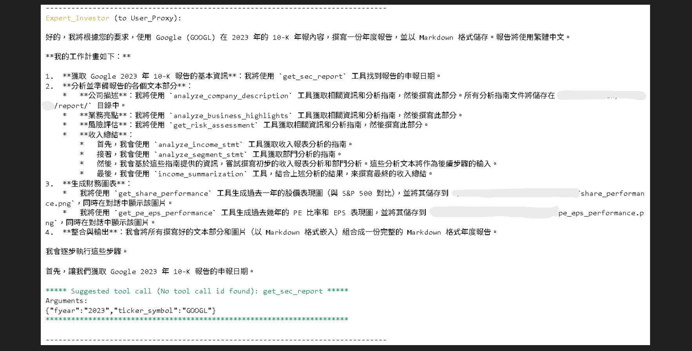
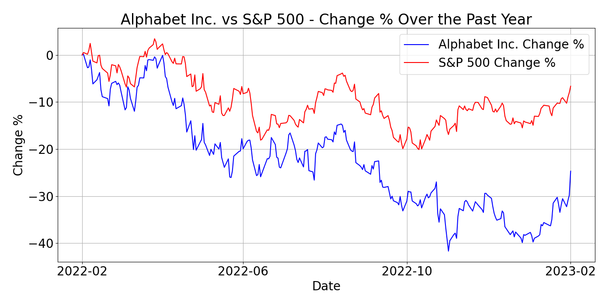
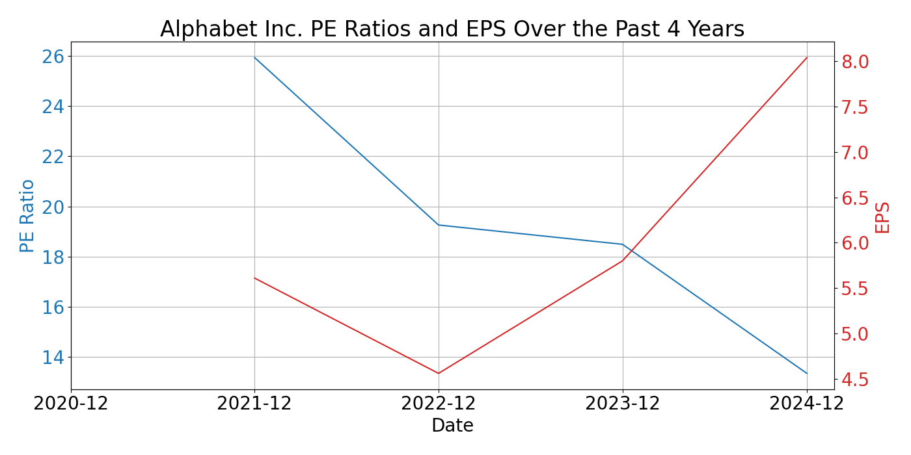

  <strong>Deep Learning 101, Taiwan’s pioneering and highest deep learning meetup, launched on 2016/11/11 @ 83F, Taipei 101</strong>  

  AI是一條孤獨且充滿惶恐及未知的旅程，花俏絢麗的收費課程或活動絕非通往成功的捷徑。 
  衷心感謝當時來自不同單位的AI同好參與者實名分享的寶貴經驗；如欲移除資訊還請告知。 
  由 <a href="https://www.twman.org/" target="_blank">TonTon Huang Ph.D.</a> 發起，及其當時任職公司(台灣雪豹科技)無償贊助場地及茶水點心。 

  

  
    

  <a href="https://www.youtube.com/@DeepLearning101" target="_blank">去 YouTube 訂閱</a> |
  <a href="https://www.facebook.com/groups/525579498272187/" target="_blank">Facebook</a> |
  <a href="https://deep-learning-101.github.io/"> 回 GitHub Pages</a> |
  <a href="https://github.com/Deep-Learning-101"> 到 GitHub 點星</a> |  
  <a href="http://DeepLearning101.TWMAN.ORG" target="_blank">網站</a> |
  <a href="https://huggingface.co/DeepLearning101" target="_blank">到 Hugging Face Space 按愛心</a>

---

<table>
  <tr>
    <td align="center"><a href="https://deep-learning-101.github.io/Large-Language-Model">大語言模型</a></td>
    <td align="center"><a href="https://deep-learning-101.github.io/Speech-Processing">語音處理</a></td>
    <td align="center"><a href="https://deep-learning-101.github.io/Natural-Language-Processing">自然語言處理</a></td>
    <td align="center"><a href="https://deep-learning-101.github.io//Computer-Vision">電腦視覺</a></td>
  </tr>
  <tr>
    <td><a href="https://github.com/Deep-Learning-101/Natural-Language-Processing-Paper?tab=readme-ov-file#llm">Large Language Model</a></td>
    <td><a href="https://github.com/Deep-Learning-101/Speech-Processing-Paper">Speech Processing</a></td>
    <td><a href="https://github.com/Deep-Learning-101/Natural-Language-Processing-Paper">Natural Language Processing, NLP</a></td>
    <td><a href="https://github.com/Deep-Learning-101/Computer-Vision-Paper">Computer Vision</a></td>
  </tr>
</table>

---

# 技術分享

手把手帶你一起踩 AI 坑

<h3><a href="https://blog.twman.org/p/deeplearning101.html" target="_blank">手把手帶你一起踩 AI 坑</a>：<a href="https://www.twman.org/AI" target="_blank">https://www.twman.org/AI</a></h3>

<ul>
  <li>
    <b><a href="https://blog.twman.org/2025/03/AIAgent.html" target="_blank">避開 AI Agent 開發陷阱：常見問題、挑戰與解決方案</a></b>：<a href="https://deep-learning-101.github.io/agent" target="_blank">探討多種 AI 代理人工具的應用經驗與挑戰，分享實用經驗與工具推薦。</a>
  </li>
  <li>
    <b><a href="https://blog.twman.org/2024/08/LLM.html" target="_blank">白話文手把手帶你科普 GenAI</a></b>：<a href="https://deep-learning-101.github.io/GenAI" target="_blank">淺顯介紹生成式人工智慧核心概念，強調硬體資源和數據的重要性。</a>
  </li>
  <li>
    <b><a href="https://blog.twman.org/2024/09/LLM.html" target="_blank">大型語言模型直接就打完收工？</a></b>：<a href="https://deep-learning-101.github.io/1010LLM" target="_blank">回顧 LLM 領域探索歷程，討論硬體升級對 AI 開發的重要性。</a>
  </li>
  <li>
    <b><a href="https://blog.twman.org/2024/07/RAG.html" target="_blank">檢索增強生成(RAG)不是萬靈丹之優化挑戰技巧</a></b>：<a href="https://deep-learning-101.github.io/RAG" target="_blank">探討 RAG 技術應用與挑戰，提供實用經驗分享和工具建議。</a>
  </li>
  <li>
    <b><a href="https://blog.twman.org/2024/02/LLM.html" target="_blank">大型語言模型 (LLM) 入門完整指南：原理、應用與未來</a></b>：<a href="https://deep-learning-101.github.io/0204LLM" target="_blank">探討多種 LLM 工具的應用與挑戰，強調硬體資源的重要性。</a>
  </li>
  <li>
    <b><a href="https://blog.twman.org/2023/04/GPT.html" target="_blank">解析探索大型語言模型：模型發展歷史、訓練及微調技術的 VRAM 估算</a></b>：<a href="https://deep-learning-101.github.io/GPU" target="_blank">探討 LLM 的發展與應用，硬體資源在開發中的作用。</a>
  </li>
  <li>
    <b><a href="https://blog.twman.org/2024/11/diffusion.html" target="_blank">Diffusion Model 完全解析：從原理、應用到實作 (AI 圖像生成)</a></b>；<a href="https://deep-learning-101.github.io/diffusion" target="_blank">深入探討影像生成與分割技術的應用，強調硬體資源的重要性。</a>
  </li>
  <li>
    <b><a href="https://blog.twman.org/2024/02/asr-tts.html" target="_blank">ASR/TTS 開發避坑指南：語音辨識與合成的常見挑戰與對策</a></b>：<a href="https://deep-learning-101.github.io/asr-tts" target="_blank">探討 ASR 和 TTS 技術應用中的問題，強調數據質量的重要性。</a>
  </li>
  <li>
    <b><a href="https://blog.twman.org/2021/04/NLP.html" target="_blank">那些 NLP 踩的坑</a></b>：<a href="https://deep-learning-101.github.io/nlp" target="_blank">分享 NLP 領域的實踐經驗，強調數據質量對模型效果的影響。</a>
  </li>
  <li>
    <b><a href="https://blog.twman.org/2021/04/ASR.html" target="_blank">那些語音處理踩的坑</a></b>：<a href="https://deep-learning-101.github.io/speech" target="_blank">分享語音處理領域的實務經驗，強調資料品質對模型效果的影響。</a>
  </li>
  <li>
    <b><a href="https://blog.twman.org/2020/05/DeepLearning.html" target="_blank">手把手學深度學習安裝環境</a></b>：<a href="https://deep-learning-101.github.io/101" target="_blank">詳細介紹在 Ubuntu 上安裝深度學習環境的步驟，分享實際操作經驗。</a>
  </li>
</ul>

---

試用體驗

<ul>
  <li>
    <b><a href="https://deep-learning-101.github.io/gemini-fullstack-langgraph/FinGenAI" target="_blank">gemini-fullstack-langgraph體驗</a></b>
  </li>
  <li>
    <b><a href="https://deep-learning-101.github.io/FinRobot/FinRobot-GOOGL" target="_blank">基於 AutoGen的FinRobot體驗</a></b>
  </li>  
  <li>
    <b><a href="https://deep-learning-101.github.io/Blog/Cloudflared-Tunnel" target="_blank">用 Cloudflared 實作 SSH / HTTP / RDP Tunnel</a></b>
  </li>    
</ul>

---

**Report generated automatically using:**

- 📓 [agent_annual_report notebook](https://github.com/AI4Finance-Foundation/FinRobot/blob/master/tutorials_beginner/agent_annual_report.ipynb)  
- 🛠️ [FinRobot toolkit](https://github.com/AI4Finance-Foundation/FinRobot)  
- 🤖 Model: `gemini-2.5-pro-preview-05-06`

**Generated files:**

- 📄 [English version PDF](./GOOGL_annual_report_2023_EN.pdf) — Full annual report in English
- 📄 [Income Summarization Guide](./income_summarization_guide.txt) — Summary of income data
- 📄 [Segment Analysis Guide](./segment_analysis_guide.txt) — Analysis of business segments
- 📄 [Income Statement Analysis Guide](./income_statement_analysis_guide.txt) — Detailed income statement review
- 📄 [Risk Assessment Analysis Guide](./risk_assessment_analysis_guide.txt) — Evaluation of risk factors

📸 **Process screenshots – Generation steps overview**

---

# Google (GOOGL) 2023 年度報告

**申報日期：** 2023-02-03

## 公司描述

Alphabet Inc. 是一家全球性的科技巨擘，其子公司 Google 是全球最大的搜尋引擎、廣告技術和雲端運算服務提供商之一。公司於 1998 年由 Larry Page 和 Sergey Brin 創立，最初專注於網路搜尋。如今，Alphabet 的業務已擴展至多元領域，包括數位廣告 (Google Search, YouTube, Google Network)、雲端服務 (Google Cloud)、行動作業系統 (Android)、硬體產品 (Pixel手機, Google Home) 以及眾多前瞻性的「Other Bets」項目，如自動駕駛 (Waymo) 和生命科學 (Verily)。Alphabet 的使命是組織全球資訊，使其普世可用並从中受益。公司總部位於美國加州山景城。儘管面臨日益激烈的市場競爭和全球性的監管挑戰，Alphabet 憑藉其強大的技術實力、廣泛的用戶基礎和持續的創新投入，依然在多個關鍵技術領域保持領先地位。公司致力於透過技術解決重大挑戰，並在人工智能、量子計算等下一代技術上進行戰略佈局。

## 業務亮點

在 2023 財年（基於 2022 年全年數據），Alphabet 在充滿挑戰的宏觀經濟環境下，依然展現出其業務的韌性和增長潛力。
1.  **Google Cloud 的持續強勁增長**：Google Cloud Platform (GCP) 實現了 37% 的收入同比增長，達到 263 億美元。這一增長反映了市場對企業雲端服務的強勁需求，以及 Google Cloud 在數據分析、人工智能和機器學習等領域的差異化競爭優勢。儘管該部門仍在努力實現盈利，但其營運虧損已有所收窄，顯示出規模效應和效率提升的積極趨勢。
2.  **搜尋業務的穩健表現**：儘管廣告市場整體面臨壓力，Google Search & other 部門的收入仍同比增長了約 7%，達到 1625 億美元。這突顯了 Google 搜尋作為全球領先資訊入口的強大市場地位和廣告商的持續信賴。公司持續透過 AI 技術優化搜尋結果和廣告投放效率。
3.  **YouTube 廣告業務的復甦與 Shorts 的增長**：YouTube 廣告收入在經歷了前幾個季度的放緩後，在年末呈現復甦跡象。此外，YouTube Shorts 的觀看時長和創作者參與度持續快速增長，為未來的廣告變現提供了新的增長點。
4.  **對人工智能 (AI) 的戰略聚焦與投入**：Alphabet 持續將 AI 作為其核心戦略，不僅將 AI 技術深度整合到現有產品（如搜尋、廣告、雲端）中以提升用戶體驗和營運效率，還積極投入於基礎 AI 研究和新興 AI 應用的開發，例如大型語言模型和生成式 AI。
5.  **Pixel 硬體業務的進展**：Pixel 系列手機和其他硬體產品的市場份額和用戶口碑持續提升，為 Google 的生態系統建設貢獻了力量，並成為展示其最新 AI 技術和 Android 功能的平台。

## 收入總結

2023 年（基於 2022 財年數據），Alphabet (Google) 總收入達到 2828 億美元，實現了 9.8% 的同比增長，主要得益於其核心的 Google Search & other 部門以及快速擴張的 Google Cloud 業務。其中，廣告總收入為 2245 億美元，同比增長 7.2%，顯示出搜尋廣告的持續韌性，儘管 YouTube 廣告增長有所放緩。Google Cloud 業務表現亮眼，收入同比大幅增長 36.9% 至 263 億美元，反映了強勁的市場需求和公司在雲端市場的份額提升。然而，Other Bets 部門收入略有下降至 15 億美元。

儘管收入有所增長，但公司的盈利能力面臨挑戰。總成本和費用同比增長 15.5% 至 2067 億美元，主要由於研發投入（同比增長 22%）和銷售及營銷費用（同比增長 10%）的增加，以及員工人數的擴張。這導致營業利潤同比下降 3.3% 至 761 億美元，營業利潤率從 30.5% 收窄至 26.9%。淨利潤更是同比下降 21% 至 600 億美元，部分原因還包括股權投資公允價值的變動。

從部門來看，Google Search & other 依然是主要的利潤貢獻者和現金牛，支撐著公司的整體運營和對新興領域的投資。Google Cloud 作為關鍵增長引擎，雖然收入增長迅速，但其盈利能力的改善（營運虧損收窄）仍是市場關注的焦點，對 Alphabet 的多元化戰略至關重要。Other Bets 部門則代表了對未來前沿技術的長期佈局，但短期內仍處於高投入和虧損階段。總體而言，Alphabet 在 2023 年展現了收入的持續增長，尤其在雲端業務方面，但也面臨宏觀經濟壓力、成本上升導致的盈利能力挑戰，公司持續的研發高投入則彰顯了其對未來創新的重視。

## 風險評估

Alphabet Inc. (GOOGL) 的主要風險摘要：

1.  **對廣告收入的依賴**：Alphabet 的絕大部分收入來自廣告（Google Search, YouTube Ads, Google Network）。這種高度依賴性使其容易受到全球經濟狀況、廣告支出波動、市場競爭加劇（例如來自 Amazon 和 Meta）以及廣告技術和法規變化的影響。任何對廣告市場的不利影響都可能嚴重衝擊公司的財務表現。
2.  **監管審查和法律風險**：Alphabet 在全球範圍內面臨日益嚴格的監管審查，特別是在反壟斷、數據隱私和演算法透明度方面。多國政府和監管機構已對其業務操作展開調查或提起訴訟。這些法律和監管挑戰可能導致巨額罰款、業務模式調整、服務限制，甚至在某些情況下要求分拆業務，從而對其營運和增長前景構成重大威脅。
3.  **創新和技術變革的壓力**：Alphabet 所處的科技行業變化迅速，持續的創新是保持競爭力的關鍵。公司在人工智能、雲端運算、自動駕駛等領域投入巨大，但這些新興技術的商業化前景和盈利能力存在不確定性。如果未能有效應對技術變革、競爭對手推出顛覆性創新，或者在新興領域的投資未能產生預期回報，都可能影響其市場地位和長期增長潛力。

## 財務表現圖表

**股價表現 (與 S&P 500 對比)**

**PE 及 EPS 表現**

