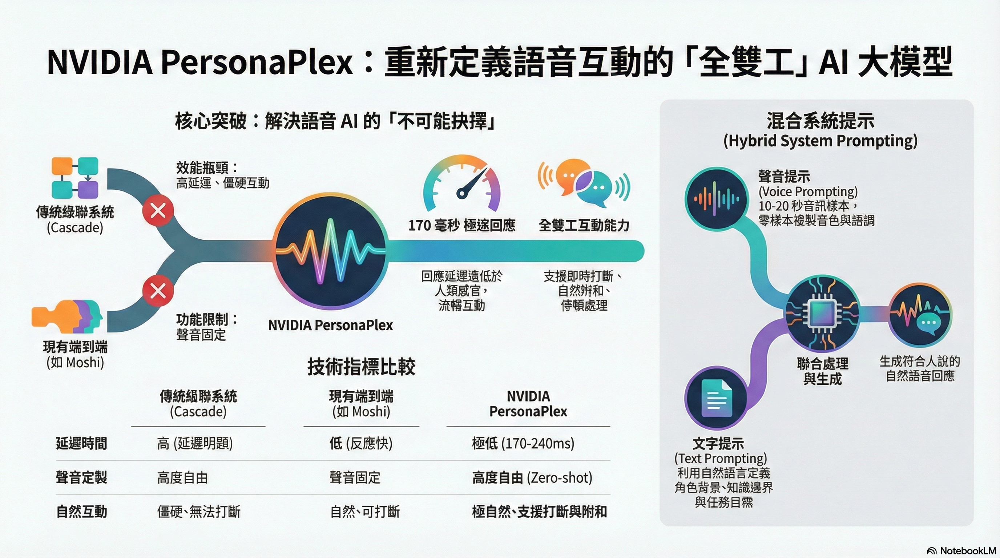
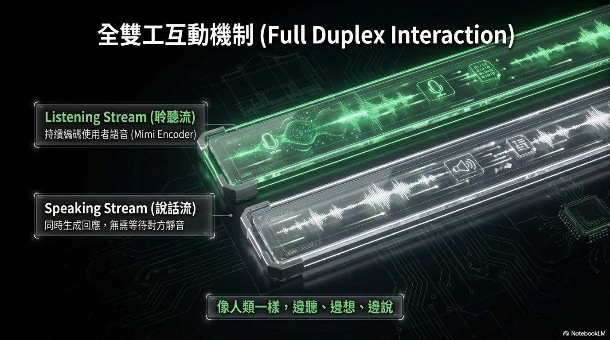
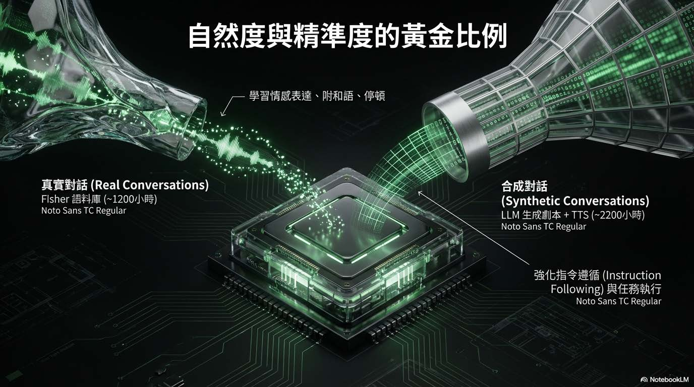
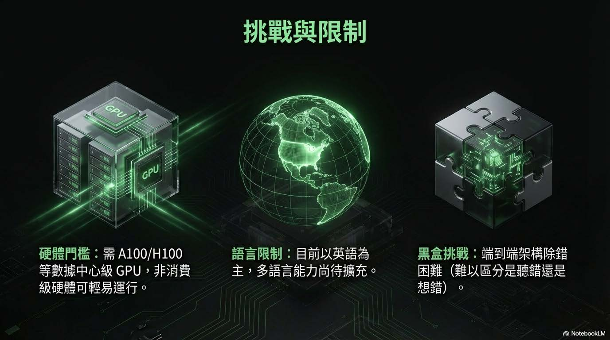
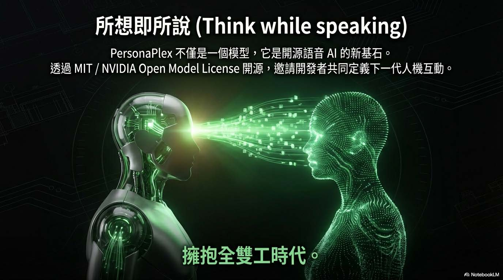



---



---

**2026年01月25日**
**作者**：[TonTon Huang Ph.D.](https://twman.org/)  
**新嘗試，追蹤到新資訊時，快速用NotebookLM製作相關資訊解說，內容摘要匯整的更完整**
  - 說明：重塑實時語音交互的 "全雙工" 黑科技
  - 資源：[🤗 HuggingFace](https://huggingface.co/nvidia/personaplex-7b-v1) | [🐙 GitHub](https://github.com/NVIDIA/personaplex) | [🌐 Project](https://research.nvidia.com/labs/adlr/personaplex/)
  - [論文](https://research.nvidia.com/labs/adlr/files/personaplex/personaplex_preprint.pdf) | [📝 公眾號解讀](https://mp.weixin.qq.com/s/dyAoh8hIjNw-LI-hb_1e6A)

---

# NVIDIA PersonaPlex 全雙工語音 AI 深度技術分析報告
_重塑實時語音交互的 "全雙工" 黑科技_

- 核心概念與定位：PersonaPlex 是 NVIDIA ADLR 團隊開發的 70 億參數（7B）全雙工（Full-Duplex）對話模型，建立在 Moshi 架構之上,。 它的核心突破在於解決了傳統語音 AI 的「不可能的抉擇」：既能像傳統級聯系統（ASR+LLM+TTS）那樣自定義角色與聲音，又能像端到端模型那樣保持低延遲與自然互動。

- 關鍵技術架構：混合系統提示（Hybrid System Prompting；PersonaPlex 引入了獨特的混合提示機制，使其具備極高的可控性：
    - 聲音提示 (Voice Prompt)： 輸入一段音訊樣本，模型即可通過零樣本（Zero-shot）方式複製該聲音的音色與語調,。
    - 文字提示 (Text Prompt)： 輸入自然語言描述（如「你是一位太空人」或「銀行客服」），定義 AI 的角色、背景與知識邊界,。

這兩者在模型內部聯合處理，生成連貫且符合人設的語音回應。

- 全雙工互動能力 (Full Duplex Capabilities)
    - 即時聆聽與說話： 模型擁有兩條並行的處理流（聆聽流與說話流），能在說話的同時持續編碼使用者的聲音,。
    - 自然對話動態： 支援打斷（Interruption）、停頓處理以及自然的附和語（Backchanneling，如 "uh-huh", "yeah"），使對話節奏更像人類,。
    - 極低延遲： 回應延遲約 170 毫秒，打斷延遲約 240 毫秒，遠低於傳統系統。

- 訓練數據策略：NVIDIA 採用了獨特的數據混合策略來平衡「自然度」與「指令遵循能力」：
    - 真實對話 (Real Conversations)： 使用 Fisher English 語料庫（約 1200 小時），讓模型學習人類的情感表達和附和語,。
    - 合成對話 (Synthetic Conversations)： 使用 LLM 生成劇本並透過 TTS 合成語音（約 2200 小時），針對客服和助理場景進行指令微調，確保模型能準確執行任務,。

# NVIDIA PersonaPlex：次世代全雙工語音 AI 分析
## 打破角色定製與自然互動的藩籬

# 痛點與挑戰 (The Problem)
    - 傳統級聯系統 (ASR→LLM→TTS)：
        - 優點：可換聲音、換角色。
        - 缺點：延遲高、對話機械感、無法自然打斷。
    - 現有端到端模型 (如 Moshi)：
        - 優點：反應快、互動自然。
        - 缺點：聲音固定、角色單一，缺乏應用彈性。

# 解決方案 (The Solution - PersonaPlex)
    - 定義： 基於 Moshi 架構的 7B 參數全雙工語音模型。
        - 核心價值： 同時實現「高自然度互動」與「高自由度定製」。
        - 關鍵突破： 聽與說同時進行（Full Duplex），像講電話一樣流暢。

# 核心技術：混合提示架構 (Hybrid Prompting)
    - 雙重輸入機制：
        - Audio Prompt： 提供 10-20 秒音檔 → 複製音色與語氣 (Voice Cloning)。
        - Text Prompt： 提供文字指令 → 設定身分、知識與任務 (Role Control)。
        - 運作方式： 模型將兩者結合，生成符合「特定人設」且用「特定聲音」說話的 AI。

# 優點分析 (Pros)
    - 極致低延遲： 回應僅需 ~0.17 秒，打斷僅需 ~0.24 秒。
    - 高度自然： 會主動附和 ("嗯嗯"、"對")，懂得知趣閉嘴 (Handle Interruptions)。
    - 角色泛化能力： 即使訓練數據只有客服，也能扮演太空人處理緊急狀況 (Out-of-distribution generalization)。
    - 開源友善： 模型權重與代碼公開 (MIT / NVIDIA Open Model License)。

# 缺點與限制 (Cons)
    - 語言限制： 目前主要支援英語，缺乏多語言能力。
    - 硬體門檻高： 推薦使用 A100/H100 等數據中心級 GPU，消費級顯卡難以負擔。
    - 架構複雜度： 端到端黑盒子架構，除錯困難 (難以區分是聽錯還是想錯)。
    - 數據規模： 相比兆級參數的 LLM，訓練數據量（數千小時）相對較小。

# 實測表現 (Benchmark)
        - FullDuplexBench 測試： 在「平滑輪替」與「使用者打斷」指標上優於 GPT-4o (Cascade) 與 Gemini Live,。

# 超架構優勢的具體展現：
    - Turn-taking (輪替平滑度)： 相比於 GPT-4o 使用的 Cascade (串接式) 架構，PersonaPlex 在對話權的轉換上更加平滑，沒有明顯的斷層。
    - Interruption (打斷反應)： 在處理使用者插話時，PersonaPlex 的反應速度與自然度優於 Gemini Live。
    - 核心意涵： 這證明了在「互動流暢度」與「打斷處理」這兩個語音互動的關鍵指標上，端到端 (End-to-End) 的全雙工架構具有顯著的性能
    - 優勢。越業界頂尖模型：在特定架構優勢下，如何勝過現有的主流模型。

# 唯快不破：極致低延遲：強調「速度」對於語音互動體驗的重要性。
    - 170ms 的極速體驗：
        - PersonaPlex 實現了 170ms (毫秒) 的端到端延遲。
        - 這個速度比人類的平均反應速度更快，讓使用者幾乎感覺不到 AI 在「思考」的時間。
    - 對比傳統架構：
        - 傳統 Cascade 系統（語音轉文字 -> LLM 思考 -> 文字轉語音）通常需要數秒的等待時間。
        - PersonaPlex 消除了這種等待，實現了定義上的「即時 (Real-time)」對話，讓與 AI 聊天就像與真人講電話一樣自然。

# 挑戰與限制：列出了採用這種先進架構目前所面臨的三大瓶頸，展現了技術發展的客觀性。
- 硬體門檻高：非消費級硬體可運行，需要 A100/H100 等數據中心等級的高階 GPU，部署成本極高。
- 語言限制：目前的訓練主要以英語為主，多語言能力（如中文、西班牙文等）仍有待擴充，限制了全球化的立即應用。
- 黑盒挑戰 (Black Box)：端到端 (End-to-End) 架構導致除錯困難。當模型出錯時，很難區分是「聽錯了」還是「想錯了」，這增加了開發與優化的難度。

# 開源承諾 & 擁抱全雙工時代：
    - 透過 MIT / NVIDIA Open Model License 進行開源。這不僅是一個產品，更是提供給開發者的「新基石」，邀請社群共同定義下一代的人機互動。
    - 強調 "Think while speaking" (邊說邊想) 的概念，將 AI 從單向的回應機器，升級為能進行雙向、即時、動態交流的夥伴，正式宣告語音互動進入了更自然的「全雙工」時代。