



---



---

**2026年01月25日**
**作者**：[TonTon Huang Ph.D.](https://twman.org/)  

  - 說明：重塑實時語音交互的 "全雙工" 黑科技
  - 資源：[論文](https://research.nvidia.com/labs/adlr/files/personaplex/personaplex_preprint.pdf) | [🤗 HuggingFace](https://huggingface.co/nvidia/personaplex-7b-v1) | [🐙 GitHub](https://github.com/NVIDIA/personaplex) | [🌐 官網](https://research.nvidia.com/labs/adlr/personaplex/) | [📝 公眾號解讀](https://mp.weixin.qq.com/s/dyAoh8hIjNw-LI-hb_1e6A) | [Zread](https://zread.ai/NVIDIA/personaplex)
  - 🎵 不聽可惜的 NotebookLM Podcast @ Google 🎵 <audio controls style="width:200px; height:20px;"><source src="../notebooklm-mp3/PersonaPlex.mp3" type="audio/mpeg"></audio>

---

# NVIDIA PersonaPlex 全雙工語音 AI 深度技術分析
_重塑實時語音交互的 "全雙工" 黑科技_

- 核心概念與定位：PersonaPlex 是 NVIDIA ADLR 團隊開發的 70 億參數（7B）全雙工（Full-Duplex）對話模型，建立在 Moshi 架構之上,。 它的核心突破在於解決了傳統語音 AI 的「不可能的抉擇」：既能像傳統級聯系統（ASR+LLM+TTS，如下附右邊之前做的YT DEMO）那樣自定義角色與聲音，又能像端到端模型那樣保持低延遲與自然互動。

- 關鍵技術架構：混合系統提示 (Hybrid System Prompting)，PersonaPlex 引入了獨特的混合提示機制，使其具備極高的可控性：
    - **聲音提示 (Voice Prompt)**： 輸入一段音訊樣本，模型即可通過零樣本（Zero-shot）方式複製該聲音的音色與語調,。
    - **文字提示 (Text Prompt)**： 輸入自然語言描述（如「你是一位太空人」或「銀行客服」），定義 AI 的角色、背景與知識邊界,。

這兩者在模型內部聯合處理，生成連貫且符合人設的語音回應。

- **全雙工互動能力 (Full Duplex Capabilities)**
    - 即時聆聽與說話： 模型擁有兩條並行的處理流（聆聽流與說話流），能在說話的同時持續編碼使用者的聲音,。
    - 自然對話動態： 支援打斷（Interruption）、停頓處理以及自然的附和語（Backchanneling，如 "uh-huh", "yeah"），使對話節奏更像人類,。
    - 極低延遲： 回應延遲約 170 毫秒，打斷延遲約 240 毫秒，遠低於傳統系統。

- **訓練數據策略**：NVIDIA 採用了獨特的數據混合策略來平衡「自然度」與「指令遵循能力」：
    - 真實對話 (Real Conversations)： **使用 Fisher English 語料庫（約 1200 小時）**，讓模型學習人類的情感表達和附和語,。
    - 合成對話 (Synthetic Conversations)： **使用 LLM 生成劇本並透過 TTS 合成語音（約 2200 小時）**，針對客服和助理場景進行指令微調，確保模型能準確執行任務,。

  

    <iframe
      src="https://www.youtube.com/embed/4Rq1yH5Y93g"
      style="position: absolute; width: 100%; height: 100%; left: 0; top: 0;"
      frameborder="0"
      allow="accelerometer; autoplay; clipboard-write; encrypted-media; gyroscope; picture-in-picture"
      allowfullscreen>
    </iframe>
  

  

    <iframe
      src="https://www.youtube.com/embed/HdtJQAgFcGo"
      style="position: absolute; width: 100%; height: 100%; left: 0; top: 0;"
      frameborder="0"
      allow="accelerometer; autoplay; clipboard-write; encrypted-media; gyroscope; picture-in-picture"
      allowfullscreen>
    </iframe>
  
  

 

- 步驟 1：初始化設定 (System Prompting)
    - 使用者提供一段「目標聲音樣本」（例如：史嘉蕾·喬韓森的聲音片段）。
    - 使用者提供一段「文字提示」（例如：「你是一個刻薄但知識淵博的電影評論家」）。
    - 模型將這兩者編碼為 Hybrid System Prompt，作為對話的基底狀態,。
- 步驟 2：全雙工輸入 (Full-Duplex Input)
    - 使用者開始說話。
    - 模型透過 Mimi 編碼器 將使用者的語音即時轉換為 "Speech Tokens"（語音代幣）,。
    - 關鍵點： 模型不需要等待使用者說完句子，它是持續不斷地 "串流" 接收資訊。
- 步驟 3：聯合處理與狀態更新 (Joint Processing)
    - 模型內部的 Transformer 同時關注「使用者當前的語音流」以及「模型自己正在生成的語音流」。
    - 如果使用者還在說話，模型會產生 "附和語"（如 "Uh-huh"）來表示正在聆聽。
    - 如果使用者突然插話，模型會偵測到輸入流的變化，立即更新內部狀態並停止生成當前的語句,。
- 步驟 4：語音生成與輸出 (Generation & Output)
    - 模型根據當下的上下文（Context），預測下一個語音 Token。
    - 透過 Mimi 解碼器 將這些 Token 即時轉換回聽得見的波形（Audio Waveform）。
    - 這個過程是持續不斷的，實現了「邊聽邊想邊說」的流暢體驗。

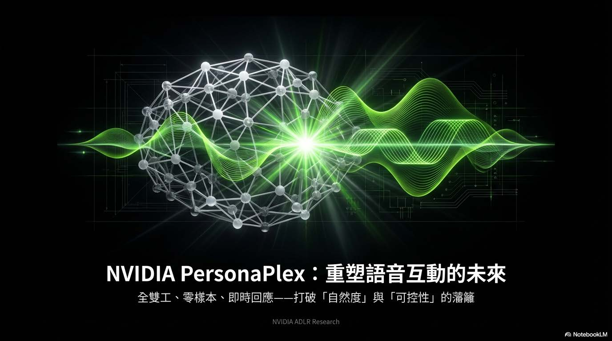

# 重塑語音互動的未來：定義 PersonaPlex 的核心價值主張與技術定位，宣告語音互動新時代的來臨。
    - 打破二元對立的藩籬：
        - 傳統技術往往被迫在「自然度（Naturalness）」與「可控性（Controllability）」之間做取捨。PersonaPlex 的目標是打破這道牆，同時兼顧兩者。
    - 三大核心支柱：
        - 全雙工（Full Duplex）： 實現如同真人般的雙向同時交流，不再是你一句我一句的回合制。
        - 零樣本（Zero-shot）： 無需針對特定聲音或角色重新訓練模型，具備極強的適應性。
        - 即時回應（Real-time）： 消除運算延遲，提供無縫的對話體驗。

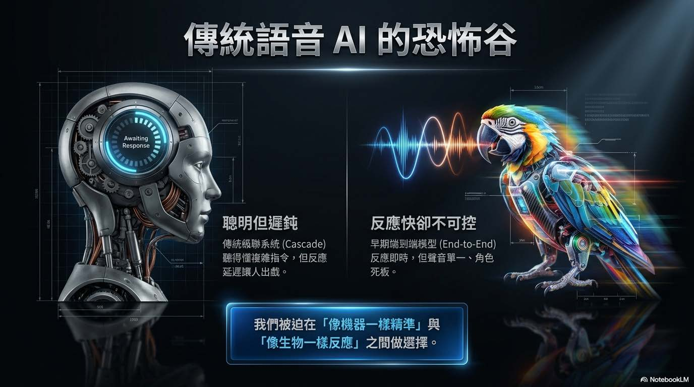

# 傳統語音 AI 的恐怖谷：當前語音 AI 市場的兩難困境，解釋了為何需要新的解決方案。
    - 被迫的選擇題：
        - 開發者長期以來被迫在「像機器一樣精準」與「像生物一樣反應」之間做痛苦的抉擇。
    - 兩大極端陣營：
        - 聰明但遲鈍（左側）： 傳統級聯系統（Cascade）雖然聽得懂複雜指令，邏輯強大，但反應延遲過高，導致使用者頻頻「出戲」，體驗不佳。
        - 反應快卻不可控（右側）： 早期的端到端模型（End-to-End）雖然反應即時，但聲音單一、角色死板，缺乏個性化的靈魂。

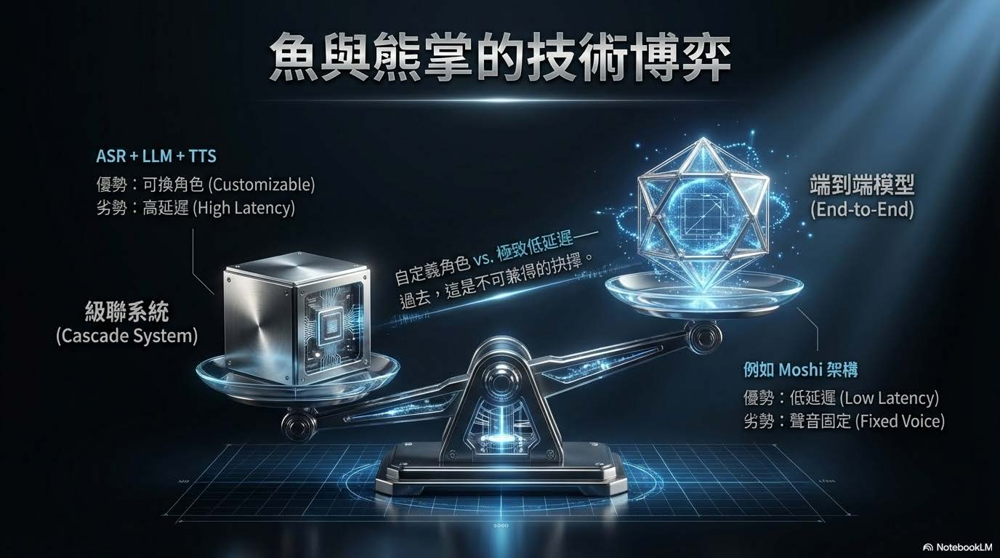

# 魚與熊掌的取捨：將上述的「恐怖谷」問題轉化為具體的技術架構對比，量化了不同路徑的優劣勢。
    - 級聯系統 (Cascade System - ASR+LLM+TTS)：
        - 優勢： 可換角色（Customizable），模組化設計易於調整。
        - 劣勢： 高延遲（High Latency），各個模組間的傳輸耗時，無法達成即時互動。
    - 端到端模型 (End-to-End - 如 Moshi 架構)：
        - 優勢： 極致低延遲（Low Latency），訊息處理一氣呵成。
        - 劣勢： 聲音固定（Fixed Voice），這在過去是「不可兼得的抉擇」，難以根據需求改變 AI 的說話語氣或身分。
    - 結論： PersonaPlex 的目標正是要解決這個「自定義角色 vs. 極致低延遲」的技術矛盾。

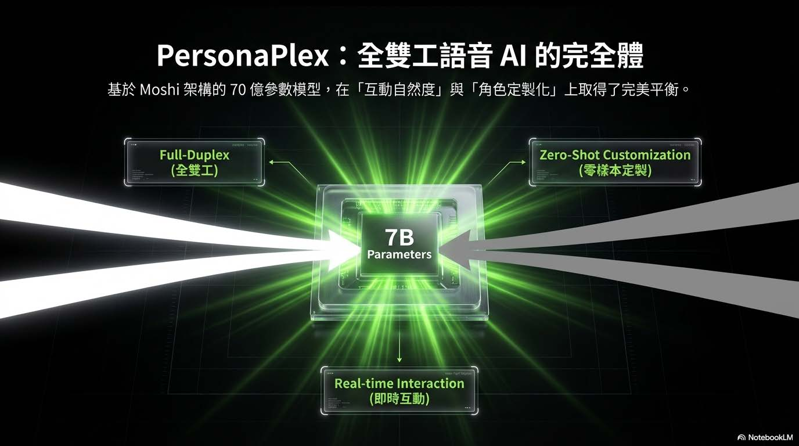

# 全雙工語音 AI 的完全體：集大成者，在現有先進架構上進行了關鍵突破。
    - 基於強大基底：
        - 模型採用 70 億參數 (7B Parameters)，並基於 Moshi 架構進行開發，保證了基礎的語言理解與生成能力。
    - 完美平衡的三角：
        - 它成功在「互動自然度」與「角色定製化」上取得了完美平衡，不再偏廢一方。
        - 結合了 Full-Duplex (全雙工) 的流暢性、Real-time Interaction (即時互動) 的速度，以及最關鍵的 Zero-Shot Customization (零樣本定製) 能力，使其成為語音 AI 的「完全體」。

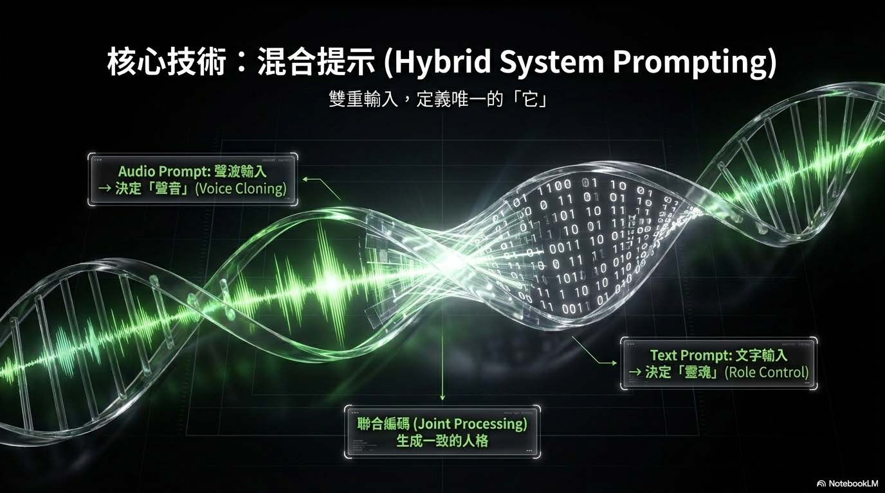

# 混合提示 (Hybrid System Prompting)：如何同時控制「聲音」與「內容」
    - 雙重輸入機制：
        - 系統並非單一輸入，而是透過「雙軌並行」來定義 AI 的最終表現，稱為「混合提示」。
        - Audio Prompt (聲波輸入)： 負責決定「聲音」 (Voice Cloning)，複製音色與語調。
        - Text Prompt (文字輸入)： 負責決定「靈魂」 (Role Control)，控制角色的性格與知識背景。
    - 聯合編碼 (Joint Processing)：
        - 這兩股輸入流最終會匯合進行聯合處理，生成一個在聲音與性格上高度一致的 AI 人格，定義出唯一的「它」。

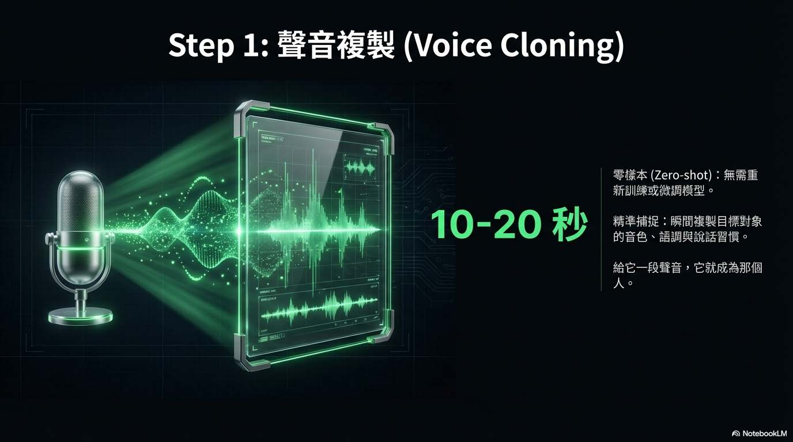

# 聲音複製 (Voice Cloning)：如何賦予 AI 特定的「聲音」，強調其便捷性與技術指標。
    - 極速複製：僅需 10-20 秒 的錄音樣本，即可完成聲音的採集與複製。
    - 零樣本技術 (Zero-shot)：無需重新訓練模型或進行繁瑣的微調 (Fine-tuning)，直接「給它一段聲音，它就成為那個人」。
    - 精準捕捉：模型能瞬間複製目標對象的音色、語調以及說話習慣，從而達到極高的擬真度。

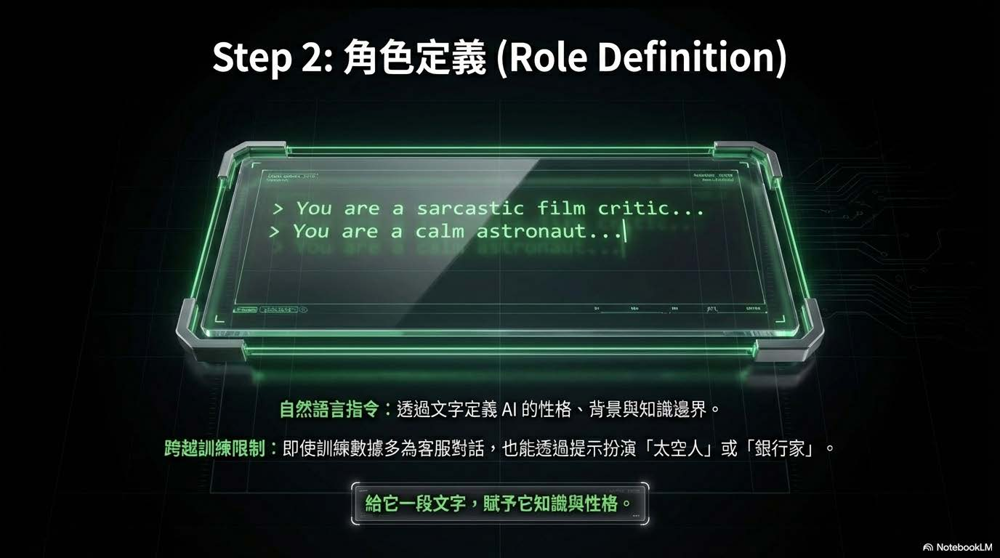

# 角色定義 (Role Definition)：賦予 AI 內在的「靈魂」，使其不僅聲音像，思維與行為模式也符合設定。
    - 自然語言指令：透過純文字描述即可定義 AI，例如輸入 "> You are a sarcastic film critic..." (你是一位講話諷刺的影評人) 或 "> You are a calm astronaut..." (你是一位冷靜的太空人)。
    - 跨越訓練限制：這項技術展現了強大的泛化能力。即使模型原本的訓練數據多為客服對話，透過提示工程 (Prompting)，它依然能完美扮演「太空人」或「銀行家」等截然不同的角色，賦予其相應的知識與性格。

# 全雙工互動機制 (Full Duplex Interaction)：PersonaPlex 「同步處理」的能力與傳統語音模型的根本差異。

    - 雙流並行處理 (Dual Streams)：
        - 聆聽流 (Listening Stream)： 利用 Mimi Encoder 持續對使用者的語音進行編碼，系統隨時處於「聽」的狀態，而非傳統的「聽完再想」。
        - 說話流 (Speaking Stream)： 能夠在聆聽的同時生成回應，打破了傳統「你說完、我才說」的回合制限制。
    - 類人互動體驗：
        - 達成「邊聽、邊想、邊說」的境界，模擬人類大腦在對話時的多工處理模式，消除了等待對方靜音的延遲感，實現真正的流暢對話。

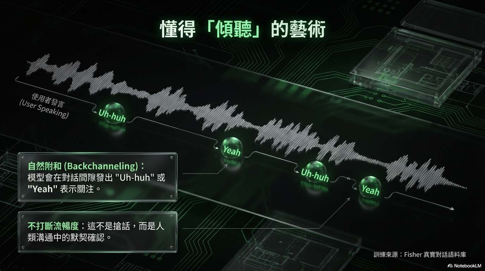

# 懂得「傾聽」的藝術：模型如何透過細微的語音反饋，展現出「主動聆聽」的社交智慧。

    - 自然附和 (Backchanneling)：
        - 模型學會了在對話間隙發出 "Uh-huh" 或 "Yeah" 等語助詞。這不僅是聲音，更是表示「我在聽」的社交訊號。
        - 不打斷的流暢性： 這些附和不會切斷使用者的發言，而是像人類默契般地確認與鼓勵，讓對話氛圍更融洽。
    - 訓練基礎：
        - 基於 Fisher 真實對話語料庫訓練，確保這些反應的時機與語氣貼近真實人類的直覺反應，而非機械式的插入。

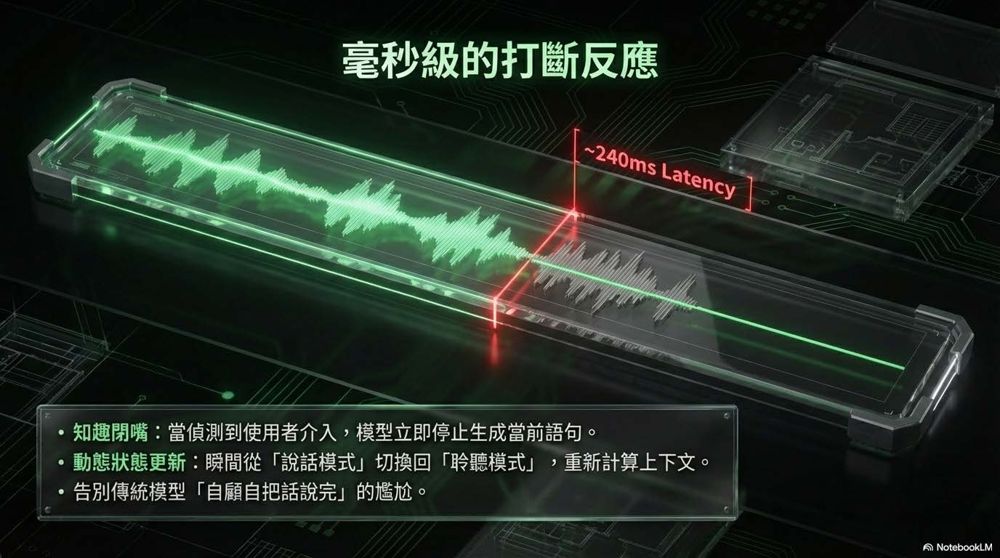

# 毫秒級的打斷反應：技術性地展示了模型如何處理「插話」這一高難度場景，強調極致的反應速度。
    - 極低延遲的狀態切換：
        - 系統具備 ~240ms (毫秒) 的極低延遲偵測能力。
        - 知趣閉嘴： 一旦偵測到使用者介入（插話），模型能立即停止當前生成的語句，避免雙方同時說話的混亂。
    - 動態狀態更新：
        - 瞬間從「說話模式」切換回「聆聽模式」，並重新計算上下文。這解決了傳統模型經常「自顧自把話說完」的尷尬痛點，讓互動更具備即時性與尊重感。

# 自然度與精準度的黃金比例：透過「混合數據訓練策略」來兼顧情感表達與邏輯正確性。
    -數據混合策略 (Data Mixing)：
        - 真實對話 (Real Conversations)： 使用約 1200 小時的 Fisher 語料庫。這部分的數據負責讓模型學習人類的情感表達、自然的附和語氣以及說話停頓的節奏。
        - 合成對話 (Synthetic Conversations)： 利用 LLM 生成劇本搭配 TTS (文字轉語音)，產生約 2200 小時的數據。這部分專注於強化「指令遵循 (Instruction Following)」與複雜任務的執行能力。
    - 結果： 透過這兩者的結合，模型既不會像機器人般生硬，也不會失去執行任務的精準度。

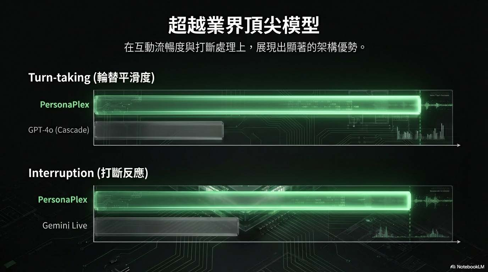

# 超架構優勢的具體展現：在特定架構優勢下，如何勝過現有的主流模型。
    - Turn-taking (輪替平滑度)： 相比於 GPT-4o 使用的 Cascade (串接式) 架構，PersonaPlex 在對話權的轉換上更加平滑，沒有明顯的斷層。
    - Interruption (打斷反應)： 在處理使用者插話時，PersonaPlex 的反應速度與自然度優於 Gemini Live。
    - 核心意涵： 這證明了在「互動流暢度」與「打斷處理」這兩個語音互動的關鍵指標上，端到端 (End-to-End) 的全雙工架構具有顯著的性能
    - 優勢。越業界頂尖模型：在特定架構優勢下，如何勝過現有的主流模型。

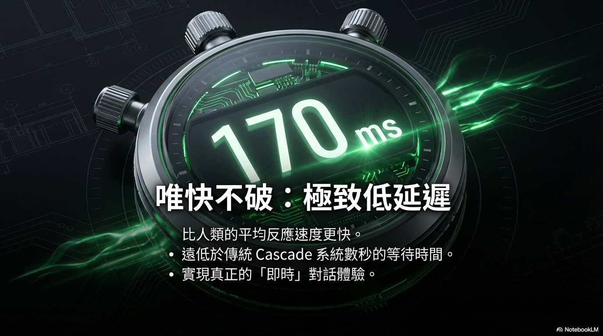

# 唯快不破：極致低延遲：強調「速度」對於語音互動體驗的重要性；以數據直觀地強調「速度」對於語音互動體驗的重要性。
    - 170ms 的極速體驗：
        - PersonaPlex 實現了 170ms (毫秒) 的端到端延遲。
        - 這個速度比人類的平均反應速度更快，讓使用者幾乎感覺不到 AI 在「思考」的時間。
    - 對比傳統架構：
        - 傳統 Cascade 系統（語音轉文字 -> LLM 思考 -> 文字轉語音）通常需要數秒的等待時間。
        - PersonaPlex 消除了這種等待，實現了定義上的「即時 (Real-time)」對話，讓與 AI 聊天就像與真人講電話一樣自然。

# 挑戰與限制：目前所面臨的三大瓶頸，展現了技術發展的客觀性。
    - 硬體門檻高：非消費級硬體可運行，需要 A100/H100 等數據中心等級的高階 GPU，部署成本極高。
    - 語言限制：目前的訓練主要以英語為主，多語言能力（如中文、西班牙文等）仍有待擴充，限制了全球化的立即應用。
    - 黑盒挑戰 (Black Box)：端到端 (End-to-End) 架構導致除錯困難。當模型出錯時，很難區分是「聽錯了」還是「想錯了」，這增加了開發與優化的難度。

# 開源承諾 & 擁抱全雙工時代：
    - 透過 MIT / NVIDIA Open Model License 進行開源。這不僅是一個產品，更是提供給開發者的「新基石」，邀請社群共同定義下一代的人機互動。
    - 強調 "Think while speaking" (邊說邊想) 的概念，將 AI 從單向的回應機器，升級為能進行雙向、即時、動態交流的夥伴，正式宣告語音互動進入了更自然的「全雙工」時代。