

---



---

**匯整**：[TonTon Huang Ph.D.](https://www.twman.org/)  
**日期**：2026年10月03日更新
**本文藉由 [Muse](https://blog.twman.org/2026/09/muse.html)，整理了 Dream-RSI 論文的技術脈絡與工程實作，並提供了開源系譜與搜尋蒸餾飛輪的完整解析。**

> 📌 **技術速覽**
**AI 會自己變強嗎？2026 年 9 月，Google、Google DeepMind、馬里蘭大學與維吉尼亞大學合作發表的 Dream-RSI 論文，給出了一個低成本答案：不直接在昂貴的真實環境裡試錯，而是把歷史探索軌跡封存成可離線回放的「夢境」，在夢裡平行演化出更強的探索策略。**  
> 實測數據：發現運算量降 1.74 倍、呼叫次數僅為對照方法的 1/162、GPU kernel 四個全數改善；而且 coding agent 本體零梯度更新，改的是探索策略。本文從 RSI 六十年演進史、AlphaZero 血統對比、Jev 毫秒級判別引擎，到開源系譜與搜尋蒸餾飛輪，一次把整條技術路線講透。

---

# 佛前金座，羅漢歸位：降龍 (LLM) 與伏虎 (Agent)：以迴夢心法練就「睡夢羅漢拳」
## 談 Recursive Self-Improvement (RSI)、Dream-RSI × Jev，AI 遞迴自我改進完整解析
_從武俠隱喻出發，講透 Recursive Self-Improvement 的過去、現在與工程解法_

> **🚀 本文重點摘要 (TL;DR)：**
> * **RSI（遞迴自我改進）** 是讓 AI 改進自己的探索策略與代碼的迴圈，概念可追溯到 1965 年 I.J. Good 的「智慧爆炸」。
> * **Dream-RSI**（2026.9，Google／DeepMind／UMD／UVA）是最新突破：用歷史探索軌跡構建離線回放模擬器，在「夢境」裡低成本演化探索策略。
> * **Jev** 把 AI 決策從生成還原為判別：只輸出型別定義好的機率分佈，毫秒級延遲（官方數據 70–500ms），格式幻覺在解碼機制上被消除。
> * **開源系譜**（Laya、CLM-8B、Kev、NanoJev、RSI-Jev、jev-skill 等）已沉澱出同一套研究方法：判別式輸出 → 對比校準 → 自我改進迴圈 → 客觀驗收。
> * **搜尋蒸餾飛輪**：System 1 毫秒剪枝 → System 2 離線深搜 → 蒸餾沉澱為本能：平時憑本能過招，遇高手開大招。

---

**📑 目錄**

- [一、為什麼是「睡夢羅漢拳」：四個概念的技術對應](#sec-1)
- [二、RSI 演進史：一個想了六十年的點子](#sec-2)
- [三、AlphaZero vs. 現代 RSI：祖師爺作弊？？](#sec-3)
- [四、戰略制高點：Discovery Loop](#sec-4)
- [五、Dream-RSI：迴夢心法 (2026 年 9 月論文解析)](#sec-5)
- [六、Jev：System 1 判別引擎](#sec-6)
- [七、開源系譜：Jev 閉源，但路線開源了](#sec-7)
- [八、搜尋蒸餾飛輪：System 1 與 System 2 的共生](#sec-8)
- [九、給企業的三個原則](#sec-9)
- [讀者體驗區：親手玩玩看判別式決策](#sec-exp)
- [延伸閱讀](#sec-read)
- [參考來源](#sec-ref)

---


<a id="sec-1"></a>
## 一、為什麼是「睡夢羅漢拳」：四個概念的技術對應

先講一個武俠梗。出處是周星馳 1992 年電影《武狀元蘇乞兒》的「睡夢羅漢拳」：主角在睡夢中練功，醒來拳法大成。這個梗不是裝飾，它和整套技術概念一一對應：

**降龍（LLM）** 是基礎[大語言模型](https://deep-learning-101.github.io/Large-Language-Model)。它提供廣袤的語義理解、常識推理與程式碼生成能力，是整個系統的基石：降龍十八掌是剛猛的外功，LLM 是剛猛的底層能力。

**伏虎（Agent）** 是智慧代理。它負責環境感知、工具調用與具體執行控制，是落地的手臂。想深入理解現代 Agent 的能力邊界與治理框架，可參考 DeepMind《Nature》論文的解析：[Agentic Profiles：AI Agent 四維資安與治理框架](https://deep-learning-101.github.io/Blog/Agentic-Profiles)。光有內力不會打架，要有招式把內力打出去，Agent 就是那套招式。
主流 Agent 開發框架的橫向比較，可參考：[Dify、Coze、n8n、AutoGen、LangChain 熱門 Agent 框架比較](https://deep-learning-101.github.io/Blog/Dify-Coze-n8n-AutoGen-LangChain)。

**迴夢心法（Replay Simulator）** 是回放模擬器。關鍵洞察：不直接在昂貴的真實環境裡試錯，而是把過去的探索軌跡（Discovery Tree）封存起來，變成可以離線回放的「模擬夢境」。注意：這不是去學一個世界模型（那又貴又不準），歷史本身就是精確的模擬器。

**睡夢羅漢拳（RSI，Recursive Self-Improvement）** 是遞迴自我改進。AI 進入離線夢境，在歷史回放中平行模擬數千次，低成本演化出更強的探索策略（Meta-Exploration Policy）。睡一覺起來，拳法大成。

記住這四個詞，後面全篇通用。

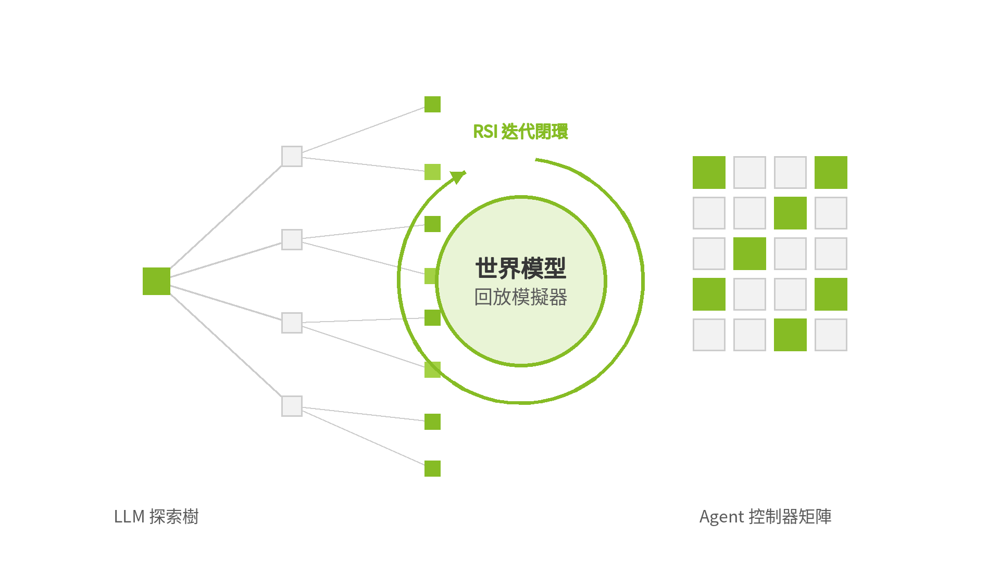

---

<a id="sec-2"></a>
## 二、RSI 演進史：一個想了六十年的點子

**1965 年，I.J. Good** 提出「智慧爆炸」（Intelligence Explosion）：一台超智慧機器能設計出更優秀的機器，引發連鎖反應。這是 RSI 的哲學原點。

**2000 年代，Jürgen Schmidhuber** 提出「哥德爾機」（Gödel Machine）：能用數學證明來自我重寫原始碼的理論主體：只有能證明「改寫後的自己會更好」才動手，是 RSI 最嚴格的形式化版本。

**2010 年代，Nick Bostrom** 在《超級智慧》（*Superintelligence*，2014）中把 RSI 定位為通往 AGI／ASI 的關鍵機制，同時也是對齊安全的核心難題：一個會自我改進的系統，目標函數一旦偏掉，會偏得越來越快。

六十年來點子一直在，缺的是工程可行性。傳統機器學習的自我改進只有一招：反向傳播更新權重。模型看不懂自己的訓練代碼，更別說修改演算法：就像拳手只會長肌肉，不會改拳譜。

**2023～2026 年發生了三級跳。** 第一跳是 LLM 的元能力突圍：模型突然會讀代碼、會反思執行報錯、會重構邏輯，拳手終於看得懂拳譜。第二跳是從 Agent 反思（Reflexion、Voyager）走向推論時搜尋（OpenAI o1／o3 的 Inference-time Compute）：與其把模型訓練得更大，不如在回答時給它更多時間思考。第三跳撞上了**算力黑洞**這堵牆：如果每次自我演化都在線上真實環境硬幹，Token 成本與延遲呈指數級爆炸。這正是 Dream-RSI 要解決的問題。

給企業決策者的翻譯：**自我改進已經從哲學問題變成了成本問題**。誰能把試錯成本降下來，誰就先拿到自動化發現的門票。

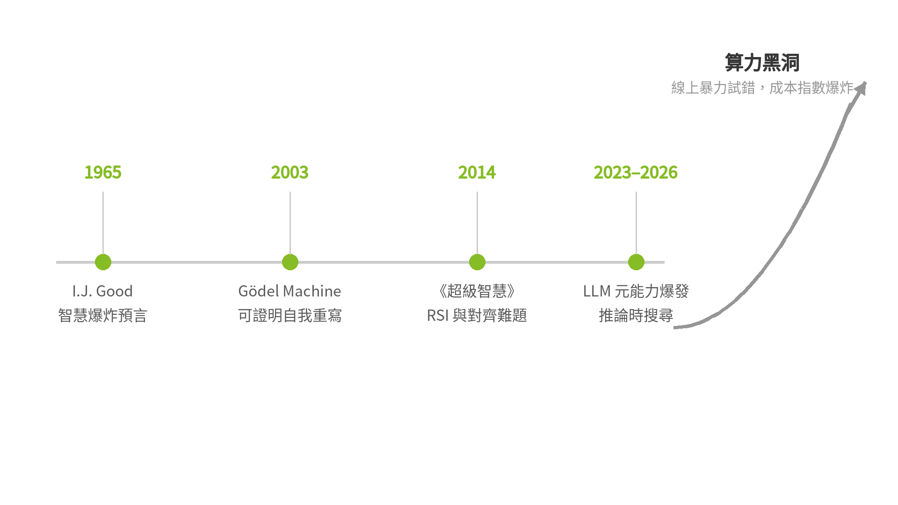

---

<a id="sec-3"></a>
## 三、AlphaZero vs. 現代 RSI：祖師爺作弊？？

AlphaZero 是 RSI 精神上最成功的祖先，但它的成功建立在四個作弊級前提上。攤開來看，現代 RSI 的難題就一目了然：

| 比較維度 | AlphaZero（封閉棋類自弈） | 現代 RSI（開放世界） |
|---|---|---|
| **環境邊界** | 嚴格封閉：19×19 圍棋棋盤 | 開放世界：真實代碼庫、雲端 API、動態系統 |
| **模擬器來源** | 人類預先寫死、零成本的完美規則程式碼 | 沒有現成模擬器：但已付費的歷史軌跡本身就是回放模擬器 |
| **驗證反饋** | 單一絕對勝負（Win／Loss） | 多維驗證：單元測試通過率、執行效能、安全邊界 |
| **改進對象** | 僅神經網路權重（演算法與搜尋規則寫死） | 自身的探索策略（Meta-Policy）與執行代碼 |

一句話總結：AlphaZero 證明了「自我對弈＋搜尋」走得通；Dream-RSI 們在回答的是：**走出棋盤之後，路費誰來付**。

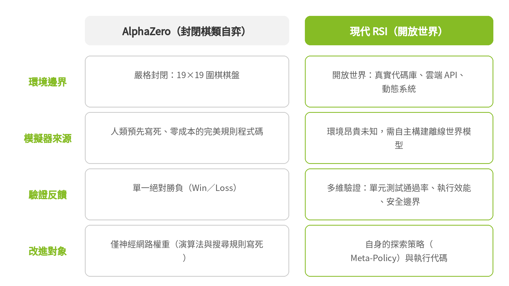

---

<a id="sec-4"></a>
## 四、戰略制高點：Discovery Loop

一個最有說服力的信號：Google 前首席科學家 Jeff Dean 在 Google 待了 27 年後離職創業，和 Sanjay Ghemawat、Oriol Vinyals、Quoc Le 一起成立了 Discovery Loop：公司就叫這個名字，做的正是用 AI 自動化科學與工程研究。連這種等級的大神都親自下場賭上職涯，是不是說明這條路線值得深入？業界對 AI 終極價值的戰略判斷正在收斂：不是生成現有知識的聊天機器人，而是**推動科學研究與工程發現的全自動閉環（Autonomous Discovery Loop）**。閉環四步：假說生成 → 代碼構建與實驗 → 客觀驗證 → 遞迴自我改進。

把「做研究」本身變成一條自動化產線：自己提假說、自己寫代碼做實驗、自己用客觀標準驗收、自己從失敗裡學到更好的探索策略，下一輪更強。

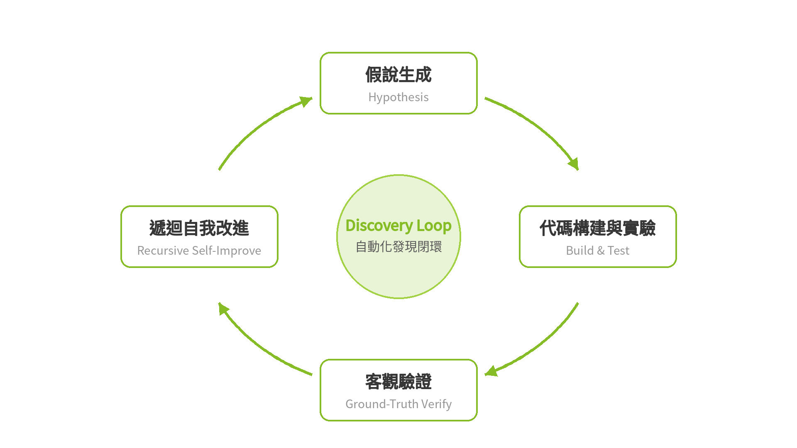

但早期未優化的 Discovery Loop 依賴暴力線上試錯，GPU 與 Token 消耗失控。這不是技術路線錯誤，是成本結構錯誤。所以產業界全面押注 RSI 的動機很務實：**必須打破暴力試錯的算力牆**，用低成本的離線演化與判別架構，讓自動化發現可持續。同賽道的玩家已經就位：DeepMind 的 FunSearch、AlphaFold 3、Sakana AI 的《The AI Scientist》（單篇論文成本壓到約 15 美元）、OpenAI 的 o 系列，以及 Periodic Labs、FutureHouse 等垂直新創。

---

<a id="sec-5"></a>
## 五、Dream-RSI：迴夢心法 (2026 年 9 月論文解析)

論文 *Dream-RSI: Recursive Self-Improvement through Evolving Worlds*（Tong Zheng 等；Google、Google DeepMind、馬里蘭大學、維吉尼亞大學；2026 年 9 月 preprint，公開 repo：[zhengkid/Dream-RSI](https://github.com/zhengkid/Dream-RSI)（程式碼準備中））的核心洞察只有一句話：**已經完成的發現過程，本身就是一座結構化的搜尋空間**。

傳統做法的困境是：評估一個探索策略好不好，必須觀察它如何形塑一整個發現過程：回饋又慢又貴。Dream-RSI 的解法是把歷史探索軌跡封存成可回放的模擬器（replay simulator），在離線「夢境」裡平行測試、演化探索策略。歷史軌跡隨線上探索持續累積，夢境不斷長大：這就是 "Evolving Worlds"。

論文實測數字（8 個任務、橫跨演算法工程、數學優化、GPU kernel 三個領域）：

* 演算法工程：發現運算量降 1.74 倍、呼叫次數僅為對照方法 SimpleTES 的 1/162、下游執行快 1.22 倍
* GPU kernel 工程：4 個 kernel 全數改善；同預算下效能高 2.09 倍，同效能下少 2.43 倍 generations（[GPU 知識中樞](https://deep-learning-101.github.io/GPU)）

最優雅的一句原話是 **"Zero gradient steps on the coding agent"**：改的是探索策略，coding agent 本體零梯度更新（寫程式的 AI Agent 實戰可參考：[Claude Code 完全指南](https://deep-learning-101.github.io/Blog/ClaudeCode)）。

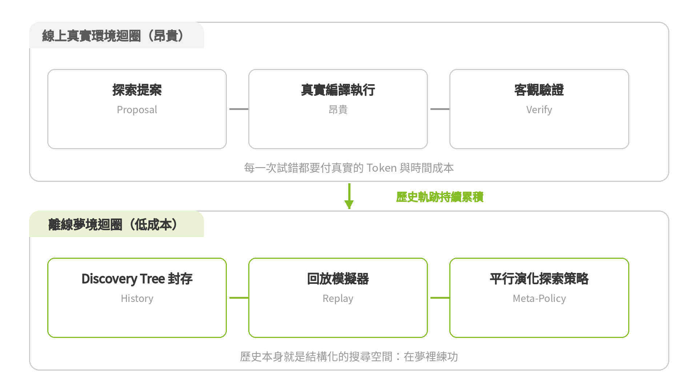

這正是「在夢裡練功」的精確含義：練的是拳譜（策略），不是肌肉（權重）。

---

<a id="sec-6"></a>
## 六、Jev：System 1 判別引擎

傳統 LLM Agent 是純粹的 System 2（慢思考）：每一步都是「生成長文字 → 解析 JSON → 條件判斷」，單步 1~3 秒，還可能因為 JSON 寫壞整段重來。在需要高頻決策的場景（客服分流、內容審核、Agent 每一步的路由），這又慢又脆。關於推論延遲優化的實戰，可參考本站熱門文章：[2026 本地 LLM 推論框架對決：vLLM vs Ollama vs SGLang vs LLaMA.cpp](https://deep-learning-101.github.io/Blog/vLLM-Ollama-SGLang-LLaMAcpp)。

Jev（TypeSafe AI 的判別式決策 API）的顛覆性在於**把決策收斂成判別式的型別契約（Contract）**：不讓模型吐廢話，只輸出符合嚴格型別定義的機率分佈：Choice（選哪個）、Score（打幾分）、Noul（是否為真）。工程哲學只有一句：**決策是分類問題，不是生成問題**。延遲從秒級壓到毫秒級（官方數據 70–500ms），格式幻覺在工程架構與解碼機制上被徹底消除：因為根本不經自由文字解碼，而是直接在受限型別空間計算機率分佈。

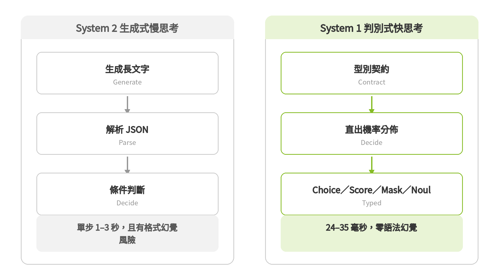

Jev 證明路線可行之後，商用閉源陣營也開始跟進。OpenAI 在 2026 年 9 月 29 日的 DevDay 發表了 Decisions API：底層是專為決策調校的 GPT-6 Luna，開發者給定封閉的候選答案清單，模型直接回傳選項與信心分數，不生成自由文字，約 150 毫秒，對比標準 Luna 呼叫的 1.6 秒，目前為有限預覽。媒體直接稱之為「OpenAI 版的 Jev」。判別式決策已經從一家新創的點子，變成巨頭的標配。

---

<a id="sec-7"></a>
## 七、開源系譜：Jev 閉源，但路線開源了

TypeSafe 的 Jev 是閉源商用 API。但它發佈後，開源社群沿著「判別式 System 1 決策」這條路線，長出了一整片系譜。這不是零散複刻：同一套方法論正在被多路人馬獨立驗證：

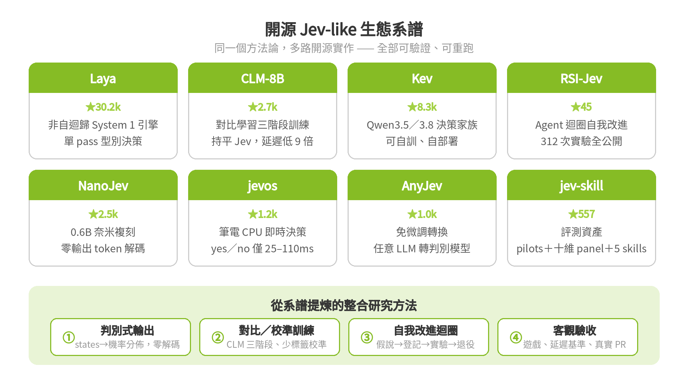

* **Laya**（★30.2k）：非自迴歸 System 1 決策引擎，typed choice／score／yes-no 單 pass 輸出，系譜中採用度最高（[NandhaKishorM/laya](https://github.com/NandhaKishorM/laya)）
* **CLM-8B**（★2.7k）："A System One Model for Fast and Generalizable Decision-Making"。對比學習三階段：60M Q&A 預訓練 → 30M 合成 hard negatives → 1M agentic trajectories；在 computer-use、gaming、tool-calling 上持平 Jev，延遲低 9 倍，並提供 TypeSafe-compatible API（[Contrastive-LM/CLM](https://github.com/Contrastive-LM/CLM)）
* **Kev**（★8.3k）：基於 Qwen3.5／3.8 的 Jev-like 決策模型家族，可自訓、自部署（[jaredpalmer/kev](https://github.com/jaredpalmer/kev)）
* **NanoJev**（★2.5k）：0.6B 奈米複刻，states＋questions 進、完整機率分佈出，零輸出 token 解碼；ViZDoom／Maze／Snake 實機驗證（[TianyuCodings/NanoJev](https://github.com/TianyuCodings/NanoJev)）
* **jevos**（★1.2k）：筆電 CPU 上 25–110ms 的 yes/no 決策，並公開對打基準（jevos-v2 短請求 26ms 對 Jev 344ms、Laya 104ms）（[feder-cr/jev](https://github.com/feder-cr/jev)）
* **AnyJev**（★1k）：把任意 LLM 轉成 Jev-style 判別模型，無需微調；100–500 個標籤把校準誤差從 0.240 壓到 0.095（[nokia-applied-research/AnyJev](https://github.com/nokia-applied-research/AnyJev)）
* **RSI-Jev**（[Shanghua-Gao/RSI-Jev](https://github.com/Shanghua-Gao/RSI-Jev)）：AI Agent 迴圈訓練判別模型：`contract.py` 定型別契約、`rl2.py` 自我校準、`serve/` 毫秒推論；歷經 471 次實驗，champion 指標從 0.622 爬升至 0.756，並將失敗實驗與成因完整公開；實體驗證包含 Atari 即時控制與工業視覺瑕疵檢測（[Computer Vision 知識中樞](https://deep-learning-101.github.io/Computer-Vision)）。

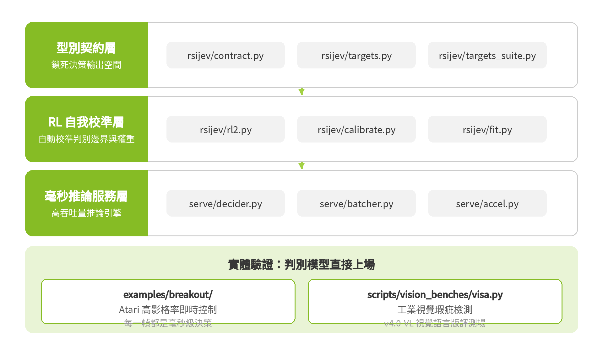
* **jev-skill**（[wuyoscar/jev-skill](https://github.com/wuyoscar/jev-skill)）："Awesome Jev Skills"：Context Pilot（指令衝突、資訊不全時主動拒絕）、Public PR Pilot（Flask、Requests 真實 PR，單元測試當裁判）、十維 Model Panel、5 個隨插即用 skills
十維 Model Panel、5 個隨插即用 skills（評測方法論可對照本站：[2026 台灣 LLM 評測報告](https://deep-learning-101.github.io/Blog/TW-LLM-Benchmark)）

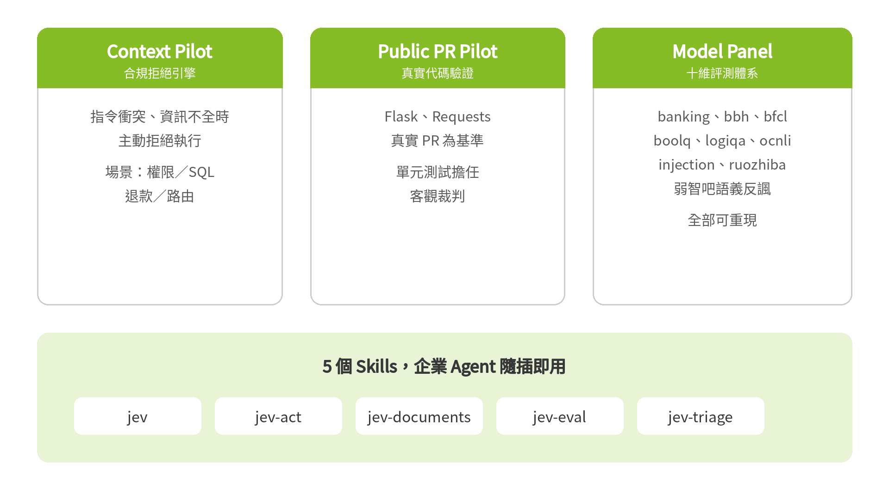
* **應用落地**：browser-use／jev-ultrafast（★21.8k）：Jev 負責選 operation＋element，小 LLM 只在需要打字時寫字；Zürich→London 機票搜尋 7.1 秒完成

從系譜可以提煉出開源社群實際在用的同一套**整合研究方法**，四步：

1. **判別式輸出**：states＋questions 進，完整機率分佈出，零（或單 pass）解碼
2. **對比／校準訓練**：CLM 三階段、AnyJev 少標籤校準：輸出的機率必須是真機率，否則剪枝就是賭博
3. **自我改進迴圈**：Agent 提假說 → 花算力前先登記預測 → 跑實驗 → 證據不足退役冠軍
4. **客觀驗收**：遊戲即時控制、延遲基準、真實 PR＋單元測試：全部可重跑

---

<a id="sec-8"></a>
## 八、搜尋蒸餾飛輪：System 1 與 System 2 的共生

> 以下為本文提出的整合框架：把前面所有技術路線貫通起來的原創綜合。

飛輪轉起來只需要四步：

**第一步，Jev（System 1）做毫秒級剛性剪枝。** 在搜尋樹的邊界高速過濾，把沒希望的分支砍掉。Jev 不是消滅搜尋，而是讓深層搜尋在成本上變得可行。

**第二步，Dream-RSI（System 2）在低成本的歷史回放世界裡深思熟慮。** 離線夢境平行模擬數千次，發掘最優解法。慢思考，但因為在夢裡，所以便宜。

**第三步，搜尋蒸餾（Search Distillation）。** 把耗費大量推論才得出的最優路徑，反向更新回基底模型參數（SFT／RL）。這與外掛知識的 [RAG](https://deep-learning-101.github.io/RAG) 不同：RAG 是把知識放在外面查，蒸餾是把能力寫進權重裡。

這裡可能有個疑問：第五節才說 Dream-RSI 最優雅的是 coding agent 零梯度更新，怎麼現在又要把能力寫回權重？這是兩個不同階段的演化。**探索期**（Dream-RSI 階段）：探索策略自我改進，底層 LLM 保持凍結，夠快、夠便宜；**結晶期**（蒸餾階段）：當探索累積了足夠多高價值的思考鏈，才觸發定期的離線大版本迭代，用 SFT／RL 把能力沉澱進權重（Amortized Reasoning），讓 System 1 的本能進化。一個負責低成本試錯，一個負責把試錯成果結晶，邏輯是通的。

**第四步，模型本能沉澱。** 進化後的模型面對常態情境憑直覺（System 1）就能給出最優解；只有遇到分佈外（OOD）的未知領域，才再啟動深層搜尋開拓新邊界：而新邊界的成果會在下一輪被蒸餾回來。

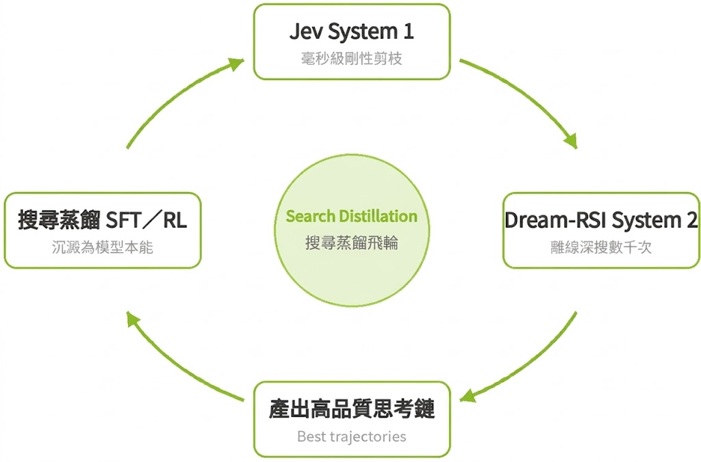

用武俠話收尾：**平時過招憑本能，遇到高手開大招，打完把心得寫進拳譜，下次本能就更強。** Dream-RSI 降的是搜尋的成本，Jev-likes 降的是決策的成本，RSI-Jev 是兩者的字面融合；三者在同一個飛輪上，缺一不可。

---

<a id="sec-9"></a>
## 九、給企業的三個原則

落到執行面，三句話：

**模擬器優先**：拒絕線上蠻幹，先建夢境再練功。任何自動化發現專案，第一筆預算應該花在回放模擬器上，而不是更多的 GPU 時數。

**判別合約守門**：關鍵決策不用生成式賭運氣。高頻、高風險的決策點，用型別契約鎖死輸出空間。

**經驗蒸餾資產化**：每次搜尋的成果都要沉澱下來。無論是蒸餾回權重，還是沉澱成評測資產（如 jev-skill 的 pilots），都是組織的數位護城河。

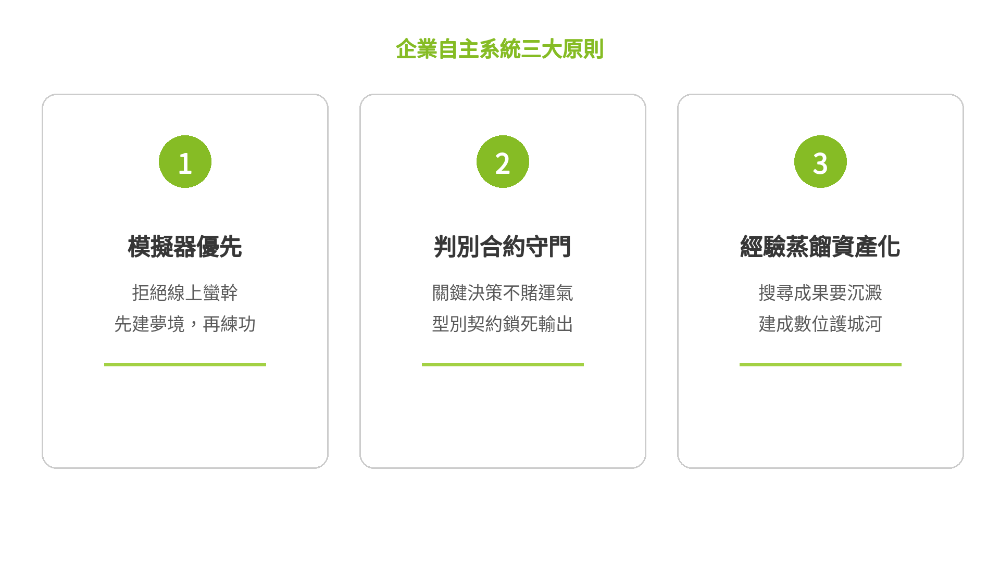

讓 AI 在夢裡練功，在現實中出手。

---

<a id="sec-exp"></a>
## 讀者體驗區：親手玩玩看判別式決策

讀到這裡，最好的理解方式是親手試一次。三種玩法，由淺入深：

**玩法一：直接玩現成的（免安裝，現在就能點）**

* **NanoJev 遊戲實機**：[ViZDoom 即時射擊](https://nanojev-dev.tianyuchen99.chatgpt.site/?autoplay=1)｜[Maze & Snake](https://nanojev-dev.tianyuchen99.chatgpt.site/side-by-side?autoplay=1#maze)：看 0.6B 的判別模型即時打遊戲，每一幀都是一次毫秒級決策，沒有一個 token 是「寫」出來的
* **RSI-Jev 互動展示**：[demos](https://shanghua-gao.github.io/RSI-Jev/)｜[Colab 一鍵重跑](https://colab.research.google.com/github/Shanghua-Gao/RSI-Jev/blob/main/notebooks/rsi_jev_v4_vl_quickstart.ipynb)（免費 GPU）

**玩法二：本地 3 分鐘跑一個 Jev-like 模型**

開源的 jevos（`feder-cr/jev`）是單一執行檔，CPU 就能跑，講的是 TypeSafe Jev 的 wire protocol：

```bash
curl -sL -o jev-linux-x64.tar.gz https://github.com/feder-cr/jev/releases/download/jevos-v3/jev-linux-x64.tar.gz
curl -sL -o jevos-v3-openvino-int8.zip https://github.com/feder-cr/jev/releases/download/jevos-v3/jevos-v3-openvino-int8.zip
tar -xzf jev-linux-x64.tar.gz && cd jev && unzip ../jevos-v3-openvino-int8.zip && ./jev serve
# 另開終端機：
curl http://127.0.0.1:8017/v1/systemone -H 'Content-Type: application/json' -d '{
  "model": "jev-latest", "state": "客人說這個月帳單多了一筆沒買的東西",
  "questions": {"team": {"type": "choice", "instructions": "派給哪個團隊？",
    "criteria": {"billing": "帳單付款退款", "shipping": "寄送包裹", "tech": "產品故障"}}}}'
```

注意回傳裡的 `"output_tokens": 0`：模型一個字都沒「寫」，直接給出每個選項的機率。這就是判別式決策。**「模型直接輸出受限類別上的機率分佈（或確定性 Top-1 選項），無需經過 Token 解碼」**

**玩法三：互動 POC**

<iframe src="https://deeplearning101-rsi.hf.space" width="100%" height="640" frameborder="0" style="border-radius:12px;border:1px solid #e5e7eb;"></iframe>


[⚡ Jev-style 判別式決策 POC](https://huggingface.co/spaces/DeepLearning101/RSI)

---

<a id="sec-read"></a>
## 延伸閱讀

* [2026 本地 LLM 推論框架對決：vLLM vs Ollama vs SGLang vs LLaMA.cpp](https://deep-learning-101.github.io/Blog/vLLM-Ollama-SGLang-LLaMAcpp)：推論延遲優化的實戰選型
* [Agentic Profiles：AI Agent 四維資安與治理框架](https://deep-learning-101.github.io/Blog/Agentic-Profiles)：DeepMind《Nature》論文的治理視角
* [大語言模型（LLM）總覽](https://deep-learning-101.github.io/Large-Language-Model)：本站 LLM 知識中樞
* [RAG 檢索增強生成](https://deep-learning-101.github.io/RAG)：外掛知識 vs. 蒸餾進權重的對照

---

<a id="sec-ref"></a>
## 參考來源

* Tong Zheng et al., *Dream-RSI: Recursive Self-Improvement through Evolving Worlds*, Preprint, Sep 2026（[論文 repo](https://github.com/zhengkid/Dream-RSI)）
* TypeSafe AI, *Introducing System One Models and Jev*（[Jev 官方](https://typesafe.ai/blog/introducing-system-one-models-and-jev)）
* OpenAI Decisions API（DevDay 2026-09-29 發表，GPT-6 Luna，有限預覽）（[報導](https://www.eesel.ai/blog/openai-decisions-api)）
* [Shanghua-Gao/RSI-Jev](https://github.com/Shanghua-Gao/RSI-Jev)（MIT）、[wuyoscar/jev-skill](https://github.com/wuyoscar/jev-skill)（MIT）
* 開源系譜：[Laya](https://github.com/NandhaKishorM/laya)、[CLM-8B](https://github.com/Contrastive-LM/CLM)、[Kev](https://github.com/jaredpalmer/kev)、[NanoJev](https://github.com/TianyuCodings/NanoJev)、[jevos](https://github.com/feder-cr/jev)、[AnyJev](https://github.com/nokia-applied-research/AnyJev)、[browser-use](https://github.com/browser-use/jev-ultrafast)
* I.J. Good (1965), Jürgen Schmidhuber — Gödel Machine (2003), Nick Bostrom — *Superintelligence* (2014)
* Sakana AI — *The AI Scientist* (2024)；DeepMind — FunSearch (*Nature*, 2024)、AlphaFold 3 (*Nature*, 2024)
* Jeff Dean 等人創立 Discovery Loop（2026-08，Google 前首席科學家，自動化科學發現）（[報導](https://analyticsindiamag.com/ai-news/jeff-dean-sanjay-ghemawat-exit-google-launch-ai-startup-to-accelerate-discoveries)）
